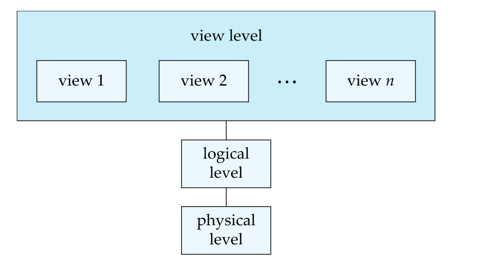

# 介绍

所有者: H34V3N

# 使用文件系统保存数据的缺点

导致数据冗余和不一致/Data redundancy and inconsistency

数据访问困难/Difficulty in accessing data

数据隔离，或者说过于离散，联系性不好/Data isolation

难以编辑数据的完整性约束/Integrity problems

更新的原子性，更新可能导致数据库处于不一致的状态/Atomicity problems

无控制的并发访问可能导致数据库数据不一致/Concurrent-access anomalies

# 数据抽象Data Abstraction

对于计算机来说，他那个冯诺伊曼结构的身子得保存起来我们需要的信息，对于开发者来说， 他们需要设计合适的数据结构来处理这些数据，而这些数据结构的复杂内容不需要用户或其他外行人士了解，他们会用就行，所以，开发者将设置多个层次的数据抽象来简化用户和系统，以及各层次之间的交互，总共分成以下三个层次

## 物理层次Physical level：

物理层面的，这些数据是怎么保存在内存，硬盘里的

## 逻辑层次Logic level：

是软件层面的，处理，整理这些数据的思路，或者说一个蓝图，计划。逻辑层的开发者只需设计这种思路，构建怎样的数据库 而无需在意和硬件适配的复杂程度，你只需提数据保存的需求，怎么实现是硬件自己的事情；哪怕物理层次突然修改了，也不会要求修改逻辑层次的内容。我们称其为物理数据独立性physical data indepence，（后文会继续说这个概念）

## 视图层次View level：

在确定数据存到哪里，怎样整理之后，就要考虑怎样把数据展示出来，这就是视图层次该干的事，你直接看到的，也许是一个表格，一个饼状图，树状图，或者说干脆括号，逗号，数据构成的文字，只要是被你眼睛看见的，都是视图层次

三种层次实现自己层次该干的事情，一般并不会因为自己的特殊情况而干扰别的层次。

# 实例和模式

实例Instance：

某个时刻，保存在数据库中的信息集合

模式Schema：

数据库的总体设计称为逻辑

逻辑模式Logic Schema：数据库的整体逻辑结构

揭示库中数据的关系，类似程序中变量的类型信息

物理模式Physical Schema：数据库的物理结构

实例：数据库在特定时间点的实际内容，类似变量的值

# 物理数据的独立性

独立性：修改物理数据而不改变逻辑模式的能力

应用程序依靠逻辑模型

各个组件之间的接口应该明确定义，这样相互修改不会对其他组件产生严重的影响

比如，物理层次的结构修改了，不需要要求逻辑层次和视图层次跟着修改，而是按照自己新的结构完成自己那部分该干的工作——存储数据；逻辑层次修改了，还会根据接口访问物理层次保存的具体信息，视图层次展现的内容（也就是用户需要看到的内容），也不会变化，而是根据新的逻辑层思路展现出信息

# 数据模型

构成数据库结构的基础时数据模型，数据模型是用来描述数据，数据关系，数据语义，数据约束的模型

几种模型如下：

- [关系模型](关系模型Relational%20Model.md)
- [实体-关系数据模型](实体-关系模型Entity-Relationship%20Model.md)
- [基于对象的数据模型](基于对象的数据模型Object-based%20Data%20Model.md)
- [半结构化数据模型](半结构化数据模型Semi-structured%20Data%20Model.md)

其他模型略

# 数据定义语言（Data Define Language DDL）

用于定义数据库模式的一组规范符号，语言

示例：

根据这个代码，数据库生成了一个表模板，这个模板保存在数据字典中。

数据字典包含元数据，也就是数据的数据，用来描述这个数据的数据，内容如：

- 数据库模式
- 完整性约束Integrity constrasints
- 权限Authorzation（谁可以访问什么）

我们通常会限制数据库的一些属性，比如，第一项信息不能是负数，第二项是字符串……我们就称这些限制是完整性约束，部分约束如下

- 域约束
    
    某一类型对应的属性值被限制在一个范围里
    
- 引用完整性
    
    关系的属性可以是来自别的关系的（比如后面会学到的概念：主键），引用来自其他关系的属性，要求属性值必须是在引用源真实存在的，完整的。
    
- 授权
    
    

# 数据操纵语言（Data Manipulation Language DML）

用来操作对已有的一部分数据模型构成的数据库进行操作，访问，更新的语言

我们也称其为查询语言

数据操作语言有下面两种

- 过程式DML/Procedural DML：用户指定哪些数据，以及如何获取这些数据
- 声明式（非过程式）/DMLDeclarative DMLs：用户指定要访问的数据就好，无需指定如何获取这些数据，相对更简单一点

# 结构化查询语言（Structured Query Language SQL）

传说中的SQL

非过程式的查询语言，其可以输入多个表作为输入数据，但只输出一个表作为输出

使用示例；

一个类似表格的文字，，规定的搜索内容和范围，由图可知，搜索的是计算机院的所有老师

为了能够计算复杂的函数，SQL通常嵌入到某种高级语言中，这种高级语言做成应用程序，就能利用程序实现和数据库的交互

# 设计数据库

设计数据库的一般结构的过程：

逻辑设计：决定数据库的模式，找到好的关系

业务决策：应该记录哪些属性

计算机科学决策：选择关系模式，属性该如何在关系模式中分配

物理设计决定数据库的物理布局

# 数据库的组成

## 数据库引擎Database Engine

整个数据库系统根据功能不同 被划分为若干模块，分别为：存储管理器 查询处理器和事务管理组件

### 存储管理器

存储管理器负责在数据库中底层数据和应用之间提供接口，和文件管理器交互

原始数据通过操作系统被保存在硬盘里

存储管理器还负责把各种DML语句翻译成低层的文件系统命令，负责在数据中存储，检索和更新数据

组成包括：

- 授权和完整性管理器：检查完整性约束是否满足，检查用户对数据的权限
- 事务管理器：保证数据库在系统故障后仍然保持一致，保证并发事物没有冲突地进行
- 文件管理器：管理硬盘空间的分配，以及其信息上的物理数据结构

       维护的数据结构有：数据文件，数据字典，索引

- 缓冲区管理器：把数据从硬盘取到主存，决定拿一些数据需要存储到主存中

### 查询处理器

包括：

DDL解释器：解释DDL语句，并把定义的内容写入字典

DDL编译器：把查询语言中的DML语句翻译为查询执行引擎能理解的低级指令组成

查询执行引擎：执行前面提到的低级指令

### 事务管理

事物：完成数据库应用中单个逻辑功能的一组操作，每个事务都是原子性和一致性的单元

具体内容后续会学习

# 数据库和应用工程

以后会学