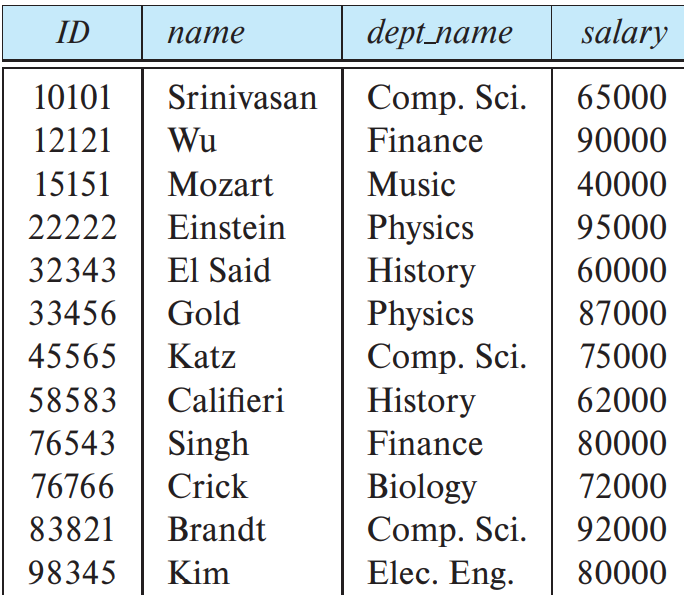

# 介绍关联模型

所有者: H34V3N

# 关系数据库的结构

一个关系数据库包含一组**表格table**，每一个表格都有一个特定的名称

下面是三个表格（他们也叫关系），记录了一个大学的一些信息

名为instructor（导师）的关系，其记录了ID name dept_name salary四列信息

名为course（课程）的关系，其记录了course_id title dept_name credits四列信息

名为先修课程（prereq）的关系，记录了course_id ,prereq_id 两列数据

我们接下来看导师这一个关系，乍一看我们就能知道，姓名为Wu的导师id是12121，工资是90000，是这种表格让这个姓名，和这个id，薪水联系在一起，这就是他们之间的“关系”，对于这种数据模型来说，每一行就是一种关系，将每一列的对应行的数据（属性）联系在一起

当然，在不同的关系中，可以保存相同的属性，这样，这个属性就将这两个关系联系起来了

## 属性attributes和元组tumple

我们将每一列的数据称为“属性”，将每一行的数据称为“元组”

*通过联想python中元组变量的性质，我们发现就算这些数据按另一种方式排列，也不影响我们获取信息，以导师那一列为例，就算他们被打乱了排列顺序，也不影响这一行都表示这个老师的特征*

## **域Domain**

对于某一列属性，我们可能需要限定其数值的取值范围，比如，导师关系的name属性中，其保存的值都是校内存在的老师，而不是hamburger这种和人名无关的字符串，也不是114514这种数字

我们称这个取值的范围称为域

## 属性的原子性atomic

对于一个域中的所有属性，我们都要求其是一个不可再分的数据，一个域不能套另一个域，如果你想在域里保存一些电话号，那这个域的每一项都是一个单一的11位电话号，而不是某一组电话

## 空值null value

空值是一种特殊值，说白了就是空的。其表示这个属性这一行对应的值是丢失的或者是未知的

避免使用控制，他会在维护数据库的时候带来麻烦（或者说，可以用一串固定字符来表示空值？比如用xxxxxx表示一个未知的电话号）

作为一种结构化数据，关联模型保存的属性有清晰且不变的定义，适合那些相对静态的数据库，但是如果你需要常常修改其保存的数据的属性列的数量（比如，在导师这个关系里新增一列属性，表示导师的性别），使用关系模型维护起来会很麻烦

# 数据库模式Database Schema

关系模式由一系列的属性和域构成，关系模式成为了其控制的关系的形成以及变化的标准，形成的关系都有哪些属性，这些属性该怎么赋值，关系模式规定了这一切，在这个关系根据关系模式的要求保存了一些数据的一瞬间，就是对应的关系实例。我们拿前面导师的关系为例，其关系模式就是：

instructor（ID，name，dept_name，salary），规定了这个关系保存的属性有ID，name，dept_name，salary

不过对于数据库模式和数据库实例来说，尽管是两个不同的东西，我们也通常用同一个名字表示他们

# 键keys

你可能会想到，如果在一个关系中出现了两个相同的元组（即两行属性完全相同），会发生什么，实际上，这种情况在关联模型中是规定避免的（也就是说，关系是一个所有元素都是元组的集合），一定会有一列属性值完全不同，将元组和元组之间区分开来，比如instructor一栏里的ID，也许会出现两个姓名，工资，专业完全相同的老师，但他们的ID一定是不一样的。

## 超键superkey

超键是一组或更多属性，专门用来将所有元组区分开来，其形成数据库实例后，超键对应的一列里没有任何完全相同的属性值

## 候选键candidate key

前面提到，超键是一组或更多属性，可以通过这样的思路证明

在一个数据库实例中，这里我们仍然用instructor这个关系举例子，其ID一定是各不相同的，但是，如果我们将每一个实例里面的ID 和导师姓名联系起来，形成一个整体属性。格式是ID - 姓名（或者说{ID，姓名}，这样构成一个集合，方便后续定义），因为ID部分本身是不一样的，所以连起来的整个字符串也一定是不一样的。所以，这个ID-姓名也符合超键的定义。但是如果想分辨出来每个元组，“姓名”这部分未免有点多余

我们把这种最小的，其真子集不是超键（或者说，自己本身每个部分都参与形成了这组超键的形成，无法再减少什么）的键称为候选键

## 主键Primary key

我们称开发者选中完全作为区分元组的候选键称为主键，主键也成为主键约束（primary key ocnstraints），其也起到了约束数据库的作用

我们要确保被选中作为主键的键一定不会出现相同的情况，比如人名，笔名等，难免会遇到多个人用一个名字，像是完全用来识别个体的身份证，或者DNA（者的会有人用这个当主键吗，这东西太复杂了），就适合作为主键

## 外键约束foreign-key constraint

我们知道，instructor关系里有一个属性是学科，那么，对于一个学科来说，我们既有很多信息要记录（如分流，学时，总分等），而且要把学科之间区分开来，所以，但对对于学科也值得创建一个关系。不过，一般学科这个东西几乎没有相同名字代表不同东西的，我们可以直接利用名字作为主键，这时候，我们发现学科这个关系和导师这个关系有联系，又发现学科这个关系的主键在导师里作为一个属性出现。这样我们引出了外键约束的定义

外键 foreign-key：在一个关系r1中引用另一个关系r2时被引用的属性，我们称其为r1引用r2的外键

我们把这个r1称作外键约束的引用关系，r2称作被引用关系称作被引用关系

这种引用操作将两个关系的数据联系起来

外键约束：在引用操作时，外键的值必须全部来源于被引用的关系的主键，而且不能破坏这种关联关系

## **模式图Schema diagrams**

模式图是利用图片的形式将各种关系以及关系之间的联系表示出来，下面就是一个模式图

我们看到了许多框，每个框都是一个关系，这些框的顶部用蓝色背景的文字表示了这个关系的名称，下面白色背景的就是这个关系的属性

有一些属性加了下划线，这些属性是主键，同时，有些属性会作为一个箭头的开始或目标联系到其他关系里的属性，这些属性就是外键

这些箭头表示外键之间的联系，单项箭头表示的是引用和被引用的关系，含义也是外键约束，从引用关系的外键，指向被引用关系的主键

有些双头箭头表示不是外键约束的引用完整性约束

# 关系查询语言Relational Query Languages

查询语言是用户从数据库请求信息时使用的语言，可以分为下面三种语言

命令式查询语言：用户指定对数据库执行的操作序列，会导致计算中途变量的更新

函数式查询语言：计算过程被表示成函数的求值过程，没有副作用，不会更新程序

声明式查询语言：用某种数学逻辑形式表示所需信息，数据库自行判断后给出所需的数据

# 关系代数Relation algebra

虽然前面提到过，关系中不会出现相同的元组，但是在实际应用中，我们允许相同的元组出现，所以你在实践中可能会看到相同的元组，但是对于讨论关系代数时，相同的元组是绝对不能出现的

关系代数是由一组操作组成，这些操作会使用一两个关系作为输入，输出一个新的关系作为结果

有一些操作，如选择，投影和重命名，只在一个关系上进行操作，我们称其为一元操作（unary operation）

另一些操作如并集，笛卡尔积和集合差，是在一对关系上进行的，我们称其为二元操作（binary operation）

## 选择操作The select operation

选择（select）操作用来选择符合我们给定的谓词的要求的元组，我们用小写希腊字母sigma（σ）表示选择操作，谓词作为其下标出现，参数关系写在其后面呢括号中

举例：选择物理系的导师：

sigma表示选择，谓词dept name = “physics”表示学科是物理 后面的括号表示添加的一元参数关系是导师关系（instructor）

对于数值来说，我们也能用比较符号 =, ≠, <, ≤, > 和 ≥筛选符合要求的元组

当然，如果你需要多个谓词也是允许的，这时候就需要离散数学中的知识点，我们可以用and ( \land)、or ( \lor) 和 not ( \lnot) 将谓词按你期望的方式组合，形成新的条件

选择了目标要干什么后面再说

## 投影操作 The project operation

我们利用投影操作实现检查一个关系，但是省略某些你不需要的属性，隐藏起来不给你看

我们用大写希腊字母pi（Π）表示，我们想看的结果在下表里表示，其后的括号表示作为参数的关系

比如，我想查询所有教师的ID，姓名和工资

Π表示投影，三个下标表示想看的属性，括号后是传入的关系instructor

## 关系操作的组合Composition of Relational operations

顾名思义，因为投影操作和选择操作返回的结果是一个新的关系，这个关系本身也可以作为一个参数再传入另一个操作

像这种式子，我们称其为关系代数表达式（relational-algebra expression）

## 笛卡尔积运算The Cartesian-Product Operation

在关系代数中，笛卡尔积操作是最基础的关系操作之一

笛卡尔积用一个叉号×表示，其作用是结合任意两个关系中的信息

如r1 × r2，其作用是将两个关系里面的所有元组进行进行两两组合，将得到的新的一堆元组组成的关系作为结果输出出来

在组合的过程中，我们难免会遇到不同的关系中出现了相同的属性名，但属性名的含义不同（如学生的ID和老师的ID），在进行笛卡尔积运算后，通常会用原关系名.对应的属性名的格式区分开这两个属性

## 连接操作The  join operation

经过前面笛卡尔积操作，我们得到了两个关系中元组全面排列组合的结果，但是，有些排列并不符合实际，我们还需要筛选出符合我们要求的信息，所以，一般笛卡尔积都是配合选择操作一起使用的，如下面的操作

我们将这两个操作的组合称为连接操作，并用一个新的符号⋈表示

完整的连接操作定义如下：

其中r和s是两个关系参数，θ是规定的介词，那么这个式子等价于：

## 集合操作 Set Operation

集合操作是像普通的集合运算一样取交集取并集，将含有兼容关系的集合进行合并或取交集的操作，具体输入或输出会在后面讲

### 元数arity

我们将一个关系含有的属性数量称为元数

### 兼容关系compatible relations

如果两个输入关系每一列对应的属性都是相同的属性（从名字到类都相同），那么这种关系称为兼容关系，下面的三个操作操作都要求输入的两个参数关系之间是兼容关系

### 并集运算union

对于有这种关系的两个关系（如你2021年每个月的收入和你2022年每个月的收入，两个关系的属性都是日期（年 + 月）和收入金额）

我们可以用并集符号∪表示，输入这两个关系r1 ∪r2，将这两个关系的所有元组放到一起形成一个新的关系，作为结果输出

### 交集运算intersection

对于呈兼容关系的两个关系，我们可以使用交集∩运算，r1∩r2实现找到两个关系里都有的元组，将他们单独拿出来，形成一个新的关系作为结果输出

### 集合差运算set-defference

对于呈现兼容关系的两个关系，我们可以用差（-）操作 r1 - r2实现找到存在r1里，但不在r2里的元组，把他们单拿出来组成一个新的关系，作为结果输出

## 赋值操作The assignment operation

这是一个关系代数表达式，很长，读起来和用起来都很不方便

但是我们可以用赋值操作←实现将这一长串内容赋值给一个临时关系变量

这样的话，如果我们在后续的操作里还想使用这个关系代数表达式，我们直接调用products_electronics即可，这个操作不会给用户呈现出关系，只是一个赋值操作，不会对已有的数据库造成改变

## 重命名操作The Rename Operation

设想下面一种情景：

我们对于一个Id和具体工资确认的员工关系A，我们需要搜索所有工资大于ID为12121的员工的名单

我们可以发现，对于这个操作来说 我们会单找出来这个ID为12121的信息σ A.id = 12121 

同时 我们还要再调用一次这个属性，表示和12121的信息进行比较的人

通常，我们想方便地进行一个关系的所有项和关系中的某一个值的运算，我们可以让整个关系和这一个元组做笛卡尔积——没错，我们将被比较的信息（如前文的12121的工资）放到每一个元组里，检查这个元组本来的信息（这个员工的工资）和被比较的信息的大小就好。

但是 我们发现这种情况会有一个问题：笛卡尔积会使用关系名.属性名的方式避免重复，但是当前情况下参与运算的关系是“同一个关系”（来自A的所有元组和来自A的某一个特定元组比较，就像，自己本来的薪水属性和笛卡尔积加进来的薪水属性都叫A.Salary），我们需要将其区分开来所以我们使用了赋值操作：

ρ_重命名后的名称(被重命名的关系)

这样就能再进一步地区分了

Π [i.ID](http://i.id/), [i.name](http://i.name/) (
σ i.salary > w.salary (
ρ_i(instructor) × σ [w.id](http://w.id/) = 12121 ( ρ_w(instructor) )
)
)

*赋值操作是吧一连串算是用一个东西代表，重命名时把本来的一个东西换一个名字*

## 等价查询Equivalent Queries

根据前面连接操作的值，有的时候采用的符号或思路会有一些偏差，但是结果是一样的，我们称这种现象叫等价查询

等式 懂了吧