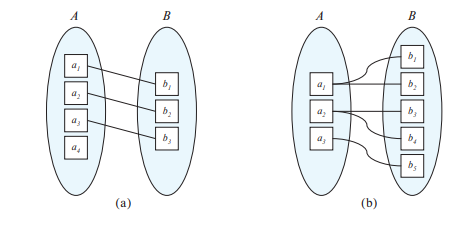

# 利用实体-关系模型设计数据库

所有者: H34V3N

[总结：ER模型图像涉及的所有元件](利用实体-关系模型设计数据库/总结：ER模型图像涉及的所有元件%2028d05a2041d28041be00f63f86bde71f.md)

# 设计流程的总览

我们作为研究数据库的人，可以将数据库的功能设计的详尽，完全，但是这样的一个数据库对于使用者来说，是一个复杂的系统，使用者面对这个复杂的系统，通常难以理解和操作，所以如果面向用户来设计数据库的话，必须是操作友好的，用户可以理解的。在之前的内容里说过，我们会将数据库分成三个层次，直接面向用户的视图层次是用户可以理解的，用户通过试图层次的操作可以被转化成更低级的层次的指令或信息来操作整个数据库。

## 设计阶段

在第一阶段，我们首先要明白的是用户的需求，作为数据库的开发者来说，对方涉及的领域可能和我们不同，甚至我们完全没了解过，这就需要我们和其进行充分交流，来大体了解对方的领域的内容，以便于我们理解对方需要设计的数据库的结构和功能

在充分了解用户的需求之后，我们进入下一阶段，就像我们之前做的算法题一样，我们需要将实际的需求抽象化，在数据库设计的领域里，就是选择一个合适的数据模型来表示这个需求，将需求转换成一个符合现实的数据概念模式，就实体-关系模型来说，这个转化的结果通常是一个展示这个概念模式的实体-关系图，然后检查是否符合实际需求，关系之间是否有冲突即可。注意，设计者的工作重心是揭示这些数据之间的关系，而不是特定的数据的存储信息，我们已经到分析这些数据的阶段了

通过接下来的操作，我们将抽象的数据转化成了数据库的实际应用：在确定数据概念模式后，我们就在数据库及系统上实现这个模式，然后确定这个数据库的物理特征，就像在确定蓝图后，将建筑整个搭建起来。而且，整个系统的核心是这个数据库路的逻辑，物理层面只负责保存数据，在某些情况下可以改变，不影响逻辑部分的运行，但是，逻辑部分是不好改变的，改变逻辑部分，就意味着改变整个数据库的框架。所以在设计数据库的初期，我们一定要谨慎确定好数据概念模式和实现的逻辑，设计完成，检查无误后就不要更改

## 设计数据库需要避免的地方

### 冗余

好的数据库的设计应该是让数据只存储一次的，就算是主键，也只是在引用关系的时候多出现一次，就课程这个例子来说，我们可以维护一个关系，将课程代码和这个课程的名称联系起来，但是对于每个课程来说，还可以维护一个关系“开设课程”，来保存这个课程的学分，教师，学时等数据，这时候，我们发现，仅仅使用课程代码或名称就可以表示这个数据了，但是两个都放到这个“开设课程”里就显得冗余了，浪费存储空间还是小事，麻烦的是在修改某些数据的时候，需要设计程序将所有关系里的这个数据都要修改（比如，我们想要修改某个课程的名称，除了修改对应课程代码和名称的关系之外，还要修改开设这个课程的关系里的对应的数据），稍有操作不慎，就可能导致数据变得紊乱

### 不完整性

数据库设计的不完整也是一个致命的问题

简单来说，不完整性说明的是设计的数据库无法涵盖描述的事务的所有情况，就前面的开设课程的例子来说，如果我们只维护了开设课程的具体信息这一个关系，万一有的课程是学校确实有的，但是因为特殊原因，学校今年没有开设，或明年才第一次开设呢，这时候，记录这些课程的关系就显得很尴尬，因为如果你不记录，就好像把他们踢出去了，你记录了的话，具体的开设的细节又没有，对于信息的维护和外键约束来说都是很麻烦的，所以明智的做法就是，维护两个关系，一个存储课程编号和课程名称的关系，另一个维护本学年或学期开设的课程的信息

所以，我们在设计数据库的时候，需要综合考虑用户的需求和需要避免的问题，也许我们会得到许多解决方案，我们就从中筛选最好的

# 实体关系模型

## 实体集Entity Sets

前面已经提到过，所谓实体就是现实世界真实存在的，可以和其他东西区分开的事物

实体集就是一组类型相同，拥有相同属性（属性的值可以不同）的一组实体的集合。举个简单的例子，有身高，智商情商，胳膊腿的东西，大概率是人类（别抬杠），这就是一个实体集，这个实体集包含的是各种各样的人的数据，他们的身高，智商情商都不一样。接着，我们可以在这个实体集里加一些属性，如学号，年龄，姓名等，可见，这个实体集就变成了描述学生的实体集，里面保存的实体就是各种个样的学生，我们也可以把学号换成工号，再新加一个科目的信息，这样，这个实体集就变成了描述教师的实体集。我们不必要要求每个实体集都是相交的，也就是说一定比包含相同的属性，这就是实体集。

注意，就像关系和关系实例一样，我们通常不用“实体集”这个名词表示特定的实体集，相反，我们用实体集的”扩展“表示某个特定的实体集，这个扩展是按照”实体集“格式的内容要求的类填充的具体信息而成的

## 关系集relationship set

这里的关系，指实体之间的关联，比如在现实中，我们可以利用关系，表示学生实体，这学期修了哪些课程

具体的表现方式就是在学生实体集中，单拎出来某个学生，再在开设课程的实体集中，单拎出来这个学生本学期修的课程，将这几个单拎出来的实体构成一个新的集合

所以可以说，关系集是涉及到的所有实体集的笛卡尔积的子集

而某个关系集涉及到的实体集之间，称参与关系

### 关系集的元数Degree of a Relationship Set

指一个关系涉及的实体集个数

我们称元数为2的关系称为二元关系，其余的称为非二元关系

## 角色role

我们称某个实体在关系集发挥的作用为角色，只是大部分情况下，构成关系集的实体通常来自不同的实体集，这些关系集通常是互斥的

比如下面的例子，我们想表示一名地大计算机系学生大一一整年修的科目，按理说，只要我们将上下学期修的科目作为实体组成集合就好，但是，我们大一上学期和下学期都要学习高等数学，而且具体的学习内容是不一样的（一本书被分成了上下部分），这个时候，这个关系集就出现了两个高等数学，这样，我们就需要用角色这个概念来将这两个高等数学区分开来。

注意，一个实体集可能会参与多个关系集，这也很好理解

而且，对于一些特殊情况来说，某个事物的属性可以存在多个值，我们就用一个集合表示这多个值，我们称这一类属性为**多值属性**

## 复合属性Complex Attributes

在之前对于属性的描述中，我们都是对一个属性规定一个具体范围的域，每个属性都是互不相干的

但实际上，有些属性和另一部分属性是包含的关系，我们称可以将被划分成子属性的属性称为**复合属性**。比如，一个人的班级是七年级二班，那么这个属性可以分为“七年级” 和 “二班”，一个学校可以有多个年级，而一个年级内的班号排列没有意外的话都应该是相同的。如果我们需要举办运动会，让年级之间进行比较，那么记录选手时只需要记录清其年级属性就可以评选出体育成绩最好的那个年级

## 派生属性Derived attributes

有的时候，我们能从某些属性或某些关系中推断出某个属性的值，我们称这种属性为**派生属性**，比如说，我们想在关系”班级“中加入“班级的总人数”这个属性，我们就可以统计“班级”属性值为这个班级的学生的总人数

## 空值null

我记得对于”空值“这个概念的描述已经出现过好多次了，当某个实体对某个属性没有取值时，这个属性就是取了空值（null），我们利用这个空值表示属性位置或实体不存在这个值

## 弱实体集

弱实体集表示不能仅凭自身的属性标识说有实体的实体集，其区分依赖另一个实体集，我们称这个实体集为标识实体集或主实体集

我们用两个实体集进行区分：其中一个实体集为员工，这个实体集中的实体能用工号这个属性和其他实体区分开来，还有一个实体集是家属，注意，这个实体集的实体没有工号，而且家属的名字可能相同，我们只能通过将家属和员工关联起来来作为这个实体集的主键：{工号，家属姓名}。其中我们称“工号”是识别实体集的主键，“家属性名”是弱实体的区分属性

我们用完全参与描述某个实体集中的每一个实体，都至少参与到联系集中的某个联系中，和识别实体集关联起来。

我们在ER图中，使用双线矩形表示这个实体集，区分属性用虚线下划线标记。将强弱实体集连接起来的识别关系集（为其家属）用双线棱形表示。之后用双线将完全参与的实体集和关系集相连，而且用箭头指向识别实体集，表示仅关联一个对应集

### 强实体集的表示

假设一个强实体集E含有n个属性，我们则表示为：N（n1，n2……），其中N是这个实体集的主键

当含有复合属性时，我们要将符合属性分解成几个不能再分的属性，再按上面的方式记录即可

当含有多值属性时，我们不会将对应的所有值都在括号里表示出来，而是创建一个新的独立的关系模式A，再将这个模式和原本的模式联系起来，保证了一个字段不会出现多个值的原则，如果我么要表示多值属性的值b，则再强实体集的表示中表示为A.b

### 弱实体集的表示

假设弱实体集A的属性有a，b，c……其依赖强实体集B，其属性为C，D，E……则A的属性集合为{a,b,c…,}∪{C,D…}

而其标准的表示方法就是在表示出原本的本实体集的属性之外，再加上其依赖的强实体集的主键即可

# 映射基数Mapping Cardinalities

映射基数用于表示，通过某个关系集，一个实体最多/最少能和几个别的实体关联

我们通常用映射技术表示两个关系集之间的实体的联系，但是偶尔也可能表示多个关系集之间的联系。但在这里，我们先考虑二元关系的情况

假设存在两个关系集AB，AB之间的映射基数，一般是下面几种关系的一种：

### 一对一One-to-one

AB两者之间的实体只对应对方最多一个实体

### 一对多（One-to-many）和 多对一（Many-to-one）

AB 之中 A的实体能对应B中的多个实体，而B中的实体只能最多对应一个实体，反之则称为多对一

### 多对多（Many-to-many）

A B 中的每个实体都能对应对方关系集的多个实体

### 几种关系在E-R图中的画法

一对一：关系集向两个实体集都画有向线

一对多/多对一：关系集向“一”的那一方画无向线，“多”的哪一方画有向线

一对一：关系集向两个实体集都画无向线

## 参与度Participation

若实体集 E 中每个实体都必须至少参与一次关系集 R 中的某个关系，则称 E 在 R 中的参与是完全（total）的；若 E 中可能有实体不参与 R，则参与是部分（partial）的。

我们用双线表示实体在关系集中的完全参与

# 在实体集中去除冗余属性Removing Redundant Attributes in Entity Set

对于良好的ER设计，我们不会让其出现冗余的属性

对于冗余的定义前面已经提到过了，大概的规则就是，如果在A实体集中出现了另一个实体集的主键，我们就将A实体集存储的主键外其他和主键来自相同的实体集的属性删掉，这就是冗余的属性

但是在关系集里还需要调整这个定义：

两个实体集出现了相同的属性，在合并成关系集的时候，我们发现这两个属性会出现两次，表达的信息重复了，所以我们通常将不是主键的那个属性从对应的关系里划掉，但是不是永久消失，单独看这一个关系的时候，被删掉的属性还会回来

# 模型的合并

考虑到一个由实体集 A，B组成的多对一的关系集AB，当A全参与时，我们可以将关系集合并到A的表里，来让表更简洁，有时可能需要扩充A的属性内容

如果A不是全参与，我们可以将未参与对应的属性设置为空值

也就是说，我们根据关系集AB，直接将关系集呈现的A的特征作为新的属性添加到A里，这样做到简洁的同时保证了关系呈现的清楚

在AB表中，会保存指向A B的两个外键，由于我们是将信息合并到A表中，我们就可以删掉指向A的外键，毕竟，整个过程是将新的属性更新到实体集A里，而实体集中每个实体对应特定的属性值，就已经将AB和A对应起来了

# 扩展ER模型（EER模型）Extended E-R Features

下面的内容可以理解为操作ER模型的思想，我们可以利用这些思想灵活表示我们要存储的数据

## 特化Specialization

一些实体集内部可能包含一些子群（subgroupings of entities），这一部分实体有一些特殊的特征或属性，能和其他属性区分开

比如，我们有一个实体集，统计某个大学里所有的人类实体，根据常识，我们知道，这些人类里有学生，有导师，还有食堂阿姨等等，而其在实体集保存的时候，含有不同的属性，作为导师，其可以有工资这个属性，而这个属性学生一般没有，这样，我们就把学生特化出来了。而被特化出来的学生可以接着特化，比如分为研究生和本科生，研究生有自己的导师，可以作为区分本科生的属性

### 重叠特化overlapping

对于特化后子集中，某一个实体，这个实体可以存在于多个子类中，比如大学中的雇员，可以跟为导师和研究者，而我们知道，一些老师也同时是研究者

### 互斥特化disjoint

特化后的子级中，所有实体都只能存在于一个子集里，比如将人员分成学生和雇员，一般情况下，学生不可能同时是雇员

### 用图表示特化

对于一个实体集，我们画出特化出的子集的实体集，用空心的箭头从子集指向更高层的实体集，如果子集之间是重叠特化，则用合并的箭头指向高层实体集，如果是互斥特化，则用分开的箭头，各自从子集指向高级的实体集

我们称这种箭头指向的关系为ISA关系（is a）

## 泛化Generalization

特化的反向过程，将多个实体集综合成一个更高级的实体集，比如我们统计学校的人类时，是分别统计的学生和雇员的信息，从而形成了两个实体集，我们发现，虽然是两个实体集，但是这些实体都含有年龄，性别，住址等属性，所以我们建立一个更高层的实体集“人员”，囊括了所有的人

泛化的过程是强调共性的过程

对于特化和泛化的过程，我们称更高级的实体集为超类superclass，较低级的实体集为子类subclass

## 属性继承Attribute Inheritance

根据前面的学习 我们知道。子类会包含超类的一部分属性，同时拥有子集独特的属性，我们称这些相同的属性为从超类继承来的属性，继承可以连续继承多个子集。同时，因为我们继承了特定的属性，这些属性连带的关系也就会继承，也就是说，子类还会继承超类参与的关系集

在层次结构中，一个实体集最多作为一个ISA关系的子类时，我们称其为单继承，当是多个ISA子类时，我们称这个结构为格lattice，这种操作为多继承

## 对特化，泛化的约束

就像是互斥，重叠特化一样，我们可以对特化泛化的操作作特定的约束，

其余的约束如下：

### 完备性约束completeness

指定高层实体中的实体是否必须属于至少一个子类，分为完全total特化/泛化 和部分partial特化/泛化

完全特化是指更高层的实体必须要能归到其中一个子类里，部分特化是指高层可能会有一些实体不在这个子类里

我们在画图的时候，可以使用关键字加虚线连接的到相应的的空心箭头的方式来表示完全特化

## 聚集Aggregation

给定一个情景：

在一个公司里，所有员工都有自己的项目需要完成，我i们维护两个实体集：员工和项目，这样，根据员工完成特定项目的关系，我们能够用一个关系集工作（员工，项目）表示出来，将这两个实体集联系在一起，接下来，数据库需要更新：我们要维护一个新的实体集”经理“，这个经理的负责内容是同时管理管理对应的项目和人，这时，我们可以选择新建一个三元的关系集：管理（经理，员工，项目）。

但是我们还可以直接将”工作“这个关系集视作一个实体，再和经理这个实体建立二元关系”管理“

大概的图画出来就会像上面那样，虽然内容和我的举例不同，但是我们可以看到，方框内的内容被视作了一个整体，通过关系集eval_for 和其他实体建立联系

## 将EER模型表示为关系模式Reduction to Relation Schemas

也就是将扩展版的ER模型落到实处，怎样展现为关系模型

### 泛化的表示

法一：

为高层实体集创建关系模式

为底层实体集创建关系模式，在保留高层实体的属性的基础上，添加底层实体特有的属性

注意，高层实体的主键属性在所有底层模式里都是主键，同时底层需要外键引用关联到外键，所以有的时候一个属性同时是主键和外键

法二：

当低层互斥且完全时，我们不需要再特地写出高层的关系集，直接写出所有底层的关系集，加入高层的所有属性即可

### 聚集的表示

此时，高层实体集包含底层实体集的主键，以及其他描述性的属性即可，相对来说比较简单

# The Unified Modeling Language UML

# 在设计ER模型时需要注意的问题

我们知道，实体集和关系集都是数据库中的关系，而并非严格的定义

## 设计时的常见错误

### 将实体集的主键当作另一个实体集的描述类属性来使用

主键和外键的作用是将不同的实体区分开来，和将不同的实体集联系起来，一般是以编号等确定性，唯一性的标记实现的，我们通常不会用主键来描述实体集的某些特征

### 把实体集的主键属性当作关系集的属性

在设计关系集的时候，我们的核心任务是建立两个实体集的关系，将描述性的属性联系起来，而区分性的属性 如各自实体集的主键，用来区分这个实体集里不同实体的属性，是和我们的任务无关的。所以我们在设计关系集的时候，无需将主键也加入到关系集的属性，只有在设计的关系集落地称为关系表格的时候，我们才会将其作为外键引入.

### 在需要多值属性的时候，用带单值属性的关系表达

拿我们的作业和成绩举例，一学期肯定会有多次作业，而我们将学生实体集和课程实体集联系起来，就能表示学生在这个课程的作业情况，如果我们直接建立学生和课程的关系集，并将作业和得分两个属性加到关系集里，会导致我们只能存储一个分数，这个分数属性是单值的属性

我们可以将作业设置成一个弱实体，依附于课程这个实体集（此时键表示为（课程id _第n次作业）），再将学生和作业这两个实体集形成关系”得分“，并在关系集中增加得分这个属性

或者，直接在错误方法的基础上，将作业和得分改成多值复合属性

## 实体集和关系集之间的选择

我们一般在涉及到行为/事件的时候，不会使用实体集强硬地保存所有数据，而是选择关系集

这是一个涉及学生选课的图标，我们看到，对于学生选了哪些课，我们并没有生硬的将选课内容加在学生的实体集里，反之亦然，而是新建一个实体集registeration，利用关系集将课程和学生两个实体集联系起来，这样，从两个实体集拿出来的属性也都是记录注册信息需要的，不多于也不缺少

## 二元关系OR多元关系

有的时候，n元关系是可以拆分成二元关系表示的

对于一个三元关系集家庭（父亲，母亲，儿子）来说

我们可以拆成父亲（儿女，妻子）和母亲（儿女，丈夫）两个二元关系集，同时包含的信息没有变化

但是对于指导老师（老师 学生 学科）来说，怎样拆都不合适