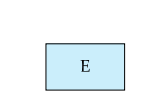

# 总结：ER模型图像涉及的所有元件

所有者: H34V3N

实体集

关系集

弱实体集的标识关系集

双横线标识实体集全参与关系集

属性

A1表示简单的属性

A2表示符合属性，分出2.1和2.2

A3表示多值属性{}

A4表示派生属性

下横线表示主键

虚线表示弱实体集的判别属性（又叫区分属性。/部分键）

关系基数多对多和一对一的表示

角色的表示，在和实体集连接的横线上写在关系中这个实体的名字，实体集旁边写上这个实体集扮演什么角色

基数限制，表示参与度的上下界，一个关系集参与度最多是几，最少是几

表示ISA关系，在泛化和特化的时候使用

如果完全参与就在箭头编上标注total

# 统一建模语言UML Unified Modeling Language

统一建模语言是在对象管理组织（OMG Object Management Group）的主持下指定的标准，为各个软件的各个组成部分创建规格说明

部分构成如下：

- 类图（Class diagram）
- 用例图（Use case diagram）
- 活动图（Activity diagram）
- 实现图（Implementation diagram）

大体对应先前学过的ER图，但记法和侧重点不同

UML构造的是对象，而ER图是对实体进行建模，但就像编程语言的对象一样，对象还包含一组方法，支持对对象属性进行各种操作

UML不支持复合属性和多值属性

在 UML 术语中，**关系集**称为**关联（association）**；为与 E-R 术语保持一致，本文仍称其为关系集。UML 中用**一条线**连接实体集来表示**二元关系集**，并把关系集名称写在线旁。我们也可以在连线靠近某个实体集处写出其**角色名**。或者，将关系集的名字及其属性写在一个**方框**中，并用**虚线**把该方框连到表示关系的那条线上。这个方框随后可以像 E-R 图中的**聚集（aggregation）**一样被当作一个实体集，并与其他实体集参与关系。

自 UML 1.3 起，UML 使用与 E-R 图相同的**菱形记法**来支持**非二元关系**。在更早的版本中不能直接表示非二元关系——必须用第 6.9.4 节介绍的技术把它们转化为二元关系。UML 也允许对二元关系使用菱形记法，但大多数设计者仍使用**连线**记法。

**基数约束**在 UML 中与 E-R 图相同，用 **l..h** 形式表示，其中 *l* 为最小、*h* 为最大可参与的关系数。不过需要注意，**约束的位置**与 E-R 图中的位置**正好相反**（见图 6.28）。例如，在边的 E2 一侧标注 **0..***、在 E1 一侧标注 **0..1**，表示每个 E2 实体**至多**参与一个关系，而每个 E1 实体可以参与**多个**关系；换言之，该关系是**从 E2 到 E1 的多对一**。边上的单值如 **1** 或 ***** 也可直接书写；**1** 等价于 **1..1**，***** 等价于 **0..***。UML 支持**泛化/特化**；其记法基本与我们的 E-R 记法相同，包括对**互斥**与**重叠**特化的表示。

UML 类图还提供了若干与我们见过的 E-R 记法大致对应的其他记法。类图中，在两实体集之间画一条线并在一端加一个**实心小菱形**表示 **composition（组合）**。图 6.28 中 E2 与 E1 的组合关系表示 E2 在存在上**依赖**于 E1；这与把 E2 表示为依赖于识别实体集 E1 的**弱实体集**大致等价。（UML 中的 **aggregation（聚合）** 是组合的一种变体：E2 被包含在 E1 中，但可以独立存在，用**空心小菱形**表示。）

UML 类图还提供了用于表示**面向对象语言特性**（如接口）的记法。更多信息参见“延伸阅读”。