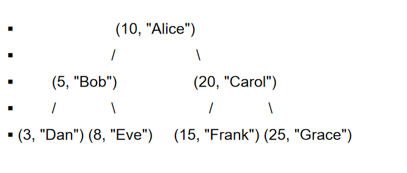

# 二叉搜索树（BST）

所有者: H34V3N

*二叉，嗯？[二分搜索](https://www.notion.so/1d605a2041d28043bb9dc9f91ef0055f?pvs=21)？*

二叉搜索树是一种二叉树，其有以下特性：

每个节点都有一个键值对，每个键值对都是唯一的

其任意节点x，x的左子节点和其以下的节点都小于他

x的右节点和其以下的节点都大于他

*我们发现，如果按照这种方式创建BST的话，利用中序遍历可以将所有键按从小到大遍历一遍*

BST可以应用于：实现字典，数据库中实现索引，实现搜索算法

大概是这样的



接下来的研究只看其键

接下来，我们给定一个数组，画一个二叉树，这个数是由数组中的数据从左到右依次添加得到的


只要在画的时候严格遵守“大于当前节点就往右塞，小于当前节点就往左塞”就行了

# 标准二叉树搜索树的操作

## put（）：在给定键的位置下添加节点

我们已知一个BST：


接下来，我们添加一个键为39的节点，这是怎么判断的呢

我们从根节点开始，以大于再右，小于在左的规则判断位置

因为39>20所以是右节点的子节点，也就是38的子节点

39 > 38所以在38的右节点


## get（）：获取指定键的节点的信息

给出键，然后让他搜呗

## remove（）：根据键删除节点

我们给定一个键，该怎样移除他呢

### 删除叶节点


如果我们要删除9，那直接让其父节点11指向空即可

### 删除其他节点

假如我们删除二级节点38

由于38只有一个子节点，我们只需让20指向38的子节点36即可，具体是左还是右具体判断就好

假如我们删除二级节点14

我们会发现，14有两个子节点，这样我们该选择那个节点来顶替他的位置呢

我们先用先序遍历写出所有节点


我们发现，如果删除14，既可以是11往后补，也可以是17往前补

按理说让17补过来是可以的


但是我们发现，如果让左子树的11替换到这个位置，好像也成立


具体的删除过程如下：

我们先让11节点顶替14的位置，此时出现了两个11节点


接着，我们用同样的方法删掉这个老的11节点


那么可以发现，补充的具体规则如下：

我们用中序遍历得到所有节点，然后找到被删掉的节点，其位置可以被这个被删掉的节点两侧的节点代替

**其实这两个节点，分别是被删除节点的左子树的最大节点，和右子树的最小节点**

其实前面的叶节点和只有一个子树的节点也可以根据这个思想操作，只是你会发现，这样操作的步骤和直接删是一样的

# 平衡二叉搜索树

平衡二叉树指左右子树元素数量都相等的树（偶数个节点的情况下，要求子树节点的数量差不大于1）

## 利用有序数组的具体实现方式

分治法

我们按数列中间的数左右分开这个数列，取中间（对于偶数个来说，中间偏大偏小的任意一个都可以）的那个数为根节点，左右的数构成子树的节点

再按同样的方式细分子树


有没有二分搜索的感觉

如果我们在以下树添加一个节点4，而且要保持树是一个平衡二叉树


我们发现，直接在原有的树的基础上添加叶结点的话，会破坏二叉搜索树的定义

所以，我们需要写出树中的所有节点的中序遍历，在再其中添加4，重新画一个树


或者说，我们根据节点键的大小，初步确定了他在哪个子树里，再对子树进行重画，这样可以减少计算量

## 二叉搜索树实现字典

在标准adt字典中，键值都是唯一对应一个元素的，如果我们想对字典某个键进行操作，我们可以选择不单纯遍历所有键，而是采用[二分搜索](https://www.notion.so/1d605a2041d28043bb9dc9f91ef0055f?pvs=21)的方法得到键

## 代码实现二叉搜索树

```python
	from abc import ABC, abstractmethod

class Dictionary(ABC):
    @abstractmethod
    def put(self, key, element):
        pass
    #将键为key的元素放入字典，返回原来的旧元素

    @abstractmethod
    def get(self, key):
        pass
				#输出键为key的元素
    @abstractmethod
    def remove(self, key):
        pass
				#删除键为key的元素
```

这个代码只能实现一个键对应一个值，但是在实际情况上，一个键可能要存储多个值，比如电话本（上了大学以后，我一个人就有四个电话号）

在此代码的基础上，我们可能需要利用数组来对应键,在执行获取或 删除操作时，需要指定获取或删除的具体是哪个元素，这样就会提高运算的复杂程度

当然，我们也可以新增一个操作：一键删除键对应的所有值