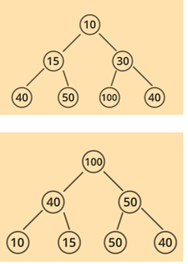

# 优先级队列与堆


当我们需要找到一系列东西里面的最重要的东西，而不是先后顺序找东西的时候，我们就需要优先级队列

# **优先级队列**

优先级队列是由零个获得多个元素组成的集合，每个元素都有自己的优先值

优先值可以由元素特定的值体现，当这个元素在队列里时，我们也可以修改他的优先值

在弹出数据时，一般不遵循先进先出的原则，而是取决于元素的优先值

## 优先级队列的操作

添加：往队列里添加新的元素

删除：删除某个元素

读取或搜索：查找或读取一个元素

```python
from typing import Any
class MaxPriorityQueue:

    def is_empty(self) -> bool:
        """Returns True if the queue is empty, False otherwise."""
        pass

    def size(self) -> int:
        """Returns the size of the queue."""
        pass

    def get_max(self) -> Any:
        """Returns the element with the maximum priority."""
        pass

    def remove(self, index: int) -> Any:
        """Removes and returns the element at the specified index."""
        pass

    def put(self, the_object: Any) -> None:
        """Inserts the element the_object into the queue."""
        pass

    def remove_max(self) -> Any:
        """Removes and returns the element with the largest priority."""
        pass

```

## 两种优先级队列

优先级队列分成最小和最大优先级队列，这两种队列里，查找和删除的操作分别针对优先级最大和最小的元素进行

## 从树，堆看优先级队列

### 堆的定义

有一个二叉树，其是完全二叉树，同时其每个节点的值都小于其父节点的值，其还是一个满二叉树，我们称其为堆

通过对下面两种树的学习，我们能理解这种队列是怎么实现的

### 最大值最小值树

最大值树，指的是树的每个节点的值都大于等于其子节点

所以，在最大值树中，最大值的值在根节点上

最小值树，指的是树的每个节点的值都小于等于其子节点

所以，在最小值树中，最小值的值在根节点上



### 最小堆和最大堆

堆也可以用来表示优先级队列，其实就是树

堆也分为两种，最小堆和最大堆，其分别对应最小树和最大数

### 我们可以利用数组来存放堆


**插入操作**

插入操作包含添加一个叶节点，比如我们添加一个12


显然，这不符合最大二叉树的定义，我们需要调整节点12的位置，我们从当前的位置开始，一次次向上冒泡（和父节点交换位置），直到自己的父节点比自己大为止


此时，12成为了15的子节点，12正好找到了大于自己的父节点

所以，对于在叶结点新加的节点，我们只需向上冒泡，找到第一个小于等于他的父节点就好

当然，如果我们添加了个巨大的节点：


就会变成这样


**删除操作：**

很简单，找到你需要删除的节点，将其与自己较大的子节点向下冒泡，直到成为叶节点，最后将其删除即可

### **堆化**

堆化，指让他成为一个堆

堆化的对象是一个普通的完全二叉树或不符合堆性质的树，在堆化过程中会涉及到调整堆的操作

**调整堆**

我们将堆中元素互相替换的过程称为调整堆

在插入元素的过程中，堆上可能会出现节点顺序混乱的情况（比如上文添加21），这会导致堆性质被破坏，不再是最大堆或最小堆

我们就用调整堆的方法adjust（i，j）将从索引i到索引j的这一段混乱的子树转化成堆

**调整的过程**

调整堆，通常是叶节点所在的最小的子树开始的，我们先将叶节点和其根节点组成的树调整成堆，接着以这个树作为子树，根节点的父节点作为新的根，调整为堆

通过这样调整，我们发现低级的树已经被调整好后，在高一级调整树的时候，就可以将已经调整好的子树作为整体来调整

所以利用这种调整方式时，adjust的j值，也就是索引的最大值一直是叶节点的位置，全程是不变的

例


可见1的左子树中9的位置错误，导致这部分堆性质破坏，需要被调整

首先：

调整9和其根节点构成的树，也就adjust（4，8）调整从4到9的所有节点，由于涉及的节点只有4 和8构成了树，调整即可


接着，我们让叶节点的值不变，调整（3，8），此时，需要调整的树的范围被扩大了，包含了3，6，7节点构成的树，这个子树确实也不符合最大树的结构，需要调整


接下来，adjust（2，8）将调整范围扩大到2节点，也就是说，多了一个由2 4 5 8组成的子树，很显然，3太小了，需要直接冒泡冒到叶节点


最后adjust（1，8）将需要调整的节点范围扩大到整个树，此时，只要将1冒泡的最下方即可·


4,9 3,9 2,9 1,9

我们发现，对于一个完全混乱的树来说，想让其堆化，我们就要做到调整方法adjust应用到每一个节点

这也意味着我们要从第一个子树开始，一个一个实现规整每个树，此时adjust的第二个参数一定是索引的最大值n，那么第一个参数该从几开始呢？

我们看下买你的满二叉树的图


根据树层序遍历的性质，我们从1开始算索引，如果从5对应的索引开始，正好开始遍历最右侧的子树，此时在将5的索引减一，就把范围扩大到2，就又只多了一个子树需要调整

那么此时最后一个节点的下标是15，15 // 2的结果是7，正好是5对应的下标

对于前面的例题来说，1对应的下标是8 8 // 2 = 4 正好对应3的节点，所以我们找到了一步一步调整堆的起始点：

调整的代码：

```cpp
public void heapify(int n)		
{			for (int i = n/2; i!=0, i--)			  
 adjust(i, n);		}
```

练习：叙述将下面的树转化成最大堆的堆的过程


[答案](优先级队列与堆/答案%2020205a2041d2808f9279ef29d6d618b4.md)