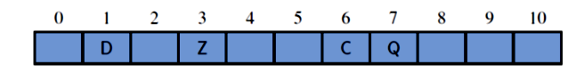

# 哈希，哈希表

所有者: H34V3N

# 哈希

一种技术，能够把任意长度大小的数据映射成一段固定长度的数据

我们在[加密方面](https://www.notion.so/1c205a2041d280308a21dc0ae9bae33d?pvs=21)能用到这个技术，同时在数据结构上 我们有哈希表存储数据，将固定的键和值存储到一起，实现了py中字典的功能

我们拥有一个表，其每个格子的位置有数字作为索引，那么，我们就能通过索引找到这个格子的位置，对其中的信息进行操作

但是 如果我想让对应的索引不再是有顺序的数字而是别的东西呢？

我们能通过一种函数，将你想起的键的名字转化成一个有规律的数据 用作存储的地址，这种函数称为哈希函数，在其转化的作用下，我们能根据自己想的键，实现数据的存储

我们输入key key通过函数转化成数组，或其他有序结构的地址值，来访问对应的数据

例：

我们要存储我们这一级的学生的数据，想实现利用学号搜索对应数据 而2024届的学生，学号都是20204开头 之后的是顺序 如2024114，2024001，2024514，这时，我们以2024114为索引保存数据，就很别扭 浪费了2024000个空间，但是如果我们设计一个哈希函数，让2024114转化成114 2024001转化成001……这样就实现了键和地址值的对应，同时让机器和人都很舒服

我们将哈希表中每个存储信息的位置称作桶（bucket），按理来说，每个键和桶都一一对应着，这个桶就成为这个键的主桶

**你说得对，但是桶就100个空间，哈希表转换出一个250，你不炸了**

我们就利用除法哈希函数，

如果转化的索引太大（比如106）我们就对数组的总长度取模得到6，在索引的范围内，就将其保存在6的位置

# 应对哈希冲突：

有时哈希函数未必尽善尽美，可能因为输入不同的数据，函数一读操作输出了相同的结果，我们称这种情况为哈希冲突

即多个键对应一个主桶（比如不同的数取完模是一样的），就会出现错误

## 解决方案：桶数组：

既然会映射到同一个地址，那就让这个地址多存几个数据嘛

我们知道，既然有几个键会对应到同一个主桶，我们先把他们的数据存起来，再在主桶里细分一下不就行了

比如 xiaoming xiaohong在一个哈希函数里转化成了同一个地址值，我们就在这个对应的桶里再建一个哈希表，再以xiaoming xiaohong为键，保存数据

我们通常用链地址法实现

我们将每个桶改成链表，如果遇到不同的键指向同一个主桶，我们只需增加这个桶对应的链表的节点即可

## 链地址法：

成型之后就是这样的

我们同样还用取模的方式确定键对应的主桶

这样，进行查找（直接在链表里找），删除（先查找有没有再删除），添加都变得方便

**或者好几个键转出同一个66，桶都搁不下，你不炸了**

所以我们需要一个溢出处理机制，线性探测

### 线性探测：

线性探测可以作为桶和桶分担数据的规则，也可以是桶数组实现的方式之一

如果指向的空间已经被用了，我们就顺延到下一个可用的空间，如果顺延前或顺延后的索引超了，我们就接着利用取模 % 来实现找到对应的地址

如果转化的索引太大（比如76）我们就对数组的总长度取模得到6，在索引的范围内，就将其保存在6的位置

后来55 取模也是6 但是6被占用了，就往后顺延 7 % 7 = 0 0也被占用了，就往后顺延到1，1是空的，就保存在1

**在这种规则下，我们该怎样检查元素呢**

我要搜索键something的桶是不是字符串”ottomother”,到到哈希表对应的位置一看，发现是“mlxg”，可见和寻找的值不同，考虑到有线性探测的防溢出方式，数据可能被存储到附近的桶 ，系统会接着检查这个桶相邻的位置，结果会有三种情况：

- 找了半天找到了，说明对应值存在
- 遇到了一个空桶：说明顺延也没顺延到这个空桶存储数据，就是压根没存，返回数据不存在
- 又回到了主桶：好家伙数组翻遍了也没找到这个值，回到原点了。说明无数据

**在这种机制下，删除元素变得更为麻烦**

如果直接删除一个元素的话，可能会导致自己对应的桶变成空桶，哈希函数转化后的地址相同的键，在寻找对应元素时，因为遇到这个空桶而返回未找到

如果盲目将后面的元素往前顺延堵住缺口的话，可能会影响本身对应的着的数据

所以还是尽量使用链地址法

## 

# 总结：

一个好的哈希函数能够做到主桶均匀分布，这样能避免主桶重合的问题 减少算力消耗

我们有100个键，其正好对应到100个不同的桶或九十几个不同的桶，这就是分配的比较好的，如果这100个键都被分配到地址为0的桶，那这个哈希表就不太行

例题

9 1 2 4 0 3 5 6