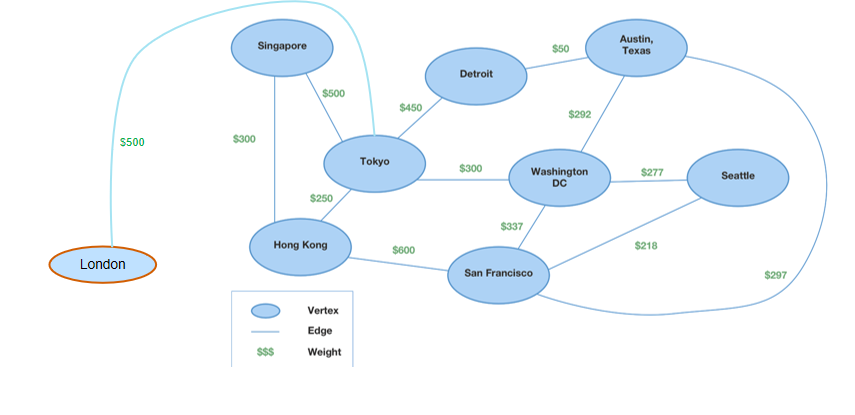

# 图

所有者: H34V3N

图是一种数据结构，由一组节点（顶点）和相互关联的边组成，这种边揭示了节点间的联系

比如这就是一个图

我们可以把二元关系表示成图，整个系统里只有两个东西之间会产生关系，不会出现三个及以上的东西的关系

我们可以把图分成两大类：

**无向图**

无向图中，没有方向的边，成为无向边

由无向边构成的图叫无向图

**有向图**

有方向的边叫做有向边，由有向边构成的图叫做有向图，有向图两个节点的来回是不同的，单向箭头一般表示可以去不能回

- 图常见的表示方法有

[集合表示法](图/集合表示法%201f305a2041d2809db0afefa24b62d642.md)

[邻接矩阵表示法](图/邻接矩阵表示法%201f305a2041d2801f8a6adae233487bdb.md)

[链式邻接表](图/链式邻接表%201f305a2041d28077a64acab34cf7d263.md)

# 与图有关的术语

相邻顶点：能由一条边边连接的顶点

顶点的度：某个点相邻顶点的数量

对度的求和：所有顶点的度的和/所有边的数量，再乘2

所以，对于图来说，每个节点保存的信息除了自己携带的信息之外，还有和自己相连的边的信息

## 路径

路径：一整个顶点序列，从顶点1 到顶点k，每个顶点都是依次相邻的

简单路径：整个路径没有重复顶点

比如一个路径从1到4：1 → 2→3 →5 → 4

环路径：在简单路径的基础上，第一个节点和最后一个节点是相同的

如1 → 5 → 4 → 1

## 连通图和非连通图

连通图：如果任意两个顶点之间至少存在一条路径，我们称其为连通图

非连通图：不是连通图

如：

连通图

非连通图

很明显，他俩断开了

## 完全图

一个具有 n 个顶点和 m 条边的图，如果任意两个顶点都相邻，那么它就是完全图

例

非完全图

根据定义，在完全图中，n个顶点的每一个都和n - 1条边相连

根据度和公式，我们求出度和应为 m = 0.5 *(n(n - 1))

所以，对一个任意给定的图，我们通过判断m 和0.5*（n（n - 1））是否相等来判断是否是完全图

# 图和树的区别

树的节点在链接的时候不会出现环状的链接，但是图会

所以，树只能单向地往下走，但是图不一样，你可能回到原点

# 生成树

生成树是一种图，也算是一种树，但他从任意一个顶点出发，到任意一个顶点都有路径，但是没有回路

对于这样一个图

他的生成树可以是这样

也可以是这样

只要把每个节点都连起来就行了

# 图搜索的方法

两种问题

- 这个节点，都和哪些节点相连
- 找到起点和目标点的最短路径

## 当前节点和哪些节点相连

也就是说，有没有一个路径实现从当前点到目标点，如果有，就说明目标点和当前点相连

我们从起点节点开始，一直搜索当前节点的下一个节点，直到找到目标节点

如果存在从u到v的路径，那么也存在从v到u的路径

两种常用的搜索方法

- [广度优先搜索BFS](https://www.notion.so/BFS-1fa05a2041d280dbbe96e55447da5c4e?pvs=21)
- [深度优先搜索DFS](https://www.notion.so/DFS-1fa05a2041d2804dabfbf31a8c76d735?pvs=21)

# 割点/Artculation Points

像图中1这样的点，如果把他去除的话，会导致整个图分成多个小部分

我们称这样的点为割点

但是像这样的图

1到5无论移除哪个点，这几个点还是能互相连着的，这样的图没有割点

# 双连通图/Bioconnected graphs

上文提到的，没有割点的图，就是双连通图

判断这种图是不是双连通图，需要我们逐个移除节点来判断

# 带权图/Weighted graphs

带权图是每个边都有一个值的图，这个值称为权重（或价cost或长度length）

在带权图中，一条路径得价等于这条路径得所有权重的和

所以，两个顶点之间得最短路径是价最小的路径

比如，我们想找到从武汉到北京最小的路程，我们可以从武汉到河北，再到北京，也可以从武汉到广东，再到北京，这是，任意两地的路程就可以当成权重，权重最小的路线就是最近的路线

其通常用邻接数组或邻接表表示，包含和价相关的其他信息

如果Aij = 1，即节点 i j存在边 Cij就是其价

如果没有边 即Aij = 0 则其价就是无穷大

下面是一个图

我们用一个矩阵表示各个点之间的价，则其价有：

  

这是一个有向图的例子，如果换成无向图，但节点和边的情况不变，其价矩阵是这样的↓

0 5 0 3 4

5 0 7 0 2

0 7 0 0 0

3 9 7 0 0

4 2 0 7 0

此时 Aij = Aji Cij = Cji

## 带权图的表示

刚才的有向的带权图的[邻接表](图/链式邻接表%201f305a2041d28077a64acab34cf7d263.md)是这样的

我们发现，和之前的邻接表相比，此时的邻接表右侧的格子保存了边的价数据

## 带权图的路径

路径的起始的顶点称为起始点，结束的顶点称为目的顶点

我们将路径长度定义为路径上各个边的权重之和

有多种算啊可以计算最短路径的长度，比如缔结斯塔拉算法

## 最小代价生成树

在带权图的基础上，我们保留其所有顶点和权重加起来最小的边，这些边能够联通所有顶点，而不形成环，就找到了一个最小代价生成树

如图，生成树有很多种，但最小代价生成树就是右下角画黄色圈的那个

# 图抽象数据类型的规格说明

对于图来说，我们要有以下功能：

verctices（）返回图中顶点的数量

edges（）返回边的数量

existsEdge（i，j）查看节点ij之间是否有边，有则返回true 无则返回false

putedge（i，j）在节点ij中间添加边

removeEdge（i，j）删除节点ij的边

degree（i），在无向图中，返回节点i的度数

inDegree（i）有向图中，返回节点的入度数

outDegree（i）有向图中，返回节点的出度数

[有关的算法见这里](算法/算法/基于图的算法 1fa05a2041d28013b492db71ad67651c.md)