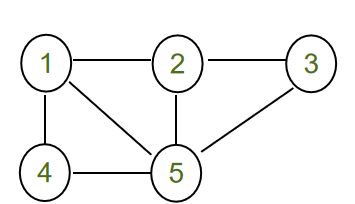
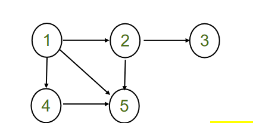

# 邻接矩阵表示法

所有者: H34V3N

对于一个具有 n 个顶点的图(G=(V, E))，其邻接矩阵是一个 (n×n) 的矩阵 A

我们用矩阵的元素 1 或0体现从i顶点到j顶点是否有边

# 无向图

我们有一个这样的图 其边很清晰

接下来用矩阵表示

比如节点1 5间就有一个边，那么矩阵元素1 5 和5 1就是1

节点2 和4之间没有边，那么矩阵元素2 4 和 4 2 就是0

可见，如果表示无向图，那么下标相反的点0 1情况是一样的，其一直是一个对称矩阵

如果是有向图，则不一样

# 有向图

有向图因为涉及方向，所以其矩阵不是对称的

矩阵元素的两个下标哦分别表示出发的节点和到达的节点

此时，节点1和节点5只有1指向5的边，所以（1，5）的值是1 ，（5，1）的值是0