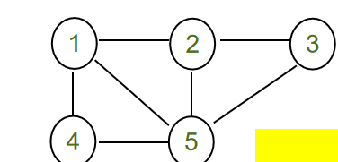

# 集合表示法

所有者: H34V3N

# 无向图

我们用 V 表示顶点集，用 E 表示边集。那么一个图可表示为 (G=(V, E))

所以顶点集V包含所有节点

V = {1,2,3,4,5}

边集E表示图里的所有边，用{a，b}表示 ab是两个用边链接的节点 比如 E = { {1,2}, {1,4}, {1, 5}, {2,3}, {2,5}, {3,5}, {4, 5}}.
• 在此情况下，我们用花括号表示边，并且图中顶点间没有箭头

就像这样

所以 V = {1,2,3,4,5} E = { {1,2}, {1,4}, {1, 5}, {2,3}, {2,5}, {3,5}, {4, 5}}.

# 有向图：

因为有向图涉及方向，所以边集E中边的表示{a，b}中的a b分别是出发的节点和到达的节点

所以，在有向图中（1，2）和（2，1）代表不同的含义

所以，我们这样表示这个图

V = {1，2，3，4，5}

E = {(1,2), (1,4), (1, 5), (2,3), (2,5), (4, 5)}