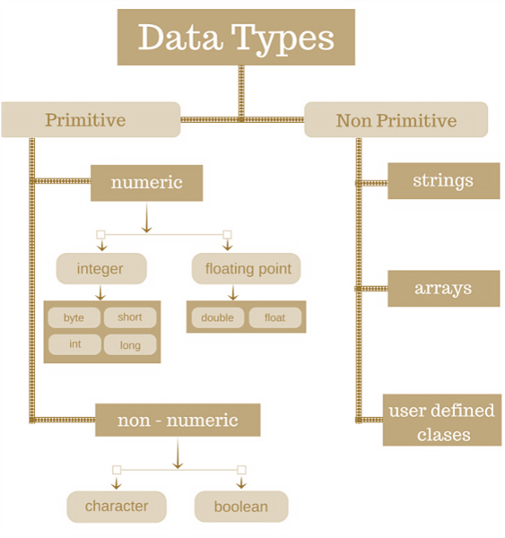

# 线性表

所有者: H34V3N

- 目录
    
    [数组和链表](线性表/数组和链表%201dc05a2041d28023bd66c9332325196d.md)
    
    [栈](线性表/栈%201e305a2041d2808d9641d33b08c75924.md)
    
    [队列](线性表/队列%201e305a2041d2809e9b0ae8976edb7055.md)
    

线性表指的是数组 链表 栈等成线性能表下标，前后只是一一对应的有序类型

其中 数组和链表是组成栈和队列的基础，可以说 栈和队列就是操作受限的数组或链表

