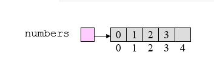

# 数组和链表

所有者: H34V3N

一种常见的数据结构其由一系列相同类型的数据组成

线性列表（数据结构）的每个实例都是一个无序的元素集合（集合），写为 （e0， e1， e2， ...， en-1），其中
ei 表示列表元素;
n >= 0 是一个有限的自然数;
ei 的索引为 i ;
n 是列表长度或列表大小;
e0 是第一个元素;
en-1 是最后一个元素;
ei 紧接在 ei+1 之前。
线性列表示例：
DSA 的学生 = （Jack， Jill， Abe， Ali， Henry， Mohamed， Mary， ...， Judy）
星期几 = （S， M， T， W， Th， F， Sa）

（想想python的列表）

通常一些有关列表的操作：

创建线性列表;
销毁线性列表;
确定列表是否为空;
确定列表的大小;
查找具有给定索引的元素;
删除（或删除）具有给定索引的元素;
在给定位置插入新的元素
按某种顺序输出 list 元素。

# 数组：

数组包含固定量的元素其长度在创建开始就不能改变 我们可以用索引来访问他们（0到len - 1）所以相对死板的数组在当其他集合（如列表使用时），会有占不满空间或空间不够用的情况

所以 我们在看一个数组的大小时分为**物理大小** 和**逻辑大 小**

### 物理大小：

指你在创建这个数组时 给他划分的空间

### 逻辑大小：

这个数组实际上已经被用来保存数据的空间

例：我们创建了一个数组 其数据保存情况如图



我们发现 其实际长度是5格 但只有四个格子保存了数据 则其物理大小是5 逻辑大小是4

### 数组的增减：

**我们在更改数组里的数据时遵循以下原则：**

·对某个数据进行替换 不会移动整体的数据

其直接替换 时间复杂度是O（1）

·删除某个数据 会让数据整体向左移动 闭合空位

以下 是删除第i个元素的代码

```python
for j in range(i, numCount - 1):
numbers[j] = numbers[j + 1]
numCount -= 1
```

过程如下图 临时被删除的数据被保存到了一个临时的空间


~~有时间把这个搞成gif~~

·添加数据 会让整体向右移动 来添加空位

```python
for j in range(numCount - 1, i, -1):        #从列表的最后一个位置开始，挨个赋成前一个位置的值
	numbers[j] = numbers[j – 1]          # 往回倒 直到添加数据处
numbers[i] = newItem
numCount += 1
```


添加或删除 要进行n - 1次循环 再操作一次某个值 其复杂度是O（n） 线性变化

## 对数组的热扩建：

我们无法直接改变数组的大小 但是我们可以将某数组中的数据转移到新的数组中，或让原始数组变量指向新数组，接下来 我们讲两种数组长度调整策略：

1.数组长度加一

在逻辑长度 到达物理长度后 我们可以新建一个更大的数组 讲原有的数据转移到其中，我们可以通过遍历语句转移元素 

假如我们有一个长度为1的数组

我们在插入一个元素后，为了扩容 我们会进行两个操作： 新建一个长度为2的数组 再转移元素

此时 转移元素语句随元素长度而变多 此时稳定1次的添加元素被忽略 每次操作（添加元素）时间复杂度是O（n）

2.数组长度直接翻倍

这是策略1的简化版，再到达上限后直接将数组长度翻倍再转移 而不是单次的加一，这样能够有效减少数组转移的操作 节省了时间资源

3.直接自己设定扩充的倍数

代码示例：

```python

def resize(array, logicalSize, sizeFactor):
	tempArray = Array(round(len(array) * sizeFactor))

	for i in range(logicalSize):
    tempArray[i] = array[i]

	return tempArray

```

总之 数组扩容操作一旦发生 其平均时空复杂度都是O(n) 因为涉及转移n个元素

而且访问消耗的时间和位置无关

其内存是相邻的单元块

其实 主存就是一个超大数组

# 列表：

py里面那个列表 相比数组在长度和存储内容都灵活很多

# 链表：

链表看起来像这样：


链表是一种单向，线性的列表，其每一项保存着这一项存储的数值，和下一项数据的地址，我们在新建链表中的一个项时，同时添加了新的一项 并且向前一项添加了自己的地址，这样就能做到灵活添加或减少元素，同时不用在意列表的长度问题（你懂吧，下一项不一定在我旁边 但是他在哪我知道 ，那我们就能联系起来）

**但是 链表的创建要相对复杂得多（我指的是从零定义 ，用别人写好的不算）：**

我们要新建一个类 这个类包含自己的值，自己在链表中下一个的元素的地址（通过对c艹的学习 我们知道任何数据都有一个自己在内存中的地址值） 以及其他有关增减数据的操作函数

其过程大概如下图：

新建一个链表 ，再为其定义第一个数据，链表的第一项指明了链表中第一个数据和最后一个数据的位置接着就是第一项内容：我们发现，链表中的最后一项，其next 也就是下一项的位置的值是null

我们就可以先定义一个类node（链表的节点），其保存着两个数据：自己的值和下一个节点的地址，其中，下一个节点的地址默认是null

接着 我们定义链表类，其有队节点node操作的函数，以及三个数据：头节点和尾节点的位置，和总长度（尾节点没有也无所谓，单向链表一般不会存储尾节点）

我们在新建一个链表类时，头节点默认时null，在执行添加操作会判断头节点是不是null，如果是，则修改成添加的节点的地址。


接着进行后续的添加操作，如果头节点不是null，我们会修改尾节点的next成员，让其从null指向我们新添加的节点的位置。


**在操作链表时 我们要考虑在列表中插入数据的三种情况：开头 中间 末尾**

**1在开头插入：**

在开头设定一个


创建一个新的链表节点，他还孤独的保存在内存之中，和集体没有任何联系……

接下来 给这个节点的参数next 修改成 目前存储的head节点的地址，接下来，他就接到头上了 他的下一个节点的地址 就是之前的第一个节点

接下来 修改链表整体的值head 将头节点的地址改成新的节点的地址‘

接下来 修改链表的大小参数，加一

**2在末尾插入：**


与在开头创建节点不同 这次无需修改新节点的下一个节点地址，修改添加新节点前的节点的下一个地址 指向新节点

同时 修改链表尾部节点位置为新位置

然后给总长度变量加一

**3在中间插入：**

在中间添加节点就有点复杂了……


我们先创建一个节点 通过操作定位到自己向插入的位置的下一个节点，，让新节点保存该节点的位置，这样新节点就和链表的一般接轨了

接下来 我们再操作一次，定位到自己前一个节点，，将这个节点的下一个节点地址修改成新节点的地址，这样就操作完成了

<aside>
💡

注意 这个操作不能颠倒顺序，如果先修改前一个节点的地址 会导致前一个地址直接指向新地址与原本的后面的地址断开

</aside>

**接下来，说一说链表的删除操作**

**删去第一个节点：**

首先判断有没有东西删

如果链表的head成员是null 说明链表中没有节点，那就会返回报错

如果不是的话：

head 参数改成 第二个节点的地址，再将总长度参数减1，就实现删去节点操作了

删去中间的节点呢：


我们直接保存起来被删的节点的下一个节点的地址，然后将前一个节点的next参数修改成被删的节点之后的节点的地址，这样在这个节点结束后 会直接跳到后两个节点，实现删除

接下来 是在之前给出的创捷链表的模板基础上，进行操作的代码：

这是一个完整定义到使用一个链表元素类型的代码

```python
# 我们要创建两个类 一个是NODE，定义链表节点的特征，下一个节点的地址，和自己节点储存的
# 数据
# 定义节点类
class node:
    def __init__(self,data):
        self.data = data
        self.next = None #定义链表节点的类
class LinkedList:
    def __init__(self):
        self.head = None
    def append(self,data):
    #这里的添加默认指在链表结尾添加，在中间添加过于复杂但是能实现，就先不写了
        new_node = node(data)
        if not self.head:
            self.head = new_node
            return #查看链表是否是空的 如果是空的，就直接修改head成员
        else:
            current = self.head
            while current.next:
                current = current.next
            current.next = new_node#如果链表不是空的，就已知搜索next直到搜索到最后一个节点，修改最后一个节点的next成员
            return
    def delete(self,data):
        current = self.head
        while current:
            if current.data == data:
                break #搜索要被删掉的节点
            prev = current #记录当前节点指针的前一个节点的指针，后面可能用
            current = current.next
        if not current:
            print("error")
            return #没搜到这个节点就报错
        if current == self.head:
            self.head = current.next
            return #如果被删的是第一个节点，直接将head成员修改成下一个节点
        else:
            prev.next = current.next
            return #使用prev 将被删的节点的前一个节点的next成员 修改成被删的节点的下一个节点。
    def display(self):
        current = self.head
        while current:
            print(current.data , end="->")
            current = current.next
        print("end")#输出链表 不再多说

ll = LinkedList()
ll.append(10)
ll.append(20)
ll.append(30)
ll.display()  # Output: 10 -> 20 -> 30 -> None

ll.delete(20)
ll.display()  # Output: 10 -> 30 -> None
    
```

```python
myl= LinkedList()#注释待施工
myl.append("H")
myl.append("E")
myl.append("A")
myl.append("P")
myl2 = myl
myl.display()
# 1111
myl.head = myl.head.next
myl.display()
#22222
myl2= LinkedList()
myl2.append("H")
myl2.append("E")
myl2.append("A")
myl2.append("P")
myl2.head.next = myl2.head.next.next
myl2.display()
```

<aside>
💡

链表相比数组的优势：

动态调整大小

插入 删除数据的操作消耗时间一般是常量，不会因操作的数据位置而改变

链表的劣势：

操作相对复杂（从头开始一堆next烦的一比）

有点消耗内存 因为每个节点在存储数据的同时要存储下一个节点的位置

链表的应用：

栈和队列的实现

图的实现

</aside>

# 双向链表：

与单向链表不同 双向链表的每一个节点新增了一个属性：prev，即前一个节点的地址

同时 链表类新增了一个成员变量end 即尾节点的地址

这样 代码就更好操作这个链表 但代价是写代码更复杂了（悲），而且又要给prev多分一些内存 信息访问的速度会更慢 因为节点是随机存在内存中的


大概就长这样

设计添加节点的代码也会变得相对复杂一些，要在单向链表的基础上，再操作一下prev参数

定义的代码：

```python
# 定义链表的代码同上，定义节点的代码更新下就好

class Node:

    def __init__(self, data):
        self.data = data
        self.prev = None  # Pointer to previous node
        self.next = None  # Pointer to next node

```

具体的添加过程类似上面 先不写了awa

删除过程我得坐着记一记

我们可以引入一个tmp1 和tmp2结点

先创建tmp1 保存了被删节点上一个节点的信息，在创建 tmp2保存被删节点的下一条节点的信息


接着把tmp2和tmp1相互连接上


当然 直接修改地址的传统派也不是不行

我们直接把前一个的next指向新的地址 把后一个的prev指向新的地址，它就变成了这种情况


看似连着 实际上这个链表已经和N2没关系啦

<aside>
💡

当一个对象没有任何引用指向它时，就会被垃圾回收器认定为可回收对象，进而在合适的时候被回收内存空间，所以 N2 符合被垃圾回收（可被视为 “被删除” ）的条件。

</aside>