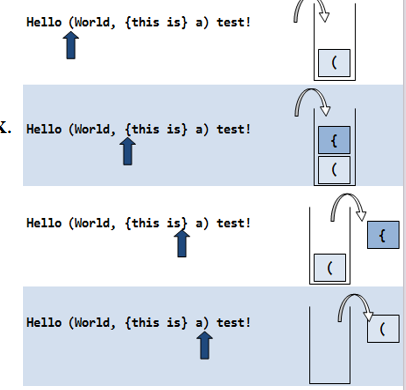

# 栈

所有者: H34V3N

一种**先进后出**的列表

我们只能从这个列表的一段放入数据，这一段叫栈顶（top）

添加元素的操作成为入栈

删除元素的操作成为出栈

典型用法：

- 一般在括号匹配时会用到（括号决定运算的先后顺序，看起来也是一层一层的，比较符合栈的定义）
    
    例：（（2 * 3） + （9 * 5））
    

机器在读取这个表达式时，读取到左括号，就把括号存到栈中，中途遇到计算结果就在内存里存入数据，如果遇到右括号，就会自动匹配栈里最外面的左括号形成整体，也能计算出括号里的数据，再遇到右括号，就接着删除栈里的右括号……直至计算结束。



（具体的计算流程再后文提到）

- 在反转一串字母时也能用到（把一串字母按顺序放到栈里，再按栈的顺序顺序取出来）
- 在错误捕捉语句中也会用到：
    
    当我们进入一个try语句块时，会让后面的语句的地址压入栈中，接着进行try语句块
    
    如果遇到报错，我们就弹出栈的地址，如果有匹配的catch块，就匹配对应的catch块，没有就接着检查。
    
    ~~（有pwn那味了）~~
    

# 迪杰斯特拉双栈算法（Dijkstra’s two-stack algorithm）：

这是一种用于计算多括号表达式的算法

我们将使用两个栈用于计算，其中一个栈用于存储运算的数字信息，另一个栈用于存储计算符号信息

我们将数字和运算符存入对应的栈中，将运算符特性和括号作为开始运算的标志，比如我们在以左括号插入为起始，在两个栈中存入各种数据，遇到右括号时为结束，此时按顺序取出栈中的数据拿出来运算，直到拿到左括号的位置上。

乘除号同理，直到结束或遇到加减号为止

我们以这个算式为例：

（1 + （（2 + 3）*（6 - 4）））其地址对应是：

1 2 3 4 5 6 7 8 9 a b c d e f 11

从左向右读取：

开始时，我们在位置1处读到一个左括号，记住他的位置

读到位置3时，得到一个数字和一个运算符，将其存储到栈


接着往后读，我们又读到了4 5 两个左括号以及之后的2 + 3，我们将其存入栈中


再往后读，我们发现了位置9的第一个右括号，那么和最后一个读到的位置5左括号形成整体，运算顺序找到了，开始计算

现在数字栈中取出 3 接着在运算符栈中取出+ 我们就知道，我们要把3 加到数字栈最后一个数字上，运算完是这样的：


接着往后读，我们有读到位置a的一个乘号 将其存入栈中，又读到6 - 4：


后面位置b又是右括号，可以进行计算，计算到最近的左括号（位置a那个）：


后面又是一个c右括号，再匹配最近的左括号 （位置4那个）


最后一个右括号，进行最后的计算：


此时，栈上只剩最后一个数，无疑这就是运算结果，系统再将其取出即可。

## 利用栈计算前后缀表达式：

**后缀表达式**

与我们平时常见的中缀表达式（类似 a + b)不同，后缀表达式先将计算数写在前面，最后写运算符

如a + b →a b +

后缀表达式相对计算机来说更方便实现，利用栈就能实现，我们来看一看这个过程

我们以a b + c d - * 为例：

 在最开始时，读取到运算数a b，就把运算数压入栈：


接下来读到运算符+弹出栈顶的两个运算数，对其进行+运算


在运算完成后，如果后续还有没有读取的运算数或运算符，就将刚刚的运算结果压入栈：


接着进行同样的操作，运算 c d -


最后读取一个*，则弹出栈顶两个数据，进行乘运算，后续没有能读的东西，则目前栈外存储的数就是运算结果


**前缀表达式：**

前缀表达式就是运算符放在两个运算数的前面

a + b → + a b

在前缀表达式中，若利用栈实现，当栈有两个相邻的值，我们就可以用这两个相邻的值之前的符号作为规则对这两个值进行运算

具体运算过程，以 - + 5 * + 1 2 4 3为例：

与后缀表达式不同，前缀表达式先从左到右读取表达式的信息存入栈中，若栈顶已经是两个运算数，下一个要被读取的也是个运算数，就暂停读取，先计算


接着，栈顶弹出两个运算数和一个符号，计算结果后，把结果压入栈中


此时，再接着读取数据，直到运算符后还是两个数


之后，按同样的规则计算结果


最后栈空了，那zhan外存储的数据就是计算结果

# 抽象数据类型栈：

栈作为一种抽象数据类型，也有一些对应的操作可以应用：

isEmpty()：如果栈为空则返回真，反之返回假

peek():返回栈顶的元素

push(self;item)：向栈中压入一个元素

(如果栈已满，则用[有限长度数组扩建](数组和链表%201dc05a2041d28023bd66c9332325196d.md)的思路来扩建栈，再进行添加操作。)

pop():向栈中移除栈顶元素，并返回该元素

(如果栈里根本没东西，就报错)

## 抽象数据类型栈的实现：

根据栈的性质，我们知道，我们只需一个线性表（列表或链表） 和一个栈的接口即可

当然 我们还要定义一个成员变量，记录栈顶的位置，当指针使

python实现：

```python
from abc import ABC, abstractmethod
#在 Python 里，abc 模块（abc 是 Abstract Base Classes 的缩写）提供了创建抽象基类的工具。该语句导入了 ABC 类与 abstractmethod 装饰器。
#它是 Python 中所有抽象基类的基类。若要定义一个抽象基类，可让类继承自 ABC 类。抽象基类无法直接实例化，其作用是为子类规定必须实现的方法。
#abstractmethod 装饰器：此装饰器用于将方法标记为抽象方法。抽象方法在抽象基类里仅作声明，没有具体的实现代码，继承该抽象基类的子类必须实现这些抽象方法
#定义一些有关栈的基类，其具体操作会在之后的类定义里面重写（至于为什么这么搞，因为这个基类后面的代码还要用awa）

class Stack(ABC):
    @abstractmethod
    def is_empty(self):
        pass
    @abstractmethod
    def peek(self):
        pass
    @abstractmethod
    def push(self, item):
        pass
    @abstractmethod
    def pop(self):
        pass
class ArrayStack(Stack):
    def __init__(self, initial_capacity=10):#初始化操作，通过给initial_capacity赋值 来决定栈的容量（构造函数）
        if initial_capacity < 1:
            raise ValueError("Initial capacity must be >= 1")
        self.stack = [None] * initial_capacity
        self.top = -1#定义初始化后栈顶的位置
    def is_empty(self):
        return self.top == -1
    def peek(self):
        if self.is_empty():#判断栈是否为空
            raise IndexError("Peek from empty stack")
        return self.stack[self.top]

    def push(self, item):
        if self.top == len(self.stack) - 1:  # 判断这个栈是否已满
            new_capacity = len(self.stack) * 2  # 如果满了 我们就新建一个更长的栈数组
            new_stack = [None](数组和链表%201dc05a2041d28023bd66c9332325196d.md)，往回看
            for i in range(len(self.stack)):
                new_stack[i] = self.stack[i]
                self.stack = new_stack
            # 进行栈添加操作
        self.top += 1#移动栈顶
        self.stack[self.top] = item

    def pop(self):
        if self.is_empty():  # 判断栈是否为空
            raise IndexError("Pop from empty stack")
        item = self.stack[self.top]
        self.stack[self.top] = None#修改当前位置的数据 改成none 意为删除
        self.top -= 1#移动栈顶
        return item
```

python类还不会写 记得搞明白了

注意我们是如何使用一维列表 `stack` 来存储元素的，这些元素的数据类型可以是任意 Python 对象。这与 `ArrayLinearList` 的数组实现方式完全相同。我们还使用了一个整型变量 `top`：

- 栈顶元素位于 `stack[top]`；
- 栈底元素位于 `stack[0]`；
- 栈中的元素存于 `stack[0:top + 1]` 这个切片范围内；
- 若 `top == -1`，则栈为空；
- 栈中元素的数量为 `top + 1`。

# 链式栈：

链表 + 栈 不再使用数组，而是用链表存储栈中的元素

其实这个相比传统链表相对简单，因为栈的特性不会涉及删除链表首节或在链表中间增减节点

因为链表长度不限，我们也无需再进行内存扩建工作，只是链表存储地址的特性是其内存花费增多。

定义代码：（stack类接着用前面的）

```python
from abc import ABC, abstractmethod
class Stack(ABC):
    @abstractmethod
    def is_empty(self):
        pass
    @abstractmethod
    def peek(self):
        pass
    @abstractmethod
    def push(self, item):
        pass
    @abstractmethod
    def pop(self):
        pass
#你看 在这用到了
class Node:
    def __init__(self, data, next_node=None):
        self.data = data
        self.next = next_node
class LinkedStack(Stack):
    def __init__(self):
        self.top = None
#return true if list is empty
    def is_empty(self):
        return self.top is None

# return top element of stack
# throws EmptyStackException if stack is empty
    def peek(self):
        if self.is_empty():
            raise IndexError("Peek from empty stack")
        return self.top.data

    def push(self, item):
        self.top = Node(item, self.top)

    def pop(self):
        if self.is_empty():
            raise IndexError("Pop from empty stack")
        item = self.top.data
        self.top = self.top.next
        return item
#一些操作
if __name__ == "__main__":
    s = LinkedStack()
    s.push(1)
    s.push(2)
    s.push(3)
    s.push(4)

    while not s.is_empty():
        print("Top element is", s.peek())
        print("Removed the element", s.pop())
 
```