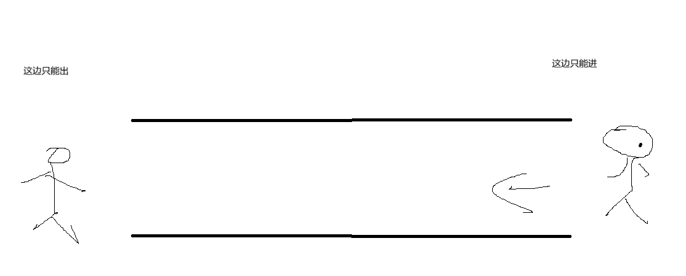

# 队列

所有者: H34V3N

与栈不同，队列是一种先进先出的列表

这东西就像一个管子



我们进行添加操作时，永远只是在特定的一边添加数据，进行删除操作时，只能在另一边删除

# 队列的应用：

- 硬件上，当一种资源在多个使用者之间共享时，例如，（在）CPU 调度、磁盘调度（等情况中）
- 不同的进程协同工作传递数据时，因为程序输出和接收的速度不同，会设立一个缓冲区，这个缓冲区就是队列，先被输出者接入缓冲区的，先被接收者接收，保证信息传递的顺序不变
- 网络打印机也是这个原理

# 队列有关的操作：

isEmpty(self)：检查队列是否为空

peek（self）返回队列的第一个数据

put（self,item）把一个数加到队列的**末尾**

remove（self）把队列的**第一位**删除 并返回

代码实现：

python

```python
from abc import ABC, abstractmethod

class Queue(ABC):
    @abstractmethod
    def is_empty(self):
        #返回这个队列是否是空队列
        pass

    @abstractmethod
    def peek(self):
        #输出最先进去的元素，但是不删除它
        pass
    @abstractmethod
    def put(self, the_object):
        #往队列里添加一个元素
        pass

    @abstractmethod
    def remove(self):
        #删除队列里添加的第一个元素，并将其输出出来
        pass

```

如果使用数组来构成队列，我们就需要一个一维数组和两个指针，分别指向队列的头尾

其中 头指第一个元素前面的那个元素（元素下标 - 1）

尾指针指向上一个被添加进来的元素的位置

初始化一个队列，其指针应该是这样的


# 队列的分类：

队列分为两种 线性队列和环状队列

## 线性队列：

长这样


### 删除数据：


开始时front = 0，rear = 3

如果我们执行操作，移除A


这时 front = 1，rear = 3

### 添加数据：

如果我们再执行操作，添加B：


此时front = 1，rear = 4

**要是。。。。数据加到头了呢？**

我们发现，线性队列删除先进的数据，不会使删掉后剩余的空间被利用。

所以，我们可以将数据统一移到数组的左边

C D E  _ _ _ 

成为这种情况

我们定义满的队列，是元素数量是数组容量减一的队列

### 实现代码：

python

```python
from abc import ABC, abstractmethod

class Queue(ABC):
    @abstractmethod
    def is_empty(self):
        #返回这个队列是否是空队列
        pass

    @abstractmethod
    def peek(self):
        #输出最先进去的元素，但是不删除它
        pass
    @abstractmethod
    def put(self, the_object):
        #往队列里添加一个元素
        pass

    @abstractmethod
    def remove(self):
        #删除队列里添加的第一个元素，并将其输出出来
        pass

class queue(Queue):
    def __init__(self,num):
        self.myarray = [None] * (num  + 1)
        self.front = 0
    def is_empty(self):
        return self.front == 0

    def peek(self):
        if self.is_empty():
            print("queue is empty")
            return
        return self.myarray[0]

    def put(self,target):
        if self.front == len(self.myarray) - 1:
            print("queue is full")
        else:
            self.myarray[self.front] = target
            self.front += 1
    def remove(self):
        if self.is_empty():
            print("queue is empty")
            return
        tmp = self.myarray[0]
        for i in range(0,self.front):
            self.myarray[i] = self.myarray[i + 1]
        self.front -=1
        return tmp
```

我们发现，在删除数据的时候，需要调用复杂的代码实现所有元素往前移

这时候，我们如果用环状队列，就免了这个问题

## 环状队列：


可见 环状队列首尾相接，根据下标可知 front = 1,rear = 4

这里的前端指针，指的是第一个元素的位置，再按逆时针方向的下一个位置（看图就懂了）

### 添加数据：

如果我们在这个队列里执行添加操作


在队列的尾部添加数据，那么尾部的下标按照顺序往后推一位：

front = 1 rear = 5

但是，再加一个数呢……

我们发现，再加一个数，下标就推到0了

这个环状的空间有限，遇到这种情况，不会将下标扩充到6，而是接着使用下标0。这涉及到取模操作，计算方式：

（5（当前下标） + 1） % 6（总长度） = 0

其实，对于每一个添加操作，都有这个计算过程，只是在下标没有溢出时，计算结果和直接加一的计算结果相同

那我们接着添加数据……


啊 被塞满了

我们发现 所有空间都被使用，此时，front 和 rear指针指向了同一地方

我们不禁疑问，好像队列是空的时，也是这么判定的……

所以 一般避免环状队列被填满，如果差一个就填满了 就及时扩充容量

扩充容量的操作：


开始是这样的

接下来，我们，将掰开的列表加倍


front = 5 rear = 4

此时 我们发现，这个队列中67位置的数据脱离组织了，他们本该紧紧贴在0位置的后面，我们就把他们移动到这个列表的尾部：


舒服了

要是我们再规整一下：


总结一下具体操作方法：

我们先新建一个双倍长度的数组，我们发现，空着的5将队列分成了两部分，我们将5之后的部分按顺序放入新的列表，再把5之前的一段按顺序放入列表

就实现了扩充。

### 移除数据：

初始状态


我们进行删除操作时，front指针顺时针移动1格，指向目前第一个数据的位置，我们再将这个位置的数据返回 再清空，就实现了删除


### 实现代码：

python

添加操作和扩充操作还没写——————

```python
from abc import ABC, abstractmethod
#库的作用栈中已讲
class Queue(ABC):
    @abstractmethod
    def is_empty(self):
        """Returns True if the queue is empty; otherwise False."""
        pass

    @abstractmethod
    def peek(self):
        """Returns the front element of the queue without removing it."""
        pass

    @abstractmethod
    def put(self, the_object):
        """Adds an object to the rear of the queue."""
        pass

    @abstractmethod
    def remove(self):
        """Removes and returns the front element of the queue."""
        pass
class ArrayQueue:
    def __init__(self, initial_capacity=10):
        if initial_capacity < 1:
            raise ValueError("Initial capacity must be >= 1")
        self.queue = [None] * (initial_capacity + 1)
        self.front = 0
        self.rear = 0
    def is_empty(self):
        return self.front == self.rear
    def peek(self):
        if self.is_empty():
            return None
        return self.queue[(self.front + 1) % len(self.queue)]
    def remove(self):
        if self.is_empty():
            return None
        self.front = (self.front + 1) % len(self.queue)
        item = self.queue[self.front]
        self.queue[self.front] = None  # For garbage collection
        return item
    def put(self,target):
        self.rear = (self.rear +1) % len(self.queue)
        self.queue[self.rear] = target
        if self.front == self.rear:
            tmp = [None] * len(self.queue ) * 2
            for i in range(0,len(self.queue)):
                j = (i + self.front)%len(self.queue)
                tmp[i] = self.queue[j]
            self.rear=(self.queue) - 2
            self.front = 0
            self.queue = tmp
        else:
            return        
```

# 链表构成队列：

链表的单向体现出来是这样的：


所以，对于链表构成队列，再添加节点时，是倒着添加的：

我们把新的节点添加到链表的头节点处。与数组构成的队列不同的是，rear指向头节点的位置 front指向尾节点的位置

代码实现：

python

```python
from abc import ABC, abstractmethod
# 库的作用栈中已讲
class Queue(ABC):
    @abstractmethod
    def is_empty(self):
        """Returns True if the queue is empty; otherwise False."""
        pass

    @abstractmethod
    def peek(self):
        """Returns the front element of the queue without removing it."""
        pass

    @abstractmethod
    def put(self, the_object):
        """Adds an object to the rear of the queue."""
        pass

    @abstractmethod
    def remove(self):
        """Removes and returns the front element of the queue."""
        pass
class LinkNode:
    def __init__(self, item, next_node=None):
        self.data = item
        self.next = next_node
class LinkedQueue:
    def __init__(self):
        self.front = None
        self.rear = None#初始化
    def is_empty(self):
        return self.front is None #如果是空的，那么头节点的地址就是空的
    def peek(self):
        if self.is_empty():
            return None
        return self.front.data
    def put(self, item):
        new_node = LinkNode(item)
        if self.is_empty():
            self.front = new_node#如果链表是空的，我们就将头地址改为新加的节点
        else:
            self.rear.next = new_node
        self.rear = new_node
    def remove(self):
        if self.is_empty():
            return None #判断减前链表是不是空的
        item = self.front.data #返回被删的数据
        self.front = self.front.next  #将被删的节点的下一个节点的地址给front
        if self.is_empty(): #判断删除后的front是不是none 如果是 说明空了，意味着尾部指向的节点也别删了
            self.rear = None  # 那尾部的节点也消失了 也是none
        return item
```