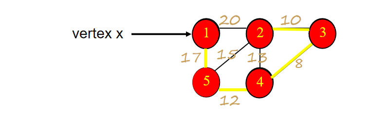

# 普利姆算法

所有者: H34V3N

基于[贪心算法](../贪心算法%201fa05a2041d28016bdafd6a61e822c22.md)，我们得到普利姆算法，用于在带权图中找到最小生成树

# 概述

我们设立两个集合，一个是整个图的节点G，和当前生成树的节点T

开始T是空集合，我们从图的起始节点开始，将这个节点加入T中

此时，我们比较T中的节点和所有不在T中的节点形成的边，找到最小的边，将这个边连接的节点加入T

重复以上操作，直到T和G的节点相同，也就是都被遍历了一遍

例

我们让1 为 x

接下来，通往5 的17最小

1 ——5

通往4的12最小

1——5——4

通往3的8最小

1——5——4——3

最后是由4到2的边最小

例2

# 算法的实现

## 存储信息

图的代价矩阵保存每个边的权重

最小代价生成树边集数组保存目标树的边集

最近顶点数组，记录不在树中的顶点i在树中最近顶点的索引k

最小代价整数变量：保存最小生成树的最小价