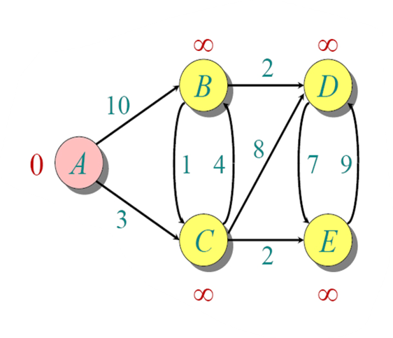

# 迪杰斯特拉算法

使用这个算法搜索最短路径，要求边的权值都是非负数

这种算法要找出图中一个固定起始节点到其他各个节点的最短路径长度

假设我们从1 开始，按照每到达一个节点，就解锁当前节点的相邻节点的到初始节点的权重，其余的被视为无法到达，权重取∞

那么开始时，是这样的

我们接下来在路径的数组添加节点A

可见 ，A到B C的权重已经被解锁。接下来在这两个里面选择最小的权重，视为即将前往的节点，再解锁目标节点相邻的节点

可见，最小的是c。添加c的同时删除选项C

我们在表格的下一行解锁和C直接相连的节点，同时标注这几个节点通过C到A的距离
接下来 DE被解锁 A通过 C到DE的权重和分别是11 和 5

因为无法从c到b，所以B的值不变，还是从A到B的权重

所以 到E的距离是最短的，选择E

因为没有通过E到其他节点的边，我们就保留原来BD的权重，按权重小则优先的原则来算

最后得到路线：

A C E B D

第二个例题

[答案](迪杰斯特拉算法/答案%2020205a2041d28092a2e4e23f6e51c4c9.md)
