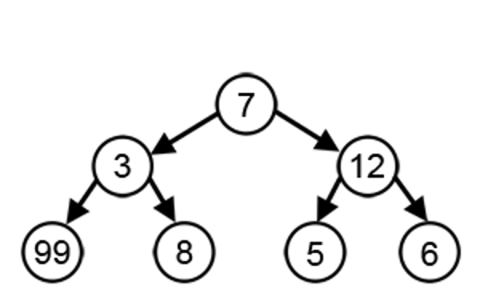

# 贪心算法

所有者: H34V3N

总是做出当下看似最佳的选择

这些算法通常用于解决优化问题，通过逐步构建来得出解决方案

这样会得到眼前的最优解，但是在整体上看未必是最好的选择

示例

假如你去商店买东西，老板要找你57块钱，他想要尽可能少的给你纸币的数量

那么他总会给你不超过剩余要找的前的面值的最大值的纸币

57 > 50 给你个50块的纸币，还要找你7块

7 > 5给你个5块的纸币，还要找你两块

2>1给你两个1块的纸币

这样，就是给你找最少数量的纸币的策略

比如上面的一个数，如果我们想得到节点的和最大的分支，我们在第一步就会选择更大的12，导致错过3的左节点99

贪心算法不一定总是有效

所以我们在使用贪心算法前，要保证局部最优解一定能得到全局的最优解

## 贪心算法的步骤

我们在使用贪心算法时，要确定这种算法的可行性，做好每一步判断，是不是最佳选择

### 选择元素

选择当前可行的最好的元素

### 判断是否合理

进行可行性检查，看看在加入你选择的元素后，是否回出现错误

### 解的检查

在选择好每个元素后，判断得到的结果是否符合题目要求