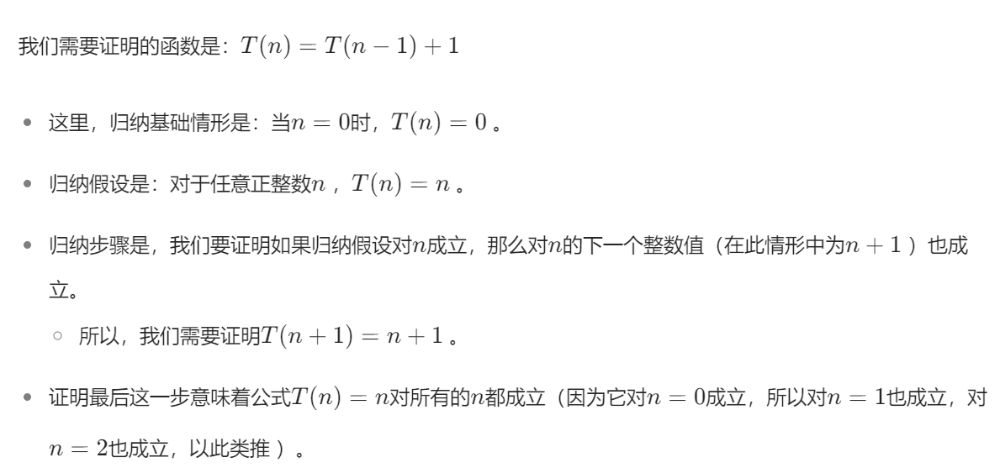

# 递归

所有者: H34V3N

递归关系是函数定义的内容，由函数本身构成的关系，不过我们也要设定一个初始值

我们以阶乘为例：

```python
def jiecheng(n):
	if n == 1:
		return 1
	else:
		return jiecheng(n - 1) * n
print(jiecheng(5)) #输出120
```

# 时间复杂度的计算：

我们以上面的递归函数为例 看看时间复杂度

## 阶乘：

对于函数jiecheng（n）我们有以下方程：

                                           **T（n） = T(n- 1) + 1**

T（n - 1）指剩下的递归层数的操作数 后面的常数是本层的操作数（未必是1）

所以 我们随着填入参数不同：

T(1) = 1

T(2) = 2

不难推断 T(n) = n

所以时间复杂度就是O（n）

接下来利用归纳法证明一下还是不是O（n）




说白了就是令n = n + 1再化简，闹麻了……

## 斐波那契数列：

代码：

```python
def fib(n):
    if n == 0 or n == 1:
        return 1
    return fib(n - 1) + fib(n - 2)
print(fib(5))
```

斐波那契是以前两个值为基础展开的

这玩意计算过程把里面的函数计算在计算 形成了一个树，如图


小了还好 要是n给大了 节点数变化如图


n每增加1 操作总数就几乎翻了一倍

其实 经过计算后表明，如果计算n个斐波那契数列，总共需要计算的次数会大于2的（n/2）次方，其实可以试一试，利用python递归计算60斐波那契，能给电脑风扇 干起来，十几分钟算不出结果awa

下图是问题规模增大性能和时间消耗的变化图：


递推关系通常涉及到2的幂次方以及2为底的对数，有下面的方法求得

# 正向代入法求解递推关系：

### 例一：

我们给出一种情况T(n) 	=   T(n/2) +1      这里的n都是2 的幂次方

所以我们设定n的值 就有以下结果：


初步观察发现 T（n） = log2(n) + 1

接下来 我们利用归纳法证明：

首先 归纳基础：

n=1时 T（1） = 1成立

假设T（n） = log2(n) + 1

那么 我们由特殊推一般：令n = 2n 则T（2n）应该是log（n） + 1 + 1

经过计算 我们发现是的awa

证明成立

### 例二：

T(n)   =   7T(n/2)

同理


推断 T（n） = 7^(log2(n))

同样的方法推理