# 作业题

所有者: H34V3N

# HW1

### 1. （20 分）给定一个升序排列的、元素为不同整数的数组 A [1::n]，设计一个算法来判断是否存在索引 i，使得 A [i] = i。要获得满分，你的算法应具有 O (log n) 的运行时间。

二分搜索的变体，只不过我们搜索的不是某个特定的数字，而是某个特定的条件

我们需要找的是是否存在值和对应索引相等的数

所以，对于索引来说，后面的数固定是前面的数+1，但是数组就不一样了：他后一个数可能是前一个数 +n 这个n最小是1，最大是任意数因为加的数可能是n，所以当前数可能会大于对应的索引值，又因为数的增长率不会小于索引的增长率，所以这之后就绝对不会再出现 A [i] = i了，符合条件的数会在这个数的前面

根据题目得知，这个数组是升序的，但数组的第一个数未知，若当前数小于索引值，那么符合条件的数一定在这个数的后后面

到了现在，我们就知道了：如果当前数值小于索引，就更新为左边界，若大于索引，就更新为右边界，以此类推进行二分搜索

### 2.（20 分）假设 A 是一个 n×n 的二进制矩阵，且每行中 1 不会出现在 0 之前。例如

A =

[[0, 0, 1, 1],

[0, 1, 1, 1],

[0, 0, 0, 1],

[0, 0, 0, 0]]

### 设计一个算法找出含 1 最多的行。要获得满分，你的算法应具有 O (n) 的运行时间。

我们采用分治的思想解决这个问题

根据题意 我们不难想到：寻找1最多的行，也就是寻找第一个1出现的最靠左的行

那么我们确定，最有可能出现1的地方，是这个矩阵的最后一列，所以我们从矩阵的右上角开始判断

在右上角设置一个指针，同时设置一个变量n记录当前指针在第几行。如果当前指针指向的这个数是0，则向下移动指针，判断是否是1，如果是，则将n更新到当前指针所在的行，接下来左移指针，直到当前指针指向的值是0.接下来我们下移动指针，直到当前指针对应的数字是1，接着更新n……

判断结束条件：若需要指针下移时指针已经无法再下移（到底了），那么当前n保存的行就是最多1的行；如果指针需要左移时无法再左移（到最左边了），那么当前指针所在行就是1最多的行，因为他全是1

## 3. （20 分）给定两个升序数组 A [1::m] 和 B [1::n]，设计一个算法来计算满足 A [i] < B [j] 的数对 (i, j) 的数量，其中 (i, j) ∈ [1::m]×[1::n]。要获得满分，你的算法应具有 O (m + n) 的运行时间。

维护双指针

我们已知本题目是一个升序数组。同时还要求找A [i] < B [j]的数量，那我们可以从B入手，筛选每一个B，寻找A中比这个数小的数有多少个，不过，我们的方法会精妙些

我们在AB维护双指针，指针初始位置都是整个数组第一个数，也就是最小的那个数。同时维护一个变量count，来记录当前找到了几个符合要求的数组

比较AB的大小，如果A中指针对应的数大于B中的，那么我们和下一个大于B的数比，也就是B中指针右移1位，再将两数组指针各自指向的数字比较

如果A小于B，那么我们这样想：当前B指针指向的值小于这个数后面的所有值，而这个数又比A当前指针指向的数字a大，那么后面的数字是不是都会比a大？所以，我们在结果n中加上B指向的数b及其之后的数的总数量，接着A中指针右移一位，重复操作

### 4. （20 分）给定 n 个正整数，将它们拼接起来，使其组成最大的数。例如，如果这些数是 123、12、96 和 921，那么结果应该是 9692112312。

这本质上是一个排序题只不过不再是单纯的比两个数的大小

我们将这些数都从整形变成字符串

我们将这些数进行一个“从大到小的”的排序：将每个数（这里指aaa 和 bbb）之间作这样的比较：比较aaabbb和bbbaaa谁大，如果bbbaaa更大，则这两个数的次序为：bbb在前 aaa在后，以此类推，直到数组中所有元素排序完成。我们在将这些数拼成一个完整的大数，就是我们要的结果

但程序需要判定一个特殊情况：题目给出的数组是[0，00，00，00].我们需要对这种数组进行检测，只有这种情况，拼接后的大数的最高位会是0，所以我们对最高位检测，如果是0的话，说明拼接结果就是0，避免得到0000000这个结果

### 5. （20 分）说明如何在 O (n) 时间内对范围在 0 到 n⁴ - 1 的 n 个整数进行排序。

按理说 排序题的时间复杂度不会小于nlogn

基数排序

范围在0 到n的4次方减一

那么 我们换一个目前少见的思路：将题目中数组的十进制数，改成n进制数：我们对这些数 通过不断除以n 取余数得到n进制写法

a = x * n3 + y * n2 + z * n1 + q

然后基数排序就好

# HW2

### 1

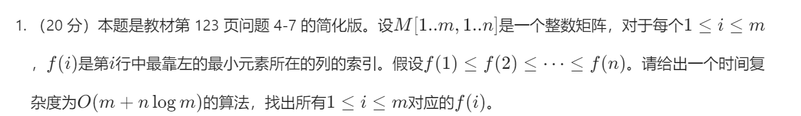

这几把题有点复杂

首先我们解释一下输入的数据：我们会得到一个n行m列的矩阵，这个矩阵每一行的最小值（若有相同值，就选择最左边那个）的索引是i，每一行的索引i的坐标都小于等于下一行索引i的坐标

现在，请在规定的时间复杂度的范围内找到每一行的索引

我们解读一下这个时间复杂度：我们可以遍历有限次列，对于每一行，采用log的时间复杂度搜索

我们可以采用二分 递归的思想，现在我们有一个7行m列的矩阵。对于每一行来说 我们用横线表示

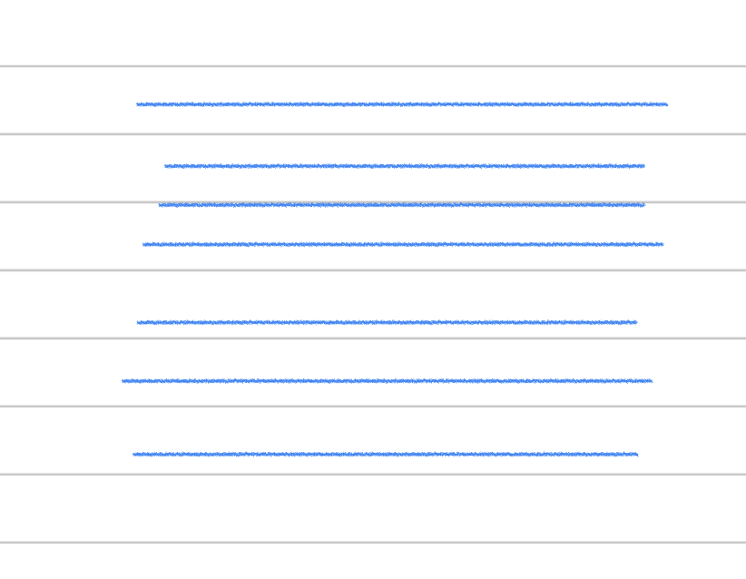

因为考虑到时间复杂度设计logn，所以我们想一想有什么将列数二分/递归的可能，我们想到了下面的方法：

我们将奇数行全拿出来，用红线表示

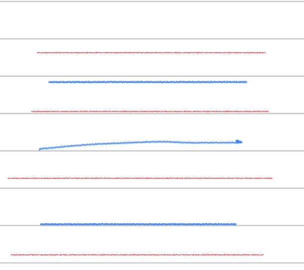

如果我们知道了所有红线里最小的值的索引，那么这几个索引将整个长度为n的列数分成了几个部分假设每个红色行的目标索引位于下图黑点的位置

那么根据目标索引随行增加而靠右的规则，每个蓝色行的目标索引一定在相邻两个红色行目标索引中间的范围里

所以，红色行的四个目标索引将整个行n分成了5个部分，而目标点一定不会在相同的部分里，所以我们一次遍历整个n，经过了一个区间，找到区间的最小值，就是某一行的最小值，而遍历一次就能找到中间夹着的所有行的最小值

但是问题来了：红色行的目标索引怎么找到呢？

当然是接着找这些红色行里的奇数行了，这次我们将找到的行变成绿色

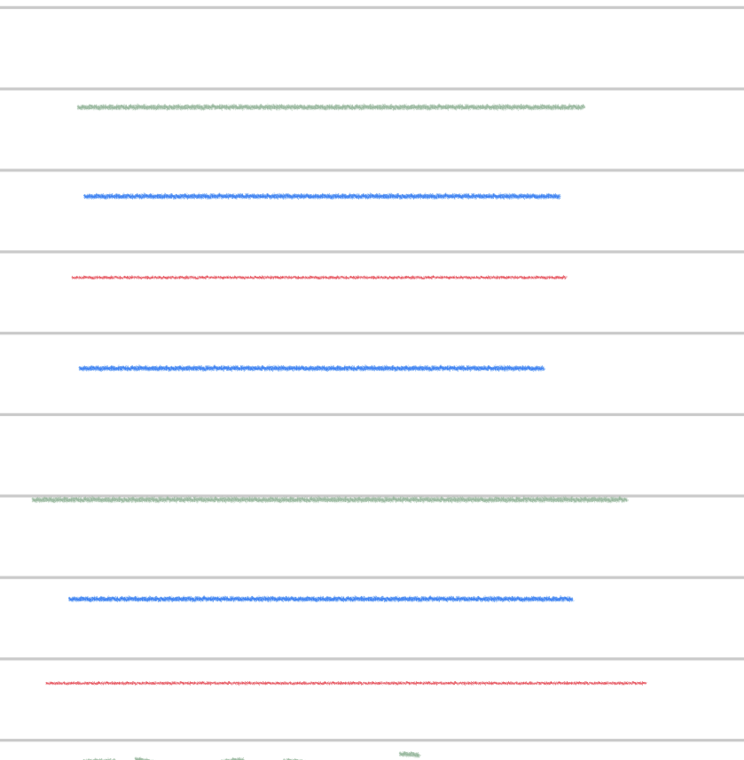

此时我们发现拿出来的行只有两行，接着我们再找奇数行，就是第一行，不过这里我们知道就行了，不在画图了~~，颜色不够~~

我们对第一行遍历整个行寻找最小值，耗时n

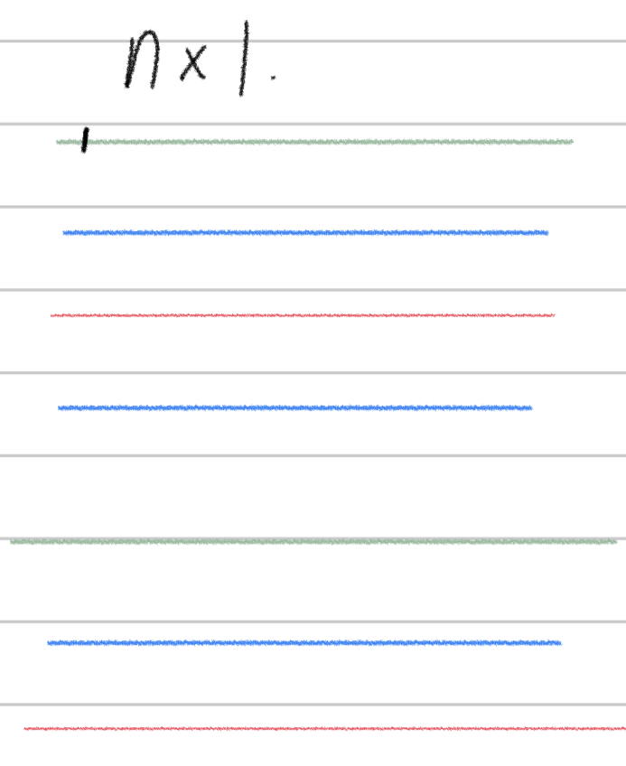

此时我们找到了第一行的范围，在图上标注上了，那么，第二个绿色行的区间我们就知道了：黑点的位置到整个n长度的剩余部分，再来一次遍历，找到第二个绿色行的目标索引

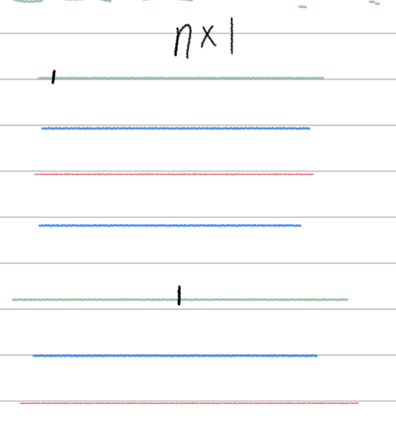

绿色行我们知道后，他们夹着的红色行，我们就能通过上述方法一次遍历得到了

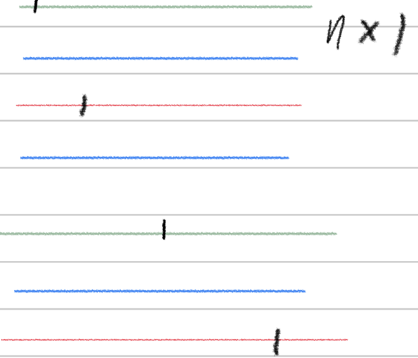

所有红色行找到答案后，蓝色的行就能通过一次遍历找到了

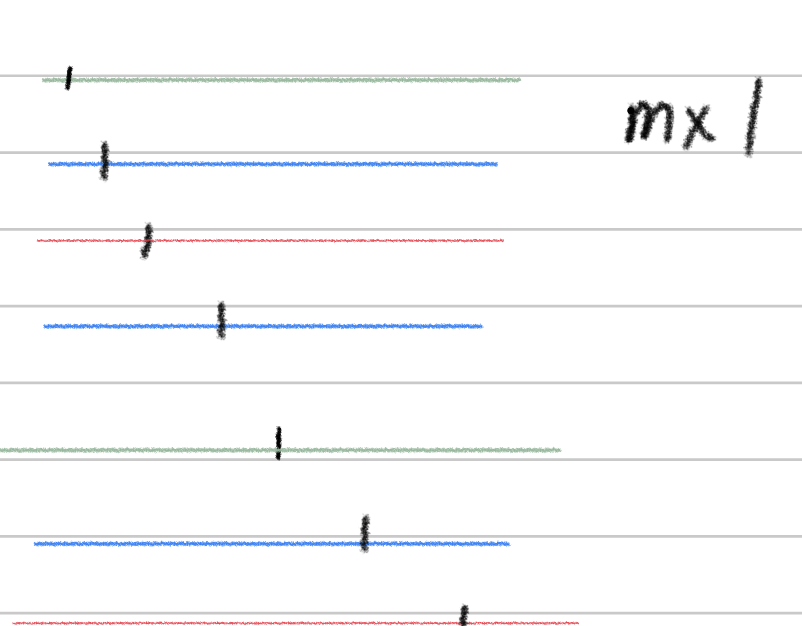

至此，题目要求的答案就出来了

我们发现，每次对整个矩阵”找奇数行“就是一个将搜索范围除以二的过程

每搜索一次奇数行（反过来的时候就是一次遍历），就相当于被搜索行的范围除以二，就是常见的二分思想。

所以总的时间复杂度是：遍历得到第一行答案的时间m 加上后续遍历log7 约等于3 次，得到答案的好事mlog7 所以总时间是 m + mlogn

### 2

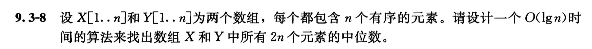

常规的找的思路：先将两个数组合二为一，合并后保持递增顺序，再找到第n个数和第n + 1个数的平均数（2n，一定是偶数个），换一种说法：前n个数的最大的那个数，和后n个数里最小的那个数的平均数

所以，我们要在两个数组X Y 里找到各自的哪些数属于前n个数，哪些属于后n个数

我们假设x中前i个数属于整体的前n个数，则Y中的前 n - y个数属于整体的前n个数

利用二分搜索来找到这个i的值：

初始设定搜索边界就是X的第一个数和第n个数，那么取其中点i = n/2，此时假设前i个数属于前n个数，也就是说，y的前n - n/2 = n/2 属于前n个数。那么理论上Y的第n/2 + 1个数是大于X中第n/2个数的，我们比较是不是这样，如果是的话，将当前i设置为新的左边界，如果不是，则设置为新的右边界，直到两边界相邻

### 3

也就是说 ，如果给这个数组首收尾相连，这个数组一定是先递减后递增这样一直循环下去

那这个数组无非就这四种情况

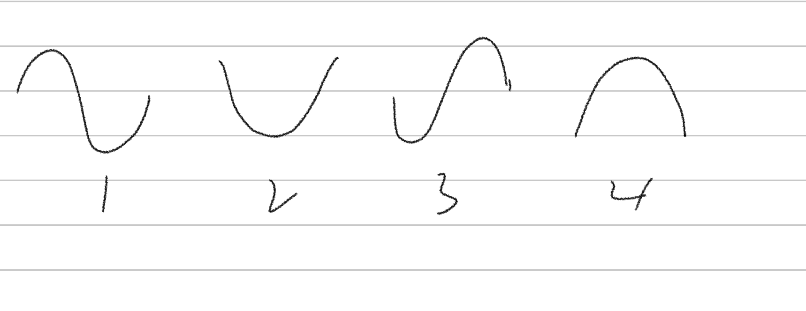

也就是说，设计一个算法，在logn内任给一种这四个结构之一，找到其值最小的位置

那么我们知道，这个最小值肯定实在先递减，再递增的交界处，问题就是怎么找这个交界处

我们将情况分成两种：

首先，我们拿到数组后，先看首位两个地方的单调性：取开头两个数 和结尾两个数来看

对于两边单调性不同的情况，如2，4

我们直接二分搜索就好

对于左边界为减，右边界为增,如2：

我们取两个边界的中点，在其左右点选择其中一个判断当前位置的单调性，若是递增，则设置其为新的有边界，若是递减，则设置其为新的左边界，以此类推，直到两个边界点相邻，此时选择更小的那个点就是最小点

对于左边界为增，右边界为减，如四

同样重复上述操作，如果当前中点是递增，则设置其为新的左边界，反之设置为新的右边界

对于两边的的单调性相同的情况，如1，3

接着，我们判断单调性是相同增还是相同减：

如果是相同增，如图1，根据单调增后必定单调减的原则，如果中间部分是单调减，那么目标点一定在这个数列的右半部分，所以我们取中间的数位新的左边界，整个数组最右侧的数为右边界二分搜索，搜索过程如下：

我们取两个边界的中点，在其左右点选择其中一个判断当前位置的单调性，若是递增，则设置其为新的有边界，若是递减，则设置其为新的左边界，以此类推，直到两个边界点相邻，此时选择更小的那个点就是最小点

如果是相同减，如图3，则取左右边界的中点为右边界。重复上述过程，此时如果终点部分是单调增，则设置其为新的右边界，反之设置为新的左边界

### 4

这个东西按单调栈的思想：直接遍历所有括号，左括号入栈，右括号让左括号出栈，如果空栈的情况下遇到右括号，则栈如一个左括号，同时翻转次数计 +1。在遍历结束后检查栈里剩余多少左括号未出栈，计数再加上未出栈左括号的数量除以二就是最少需要的次数

### 5

也就是说，找到三个数，他们的大小关系大概是这样 

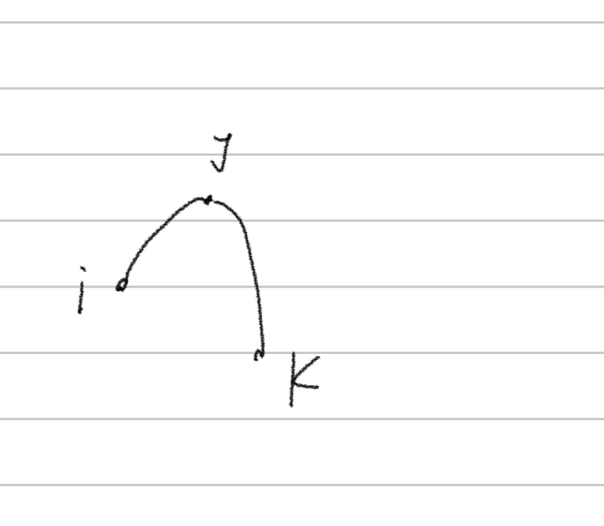

此时我们还是采用单调栈的思想：

我们先构造合理的i - j组合

维护一个栈

我们从前到后遍历整个数组，首先将第一个数入栈，接下来看第二个，以及后面的数：

如果第二个数大于栈顶，则将其入栈，如果小于栈顶，则持续出栈，直到大于新的栈顶或栈已经空了

如果连续出栈达到两次，则说明当前遍历到的数就是k，前面先后出栈的两个数分别是j i问题解决

如果遍历完数组还是没有结果，说明没有