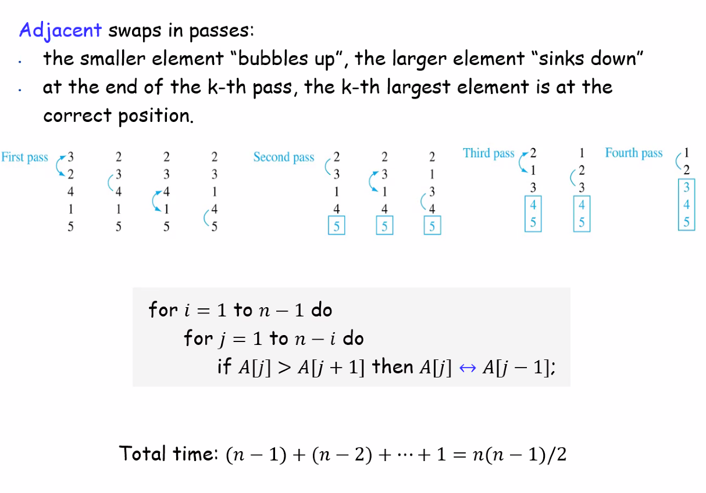

# 分类，排序

所有者: H34V3N

# 基于比较的排序

## 冒泡排序

假设需要排序的数字有n个

按从小到大排

比较分成轮，每一轮与自己前面的数比较，如果这个数比和自己前面的大，就与其交换位置，进行一次比较后，将第二个位置的数字和第三个的比较，但是少比较一次，直到比较n-1次

假设有n个数字，进行排序的次数就最多是n（n - 1） / 2，平均是n（n - 1） /  4

## 插入算法

假设从小到大排序

遍历这一串数字，将遍历到的数字与自己前面的比较，直到遇到比自己小的数字，此时将该数字排到这个数字后面

假设有n个数字，进行排序的次数就最多是n（n - 1） / 2，平均是n（n - 1） /  4

## 选择排序

假设从小到大排序‘

遍历整个数组，维护一个变量保存数组里目前遇到的最小的数，遍历完后取出最小的数，将其保存在另一个数组里，并在原数组删除它，重复这个操作，直到原数组的数全部到新数组里

不过这种排序消耗的次数固定是n（n - 1） / 2

## 归并排序Merge sort

自底向上，一个递归的过程

我们想要排序[1，7，5，2，5，6，8，4]

我们不断尝试将这个数组分成小段，从最小的段开始，如果说排序一群不好搞，排序两个总好搞吧（）直接比大小就行了

我们将这些数据一半一半地分开，分成[1，7，5，2],[5，6，8，4]

再将每一个对半分开成[1，7],[5，2],[5，6],[8，4]

然后分别比较成

[1，7],[2，5],[5，6],[4，8]

然后往上返回，再合并成两个四元数组，再合并成原本的八元数组

合并的过程用双指针方法就行了

总的时间复杂度：你所做的是在分到最细后，利用双指针合并这些数组，每合并一次都要进行一次排序 需要合并logn次，排序需要n次计算，所以整体的时间复杂度是O（nlogn）

# 决策树下限——基于比较的排序算法时间复杂度不会低于nlogn

前面涉及的所有的排序算法内部的工作原理都是挑出来两个数据进行比较，我们发现，虽然顺序不同，但是所有方法都经过了一遍每一项与其他项的两两比较

这种过程，就可以抽象成一个决策树：这个数的所有非叶节点都是数组两个元素之间的比较，这个数是一个二叉树，每个节点的比较结果（哪个数更大）引出两个分支，以此类推，直到叶节点……，叶节点的内容是排序后的结果。

可以结合下面的图理解：

我们已知叶节点的内容是所有元素的可能排列方式，那么对于n个元素来说，有n！个叶节点，这意味着这个二叉树至少有logn！层，最少比较logn！，也就是nlogn次

[有关二叉树移步这里](https://www.notion.so/1eb05a2041d28036959ff121b2920b9b?pvs=21)

[例题：用七次比较排序出这个数组](分类，排序/例题：用七次比较排序出这个数组%2027805a2041d28016bd6ecc27e2c30334.md)

# 不基于比较的排序

## 桶分类

我们可以将这种排序方法视作一种分治策略，这个桶被确定成先进先出的链表

我们在排序前，先维护几个桶，根据一定映射关系（最好是能分完所有桶后结果就出来了）

接下来比较每个桶里，先局部进行排序，最后，再根据桶的排序将每个桶里的元素依次取出，取出后的结果就是排列的顺序

这个图比较暴力。直接分出了9个桶涵盖住所有数字，在放到对应的桶里后再依次取出结果就出来了，因为桶的大小顺序是默认排好的了

## 计数分类

我们假设最大值是R - 1

假设我们需要对这个数组进行排序

我们先遍历这个数组，同时维护一个计数数组，计数数组长度是R - 1，记录待排序数组中，不大于i（0 ≤ i ≤ R - 1）的数有多少个

最后得到结果                                                                                                                                                                                                                                                                                                                                                                                                                                                                                                  

最后根据这个计数数组，将排序结果输出：

已知不大于0的数有2个 ，那么有2个0

不大于1的数有2个 而不大于0的数有2个 所以没有1

不大于2的数有四个 而不大于1的数有两个，所以2有2个……以此类推

最后的结果

时间复杂度是O（n + R）

## 基数排序

我们用这个方式排一些位数相同的整数，或是字符串

这是一堆四位数

我们知道高位大才是真的大，所以我们再运用基数排序的时候先确定哪一位是基数，这是对排序结果影响最大的，由此可见，是最高位（最左边的那一列）

我们先对最低位排序

接着依次往高位排序

我们将这些四位数就按从上到下升序的顺序排好了

[一些练习](分类，排序/一些练习%2027905a2041d280f9bc6ce51e153e37a0.md)