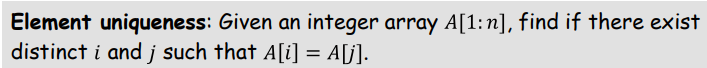

# 一些练习

所有者: H34V3N

我们可以采桶分类的方式，，就能直观看出哪个数不止一个，就是存在的

或者直接暴力遍历几次

或者先排序，看相邻的元素是否相等

维护一个n元计数数组，遍历题目给的数组，对每个出现的数字进行计数，最后寻找数组的最大值

先将这些时间戳按照从小到大的顺序排列起来，接着维护一个变量，同时遍历这个排列后的数组计算数组元素之间的差值，找到最大差值就是所求

先遍历数组两次得到所有数据两两相加得到的

首先，我们将数组从小到大排序一遍，接下来遍历每个数组寻找是否有合适的两个数

寻找方式：在数组两侧分别维护一个指针（指针不指向当前遍历到的数），接下来计算当前遍历到的数和指针所在的两个数的和，如果和大于零，则左指针向右移，若小于0，则右指针向左移，重新计算三个数的和，直到找到和为0，结束遍历输出结果

单调链扫描

两次排序，分别按横纵坐标从小到大排出两个数组，接下来维护双指针，都在两个数组的第一个元素开始，首先将纵坐标最小的点放到结果栈里，接着横坐标排序的指针右移，直到遇到第一个横坐标大于等于结果栈顶的点，接下俩纵坐标排序的点右移，直到遇到第一个横坐标大于等于横坐标数组指针指向的点的点，将其压入栈，重复过程，直到横坐标数组指针指到头