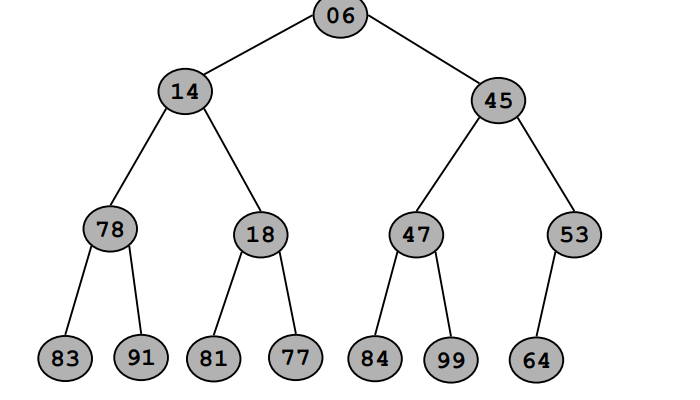

在解决问题的时候，我们应该尽可能选在满足我们的需要的情况下，选择简单的数据结

# 堆heaps

## 二叉堆：二叉树Binary heap: a binary tree

这个最小堆是[平衡二叉树](数据结构/数据结构/树 1eb05a2041d28036959ff121b2920b9b.md)：除了最后一层之外，其他所有层都是填满的

每个子节点的值都大于父节点，最小的值在根节点上

此时，如果我们按[层序遍历](https://www.notion.so/1eb05a2041d28036959ff121b2920b9b?pvs=21)，给每个遍历到的节点按顺序标记上下标，就是这样的

我们发现，对于每个节点来说，其左子节点的索引下标是自己的二倍，右子节点的下标是自己的2倍再加上1

同时，第一个叶子节点的下标是：n（总结点数 )/ 2 + 1

### 插入新的节点

在这个堆上插入一个新的节点，那么我们就有一个算法将其移动到符合堆规则的位置——向上冒泡

前文提到过，我们要求堆中父节点的值小于子节点此时若插入一个新的节点，其位置一定在叶节点上

接下来，这个新节点会和自己的父节点比较，如果这个节点的值小于父节点，那么这个节点就和父节点替换位置

重复这个操作，直到当前位置时，自己的值大于父节点的值

### 删除一个节点

删除节点也是有讲究的，我们依然需要在删除后保持堆的性质,我们采用——向下冒泡

假如我们要删除一个叶节点，那还说啥了，直接删了就行，对堆没有影响，因为自己没有子节点

但是如果我们删除一个非叶节点的节点：如根节点

我们要将整个堆按层序排序的最后一个节点（叶节点里最右边的那一个），和被删除的节点替换位置，然后直接删除被换掉的原节点

因为要保持越往上，值越小，我们和当前节点的两个子节点比较，和较小的那调换位置，如果两个都比当前节点小，挑选较小的那一个，和其调换位置

重复上述操作，直到被删除的节点被移动到叶节点，或自己小于两个子节点

### 增加或减少键值Decrease or Increase Key

对于前面的操作，我么通常都是通过指明索引来实现确定删除或增加哪一个节点的，这就是增加或减少键值，具体的实现方法就是冒泡上升或下降的方法，时间复杂度时O（logn）

## 应用：将给出的数组构建成堆

这是一个无序数组，请使用其构成堆

### 笨方法

我们直接一个一个往里加，每加一次就调整一次顺序，最后的时间复杂度是O（nlogn）

### Floyd方法

我们先按层序遍历的顺序，将这些数一个个放到一个二叉树上

此时我们可以看到，这个树是完全不符合堆的规则的，但是对于每个叶子节点来说，每个叶都可以说是一个小堆（毕竟他们没有子节点，无需再考虑和子节点的大小关系问题），我们就可以视为：每个叶子节点都已经排好了，我们要从叶子节点开始，往根节点扩散，一步一步让整个树规整起来。

那么我们一步一步倒着看索引，直到到了倒数第二层，因为9没有子节点，所以跳过，接着看6：我们发现 6 >2所以我们进行冒泡下沉操作，将其替换位置

所以。对于“6-2”这个小树来说，已经规整称堆了。接着往前遍历，可见，10也不符合要求，我们将其冒泡下沉

再往前遍历，发现3符合要求，就跳过，到上一层11：11大于两个子节点，应下沉：

以此类推，直到遍历到根节点，调整后，就把树构建出来了

**时间复杂度分析**

取一种极端的情况：每次遍历，都需要冒泡下沉到叶节点：

假设有n个数，则被分成了log2（n）层，排除叶节点外，其上的父节点一共有2的n-1次方个，而倒数第二层只需下沉（比较）一次，每遍历到上一层，剩余的未遍历节点数就对缩小一半，所以，整个比较次数的计算过程就像这样

h的范围是1到logn，说明这里的h指的是层数

当你最多下沉一层时，你的原位置就是倒数第二层，根据前面推理，这倒数第二层的数量就是n/4（我们假设叶节点全部被填满，如果不填满，那么这个量不超过2/n）

接着进行推导：

复合O（n）的时间复杂度

# 二叉搜索树Binary Search Trees

[二叉搜索树的定义前面已经讲过了](数据结构/数据结构/二叉搜索树（BST）.md)

*下面的情景是一个有关飞机降落的问题，先放一个高人在这里*

假设有一个飞机降落跑道，有好多个飞机都要从这个跑到落地，这些飞机不能在相同的时间点下降，否则就会相撞导致坠机

在天上的飞机会先往地面传输一个预定的降落时间点，地面的接收方会审核这个时间点是否合适：此前，已经收集到了其他飞机的降落时间，如果新来的时间和其他时间点相差小于3，则这个时间不可以，反之将这个时间加入这些时间点，未来再有新的时间点到来时，也会参与比较

## 笨方法

遍历这个数组，将新时间点和老时间点一一作差比较

比较的时间复杂度时O（n）

添加新时间点的时间复杂度是O（1）

## 有序数组

利用二分搜索找到离新时间点最近的两个前后时间点，和这两个比较，如果没问题，就将新时间点加入，重新排序

比较的时间复杂度：O（logn）

插入的时间复杂度O（nlogn），这是最快的情况，具体的时间复杂度依照你选择的排序算法而定

## 使用二叉搜索树

这里的键值对可以是：飞机编号：降落时间点，在后续的问题讨论中，我们忽略飞机编号，只考虑时间节点

我们知道，将整个二叉搜索树按照中序遍历遍历，那么遍历结果就是一个从小到大排序的数组

对于第一个到来的时间节点，我们将其设置为树的根节点

对于后续到来的时间节点，我们首先将其从根子节点开始比较，如果大于根节点，就和其右子节点比较，如果还是大于，则接着和其右子节点比较，若小于右子节点，则和其左子节点比较，如果小于左子节点，就接着和其左子节点比较……直到找到小于父节点，大于左子节点的位置（开始时大于根节点则找到小于父节点，大于右节点的位置），和这两个点做差求得差值，检验是否小于3

注意 我们可以视堆为一种独特的树结构，因为对于其子节点没有特定的指针指向，我们是通过边序遍历来实现编号的，而BST不同，对于每个节点来说 都有指向左右子节点的两个指针

因为BST的划分左右子节点的特性，我们知道：宏观从左往右看，这个每个节点就是从横坐标从左向右逐渐变大的

## 搜索BST中特定的值

给定一个已知的二叉树

假如我们需要搜索是否有数字5：

我们从根节点走，如果需要搜索的值大于这个节点（7），则前往根节点的右子节点，反之则前往左子节点，对于这个题来说就是前往左子节点”2“，接着重复上述过程，直到找到”5“（找到了）或到了叶节点还是没找到

## 平衡二叉树的质量

根据定义，下面的一个树也是二叉树：

这tm不是链表吗

所以我们看到，这确实符合BST的定义，但是却搞成了一个链表，这样其性能，时间消耗都是和链表一样的，我们应不断优化我们的思路，保证BST处于一个[平衡二叉树](https://www.notion.so/BST-1ee05a2041d280b6bd54d57189a40827?pvs=21)的状态

## 保持性质有序的旋转操作

这种操作能够在保证二叉树的基本顺序的基础上，实现更换根节点

对于右旋（zig）初始状态是左侧的树，我们需要让y来当根节点，根据现有状态我们知道：x 是大于y的，所以旋转后，x是y的右子节点。此时y的子树A仍然确定比y小，保留左子树状态，而y原本的右子树作为x的右子树

左旋（zag）同理

## AVL树

一种BST，其每个节点的左子树和右子树的高度不会相差超过1

### 红黑树

红黑树在普通的算法导论的基础上，通过增加颜色属性来给树自平衡的能力

其性质如下：

- 每个节点不是红色就是黑色
- 根节点是黑色
- 所有外部的“空节点”（每条路径的末尾）
- 红节点的子节点必须是黑色
- 从任意节点到其所有叶节点的路径上，黑色节点数必定相同

对于一个初始的红黑树，默认是全部都是黑色节点，在这之后，新插入的节点是红色节点

如果共色节点出现相连的情况，则进行修复程序

# BST的扩展

我们可以通过在普通的BST中增加额外的信息来实现更复杂的操作

简单的例子：x.count：和当前节点值相同的节点的出现的次数

x.size：以x为根节点的子树的节点数

但是很麻烦，因为当BST进行增加或删除操作的时候，这些节点的值也要同步更新

## 搜索整个树第i小的节点

我们从根节点开始，假设根节点的左子树的大小是i，右子树的大小是j，我们就知道：

当前节点是第i + 1小的节点，那接着我们将指针移动到左子节点，假设其左子树的大小是i1，右子树的大小是j1，那么这个节点就是第i1小的节点。如果i1 < i 则指针移动到右子节点，反之则移动到左子节点……直到找到第i小的节点为止