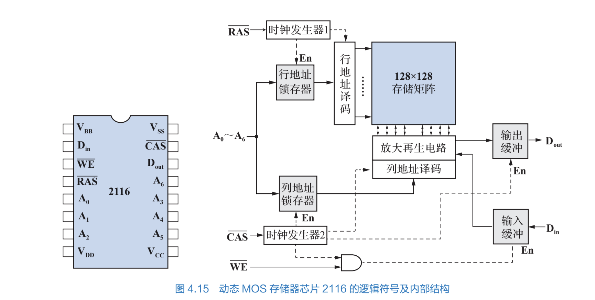

# tmp

所有者: H34V3N

左侧是2116芯片的结构，其有7个地址线 右侧7个地址有行列两种锁存器读取数据，所以能存储

# 38译码器

[全相联映射*](tmp/全相联映射%201ee05a2041d280a79c6ad08c8ec7c66e.md)

[直接相联映射](tmp/直接相联映射%201ef05a2041d28042aacaec0095cbd1dc.md)

[组相联映射](tmp/组相联映射%201f005a2041d2808ebae0d59f3ddf74b0.md)

[先进先出算法](tmp/先进先出算法%201f005a2041d280e2b045f6554ac66df5.md)

[最不经常使用算法](tmp/最不经常使用算法%201f005a2041d280f6b4c9d2c3f650113a.md)

[近期最少使用算法](tmp/近期最少使用算法%201f005a2041d2808a92bfee734460ff25.md)

[随机替换方法](tmp/随机替换方法%201f005a2041d2801a8b76c1e42a4c67f8.md)

[写穿法](tmp/写穿法%201f005a2041d280549d6adcaffaed42d3.md)

[写回法](tmp/写回法%201f005a2041d280d8b02cce321a02a185.md)

[附件：书中的微指令和MIPS汇编代码](tmp/附件：书中的微指令和MIPS汇编代码%2020605a2041d2809683b7d678832693ad.md)