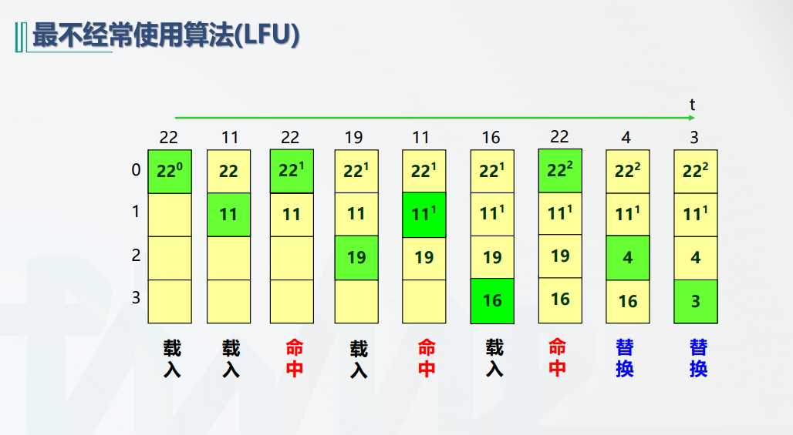

# 最不经常使用算法

所有者: H34V3N

在这种情况下，每行的会设置一个计数器，计cache上电后的历史访问情况

在需要替换数据时，将计数最少的行的数据替换成新的数据，并将计数归零

这种算法同样有缺陷，如果a行前期多次使用，但后期基本用不到了，就会导致其后期占用空间，而且无法被删除 b行前期使用的不多，但后期需要常用，在得到新的行的时候，其会因为使用次数过少被换掉，再用它时虽然还会被替换回来，但是计数被刷新了，下次替换新的数据还可能是他被替换……就会导致cache命中率降低

