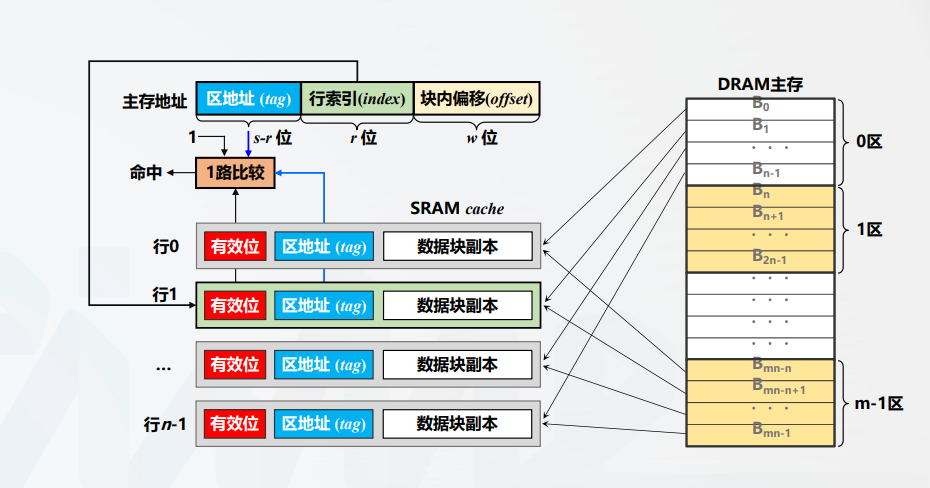

# 直接相联映射

所有者: H34V3N

直接相联映射中，每个主存块地址只能映射到cache固定的行

映射规则如下：

cache行号 i = 主存块j % cache行数n

我们也可以理解为，按cache的大小给主存分区，每个区域都能看成一个cache，只是编号不同，访问这个地址，就相当于在访问某个编号的cache的哪个位置

利用这个原理，我们可以把主存在进行细分

区地址  区内的行索引 块内偏移

和全相联多了一个区地址，就是上文说的“cache编号”

`

## 计算cache容量：

我们将主存地址的长度分别为：区地址（s - r）位

行索引r位，块内偏移w位

那么cache的块大小是2^w字节，cache的行数为n

那么对应的主存容量就是2^(s + w)字节，也就是主存地址的二进制的最大值

如果不考虑脏数据位和淘汰计数，cache的容量就是

n * （1 + s - r + 8 * 2^w）位

n指n行，括号里就是每一行的容量

其中1是有效位 为0就是没存东西 是1就是存东西了

s - r记录了块地址的信息

8 * 2^w 就是一字节八位，一共w位偏移，也就是几个小块，注意 w是二进制表示，当二进制全为一时是最大值，2 * w就是十进制的所有字节的数量，再乘8转化为位

## 硬件实现：

过程和全相联映射相似，又有细微差别

假如我们访问以下序列：

1f 20 24 48 54 55 103

### 载入的情况

在访问1f (0000 111 11) →（0，7，3）时

访问第0区第七行

行索引位于第七行，我们发现有效位值是0，访问缺失，cache没东西，那么就载入主存中对应的数据块（1C ~ 1F）到对应的位置，同时，将tag字段写入读取的区的编号，让有效位变为1，表示有东西了，再输出我们想要的数据

20 24 48 54同理

（54 →（0010 010 00） →(2，5，0),后面会用）

### 命中的情况（找着了对应了区和行）

接下来看55

55→(0010 101 01) →(2,5,1)

得知，我们要访问cache的第二区第五行，偏移量为1的位置的信息。我们到第五行，发现有效位是1 说明里面已经载入了数据了，接下来比较tag位，发现正好是2，和我们需求的2区第五行数据相同，那么，我们直接输出2区第五行偏移量为1的数据即可

### 替换的情况（行有东西，但是区是错的）

接下来看103

103→(1000,000,11)→(8,0,3)

我们要访问8区0行偏移3的数据

我们到第0行，发现有效位是1，说明有东西

接下来比较tag为 tag位是1（访问20时存储的），与我们需要的位置不同，所以，我们要载入主存里103所在的位置的信息，也就是8区0行的信息，替换cache的0行，并把tag改成8，再输出信息

这样替换，保证了位置准确，但是会出现cache某一行已知为空的情况（比如一直没有访问某区3行的信息，那这一行就已知空着），这导致对cache的利用率降低。

直接相联的适用场合：

- 映射速度快，一对一映射
- cache容量很大时，能减少冲突概率
- 替换算法简单