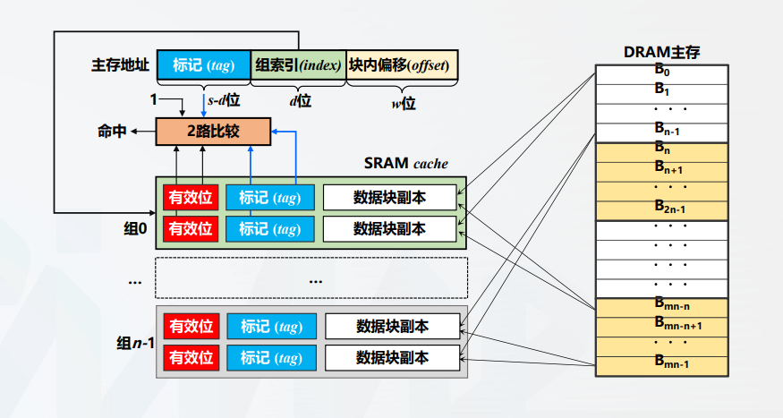

# 组相联映射

所有者: H34V3N

组相联映射是前面两种映射方式的集中，能够提高命中率，又能降低查找硬件的开销

组相联映射将cache分成固定大小的组，每组有k行，我们称其为**k-路组相联。**主存数据块先利用全相联映射的方式定位到cache的某个组里，然后采用全相联映射的方式映射到组内的某一行

映射规则如下：

cache组号 = 主存块号 % cache组数

利用这个规则，我们可以将主存地址分成以下三个部分：

标记字段tag，组索引index 和 块内偏移offset

由图可知，主存的每个块都指向了同一个cache组的所有行，这意味着，如果将cache分成n组，那么主存中编号0 到 n - 1的块会存储到cache对应的分组里，放到分组里具体哪个位置，就按全相联的规则来。

这样 我们就会发现，不同的第n行数据可以同时存在在cache中，如果搜索的话，只在存储第n行数据的范围里搜索即可

## 计算cache容量：

假设cache一共有n组，每组有b行，标记s - r位

组索引r位，块内偏移w位

那么计算方式是

n * b * （1 + s - d + 2^w）

## 硬件实现：

在接收到主存地址数据时，主存地址中的组索引index进入组索引译码器（译码成十进制的组号），找到想要的信息应该在cache的哪个组，找到后，根据标记字段tag的信息，与n个路的tag并发比较，看看有没有符合要求的tag，如果有，则输出数据；如果没有，则说明未存储，要进行添加或替换操作再输出数据

接下来，我们访问 20 54 55 103这四个位置的数据

（初始cache为空）

## 载入的情况：

### cache块全空时的载入

访问20时

20 →(00010 00 00) →(2 0 0)

可知，信息对应的组在cache的第0组，接下来进入第0组，再根据tag，搜索有没有存储这个数据，因为初始为空，所有行的有效位都是0，我们就在第一个空行里载入主存对应位置的数据，tag存上主存的tag信息，再输出我们想要的信息

访问54同理

54 →(00101 01 00) →(5 1 0)

### cache块有东西，但是没存储我要的行

访问103时

103 →(10000 00 11) →(10 0 3)

找到cache的第0组，发现被填了，但没有填满。根据tag，有效位为1的行的tag进行比较，发现没有tag 10，那么，我们直接再这一块的另一空行载入103所在的行的信息，再输出数据

## 命中的情况：

访问55时

55 →(00101 01 01) →(5 1 1)

我们找到cache的第1组，发现第一组有的行有效位是1，那么这几个是1的行进行并发比较tag值，发现之前访问54的信息时，存储了tag为5的那一行的信息，这样就命中了，输出这一行偏移量为1的数据的信息