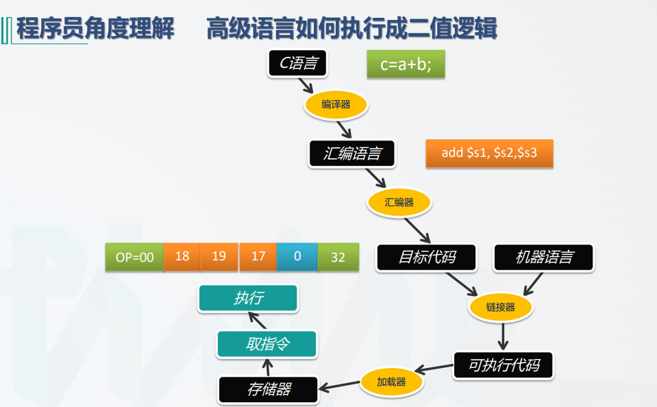

# 中央处理器

所有者: H34V3N

cpu包含运算器ALU，控制器和各种寄存器

[概述](中央处理器/概述%201f905a2041d28090b9e0cb5b621342a8.md)

[指令周期](中央处理器/指令周期%201f905a2041d2806aafb1d74b44956cb7.md)

[数据通路，指令的操作流程](中央处理器/数据通路，指令的操作流程%201f905a2041d28060a846cf496019bffc.md)

[时序与控制](中央处理器/时序与控制%2020005a2041d2802486a8fc16a9231552.md)

[控制器](中央处理器/控制器%2020005a2041d280719bb0e8c7c796ed3b.md)

[异常和中断处理](中央处理器/异常和中断处理%2020205a2041d280598d5bdcc83f02fb03.md)