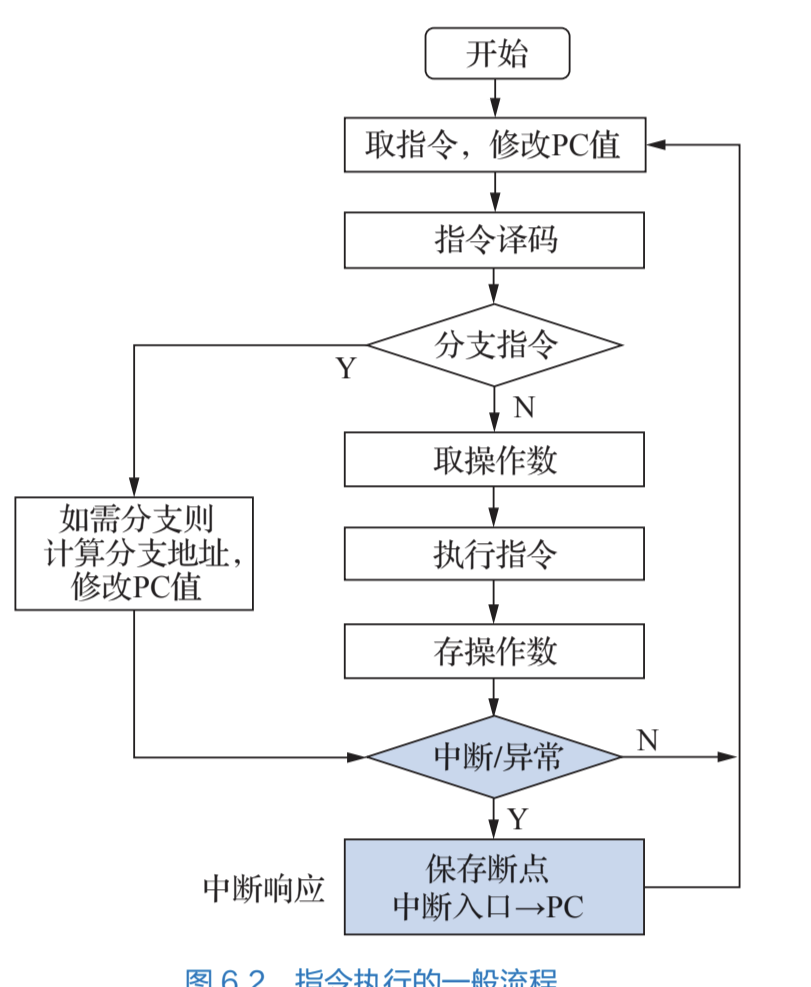
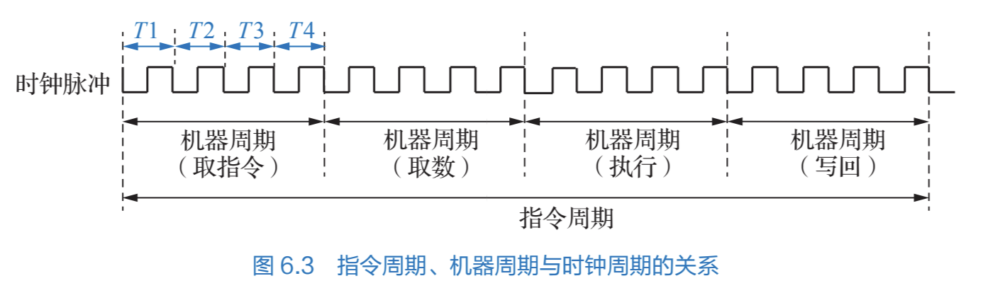
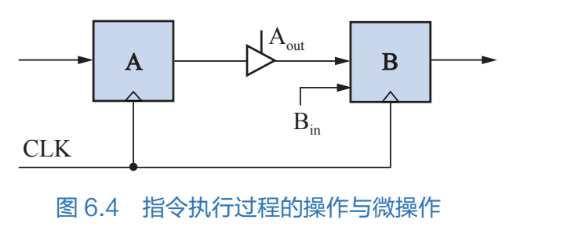

# 指令周期

所有者: H34V3N

这是指令执行的一般流程

# 指令周期

通常一条指令从取出到执行完成的所需要的时间称为指令周期

指令周期还可以被分成更小的周期，即各种操作的周期，包含取指周期/取操作数周期，执行周期和写回周期，也可以理解成指令周期的不同的阶段

### 取指周期

cpu从pc中得到指令的地址，再计算pc下一个指令的地址，也就是pc + 1的地址

整个过程的时间称为取指周期

### 译码/取操作数周期

将指令寄存器中的指令字进行译码，识别指令类型，生成操作数有效地址，访问主存中或寄存器中的内容

这时译码周期

### 执行周期

访问计算器机型运算，对得到的操作数加工，将结果保存到程序状态寄存器PSW中

这是执行周期

### 写回周期

将运算结果写回到寄存器或主存中

这是写回周期

### 时钟脉冲

机器周期：从主存读出一条指令的最短时间，可能是一个取指令，或是写回指令

[时钟周期](../计算机系统概述/计算机性能指标和评价%201fa05a2041d28018947dd89f299f87e5.md)，记录一个开关门动作的时间

——————————————待整理————————————————

# 指令周期同步

指令周期的机器周期数，和机器周期里面的时钟周期数都不一定是一样的，通常分为定长指令周期和变长指令周期

## 定长指令周期

机器周期，节拍/脉冲数固定，按机器周期同步，MIPS单周期

一般在传统的三级时序系统使用

### 变长指令周期

指令周期数，节拍数都可变，按时序周期同步，MIPS多周期

# 寄存器传送语言

为了便于统一指令传输的流程，人们研究出寄存器传送语言（RTL）来书面化表示指令和数据的流通，因为汇编语言表示的一些指令，通常再cpu里能分解成基本的硬件的操作，我们称其为微操作（比如，读取指令的操作，涉及寄存器接收信息，内存传输信息，运算器加一等微操作，下一节会讲）

一些典型的描述如下：

- （看上图）我们在控制将寄存器A的信息输入到寄存器b中时，有以下微指令执行：$A_{out}$ 控制三态门将A中的数据输出，通过数据通路送到B处 ，$B_{in}$打开寄存器的写使能信号（下一节会介绍），将接收到的的信息写到自己的寄存器里
- M[addr]表示**主存**中某个位置的信息，addr是单元字节的地址，十六进制的那些，
- R[addr]表示寄存器组i号寄存器的信息，如果用了这个指令，就要调用寄存器组中的寄存器i进行读写操作，后文Rs Rt寄存器就是这个
- 用B ← A或 A → B来表示数据的传送 A为源操作数，B为目的操作数，这里的操作数未必是数，还可能表示某些数据和寄存器
- $X_{yz}$表示寄存器X中第y位到第z位的数值字段，用这个就说明对yz的部分的信息有操作
- SinExt（X）表示将X符号扩展到32位
- {X，Y}表示将XY的比特位连接到一起如{10，11，111} = 1011111