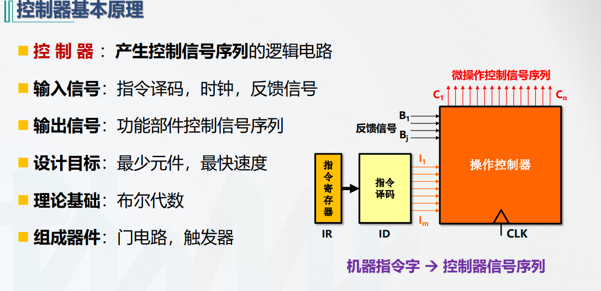

# 控制器

所有者: H34V3N

控制器一共有两种，分别是硬布线控制器和微程序控制器

[硬布线控制器](控制器/硬布线控制器%2020005a2041d280f8a17def952ef0256a.md)

[微程序控制器](控制器/微程序控制器%2020005a2041d2804a8eb6f00308a883f1.md)

# 控制器的基本原理

反馈信号：在运算过程中可能出现的溢出，除以0等错误信息也要反馈出来

通过前面对数据通路的学习，我们知道调用各种寄存器计算器时会发出各种信号，这种信号的发出就是通过控制器实现的，

我们向操作控制器输入指令译码，时钟，反馈信号，操作控制器对译码加工后，就能发出控制信号，其控制的可能是微指令的发出，也可能直接控制硬件的开闭，取决于控制器类型

