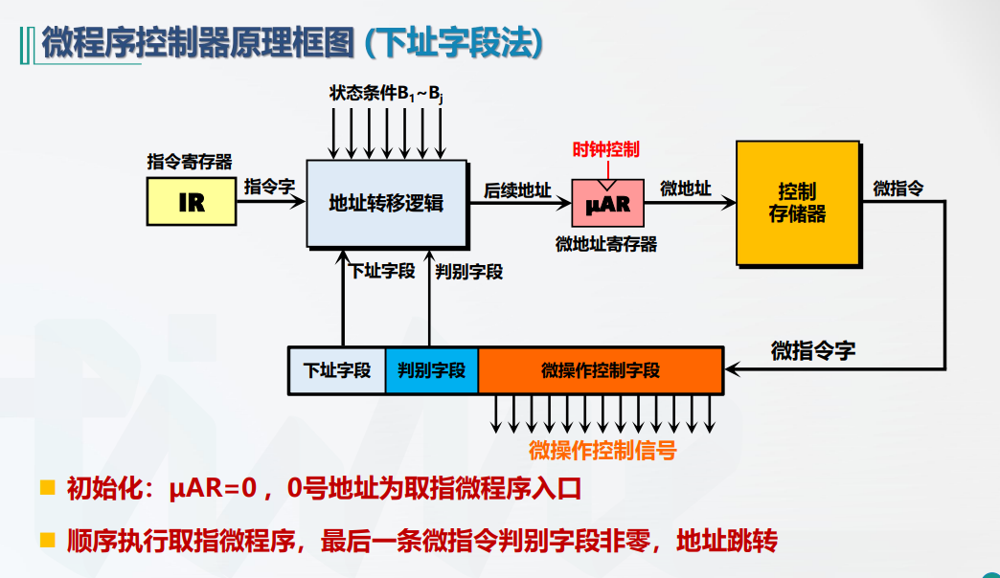

# 微程序控制器

所有者: H34V3N

微程序控制器利用软件思想来设计硬件

通过前面数据通路的学习，我们知道指令在执行的过程会发出不同的信号

单总线cpu的微指令构造

# 控制存储器cs

控制存储器用于存放微程序，其存储容量小，存储的字长单位为微指令的长度，通常以ROM/RAM为介质

微指令的格式

## 微指令的地址转移

从IR开始，将指令字输入地址转移的逻辑里，得到微指令在存储器的位置信息，保存到μAR里，接着把位置信息输出到控制存储器，控制存储器输出对应位置的微指令字，执行操作字段的内容，在输出判别字段和下址字段经过地址转移逻辑得到下一条指令的位置，重复操作

地址转移逻辑如下

微程序的格式

一个微指令对应一个时钟周期

一个指令需要多少时钟周期就包含多少个微指令

# 微指令的编码

直接表示法

编码表示法

有些微指令互斥，绝对不会同时进行的，我们不再将其分别yong01决定是否输出，而是采用编码和译码的方式决定输出哪个微指令

计数器法微指令

要额外使用地址计数器

垂直型微指令（被淘汰）