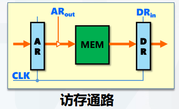
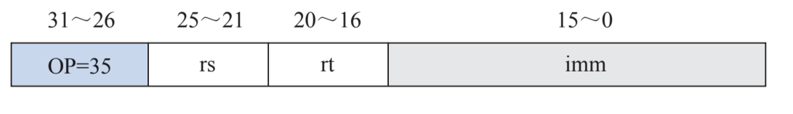

# 数据通路，指令的操作流程

所有者: H34V3N

数据通路：执行部件间传输信息的路径（数据流）

操作控制器发出的控制信号决定通路流向，同时通路受到时钟驱动（控制流）

不同指令，相同指令的不同阶段 信号通路都不同

# 数据通路的抽象模型与定时

CLK：时钟频率，是时钟周期的倒数 1T差不多是1ns

通路里，数据流带着从AR里拿出来的数据在内存里的地址信息，访问MEM主存，在主存出来后，数据流里面就是信息的二进制了

AB是两个寄存器，数据流从两个寄存器出来后携带不同的运算数信息进入计算器ALU，经过计算器计算后，输出计算结果到C寄存器

AB是两个寄存器，A受到out指令，传出数据到总线，再传到B，b受到in指令后接收数据

## D触发器定时模型

在图中我们可以看到，D触发器接收两个信号，一个是时钟信号clk 一个是输入信号data

WE的意思是写使能，在时钟信号到达时，输入的信息Data会被修改成Q再输出

由于修改的操作是信号传输，WE在处理Data信号变成Q是需要时间的，我们需要这个时间里保持信号稳定

所以对于Data来说，时钟触发前，时钟触发后一段时间是Data信号必须保持稳定的时间，也就是**建立时间Setup和保持时间Hold**

同时，我们把Clk触发的那一刻和Q被完全修改的那一刻的时间段称为触发器延迟

对于一个写使能元件来说，数据通路最小时钟周期就是clk信号触发的时间间隔

# 数据通路的分类

## 共享通路（总线型）

单总线cpu结构

主要部件都通过总线连接，信息通过总线流动

优点：简单，所有信息都在总线传输

我们运行以下五条指令，我们研究数据的流动，具体过程的表示方法                                                                                                                                                                                                                                                                                                                                                                                                                                                                                                                                                                                                                                                                                                                                                                                                                                                                                                                                                                                                                                                                                                                                                                                                                                                                                                                                                                                                                                                                                                           

哈哈，看不懂对吧，我们先看一下书上给出的[各种微指令和MIPS汇编指令的表](../tmp/附件：书中的微指令和MIPS汇编代码%2020605a2041d2809683b7d678832693ad.md)                                                                                                                                                                                                                                                                                                                                                                                                                                                                                                                                                                                                                                                                                                                                                                                                                                                                                                                                                                                                                                                                                                                                                                                                                                                                                                                                                                                                                                                                                                                                                                                                                                                                                                                                                                                                                                                                                                                                                                                                                                                                                                                                                                                                                                                                                                                                                                                                                                                                                                                                                                                                                                                                                                                                                                                                                                                                                                                              

当然，在看完这些后，还建议再重温一下[概述里面的各种寄存器的名字和作用](概述%201f905a2041d28090b9e0cb5b621342a8.md)，方便理解后面操作

ok，接下来看这些指令的具体执行方法

### 在正式执行表中的指令前，我们应该在内存里拿到对应的指令，注意，再执行每个指令之前，都要执行这个操作来得到指令（这也是这个指令操作的一部分，被称为取指周期！！！！），但具体解释只解释这一次

M[Pc++] → IR

这个指令的意思是，在主存里找到PC寄存器保存的地址，将这个位置存储的指令保存到IR指令寄存器里 在将PC++（注意，这里的++不是加一，而是加一个指令的长度，这样能保证Pc存储的地址指向下一个指令的开头）

首先，PC寄存器保存的指令的地址信息转移到AR 和 X两个寄存器

然后 X寄存器将数据放入累加寄存器ALU里，让L增加指令的字长（图中是4），实现PC + 1 在将结果保存到Z寄存器里

接着Z寄存器把下一个指令的地址值转移到PC里覆盖数据，主存通过AR给的指令的位置找到指令，输出到DR寄存器里

最后，DR寄存器将自己的指令信息输出到IR里，准备执行

注意，在这个指令中，T3的两个指令在同一个节拍里进行，就指明了前一个节拍必须是计算出下一个指令的地址，后一个节拍是保存指令的后续操作

### 接着是LW指令执行通路

执行指令lw rt，imm（rs） 读取一个存储器字

指令的含义：将寄存器rs中的地址信息，加上立即数imm 得到一个新的地址信息（典型的[变址寻址](../指令系统/寻址方式%201f205a2041d280ed9894d0b66bcaff23.md)），在主存中找到这个地址的信息，保存到rt里

这时lw指令的指令结构，我们发现，立即数imm占了16位，但是寄存器的位宽是32位的，即每段信息长32位，这就需要我们把立即数信息扩展到32位在进行计算

接下来我们看具体过程

首先，将rs寄存器的基址值保存到寄存器X中，等待使用

接着，将imm值扩展到32位后，和基址值相加，得到我们需要的地址，保存到Z寄存器中

将Z的信息保存到地址寄存器AR中

在内存里找到AR对应的字信息，保存到Dr里

将DR的信息保存到rt里

### BEQ指令数据通路

比较rs和rt两个寄存器的值，如果值相等，就进行指令跳转：修改PC的值，让PC的值加上imm值左移两位的结果

首先，打开Rout和Xin，将rs寄存器的值保存到X中

接着。把X里的值和rt的值相减，把rt的值送到ALU的B端，计算相减结果后将结果输出到PSW

接着，将PC的值存入X，IR的Aout打开输出imm立即数，在扩展位数后和PC左移相加，结果输出到Z

最后，如果比较器PSW输出结果rs和rt相等，把Z的结果输出到PC

### I型运算类指令执行数据通路

addi rt，rs，imm

将rt中的数据和立即数相加，结果输出到rs

将rs寄存器的值输出到X

X和立即数相加，结果输出到Z

Z的值存入rt

### R型运算类指令执行数据通路

add rd，rs，rd

将rd和rt的值相加，结果保存到rd里

和前面立即数相加相比，立即数的值变成了rs的值，结果输出到新的寄存器rt

方框图体现了数据的流动方向，我们发现，取指，计算，执行三个周期的步骤数量不同，执行的时间就不同

## 多总线cpu结构

其中 bus bus1 bus2 都是总线

PC输出自己保存的指令的位置信息→信息进入AR，AR带着位置信息访问主存 → 主存带着具体的指令信息给DR

## 专用通路

所有的部件和部件之间都是用专门的通路连接的

专用通路自己看书总结