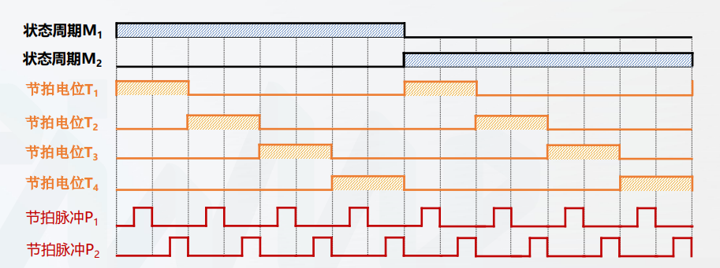

# 时序与控制

所有者: H34V3N

# cpu的时序

指令的执行需要时间上的顺序，不能乱套

传统三级时序系统

状态周期，节拍电位，节拍脉冲

节拍脉冲最小，再大一点的是节拍电位，最后是状态周期

节拍脉冲形成节拍电位，控制信号在节拍点位高电平的时候会被输出，利用与门操作，控制

其内部结构非常复杂，我们只要知道其输入的是节拍脉冲，在原件里输出的是信号经过加工处理后的指令

变长指令周期

# 控制方式

## 同步控制

机器周期数，节拍数是固定的

变长指令周期和定长指令周期节拍数是变化的