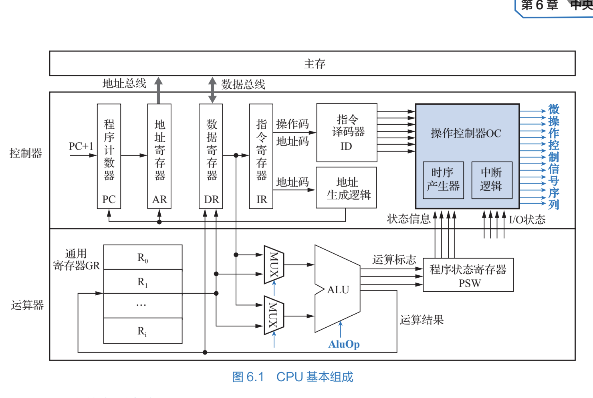

# 概述

所有者: H34V3N

cpu是取指令并执行指令的部件

利用运算器进行数据加工，

程序控制：用控制器实现

操作控制：将机器指令翻译成执行部件所需的控制信号，在时序下执行指令

时序控制：控制操作信号的产生，持续时间

 异常控制

# cpu中主要寄存器，很重要

PC：程序计数器，记录指令的地址，指令系统中说过

IR：指令寄存器，内存中的指令取出后保存在这里

AR/MAR：地址寄存器

DR/MDR：数据缓冲寄存器，相当于一个中转站，在访问主存的时候，我们先将得到的数据保存到这里，再进行别的操作，比如移动到cpu内指定的寄存器中，也可以存放指令（毕竟指令也是数据）

AC/AX：累加寄存器

PSW：程序状态字，反应cpu运算结果的状态，可能有正常状态，或产生溢出，除数是0等状态

还有其他的通用寄存器堆GR，后续学到的rs rt什么乱七八糟的东西都在这里

指令进行时，指令流向：

PC  → AR → 主存 → DR → IR

其中，程序计数器中的地址会给指令寄存器，指令寄存器通过地址总线向主存中寻找信息

数据寄存器通过数据总线和内存链接，在执行指令时，主存中数据和指令信息都先流动到数据寄存器，其中的指令信息再流向指令寄存器

程序计数器中的地址会给指令寄存器，指令寄存器通过地址总线向主存中寻找信息

# 操作控制器OC

输入：机器指令，输出：控制信号序列

功能，循环取指令，执行，处理异常，生成时间控制

将机器指令译码，生成执行部件需要的信号序列，控制逻辑门开闭，建立正确的[数据通路](数据通路，指令的操作流程%201f905a2041d28060a846cf496019bffc.md)

取指令本质上是建立数据通路，不同的指令对应着不同的数据通路的流动顺序和流动方式，也就是说，指令本质上就是各种寄存器和运算器的访问顺序，在正式向主存拿信息前，要提前规定好哪些寄存器 运算器按什么顺序访问

在执行指令时，从R1开始，将R1保存的数据地址传给MAR，MAR传到主存找到对应的地址的数据，保存到MDR，接着MDR传入cpu中的计算器进行计算，再将结果传到MDR里