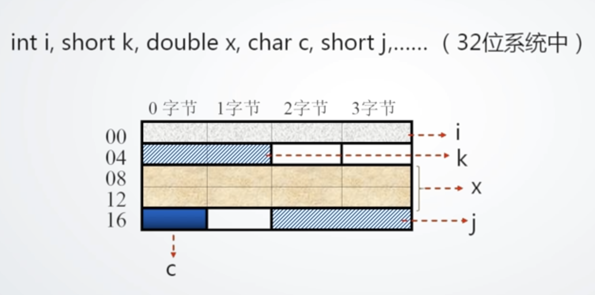
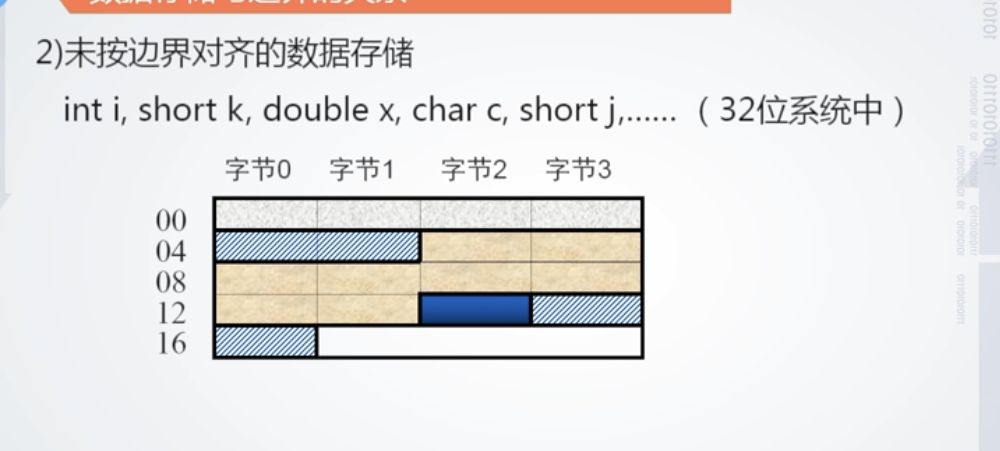
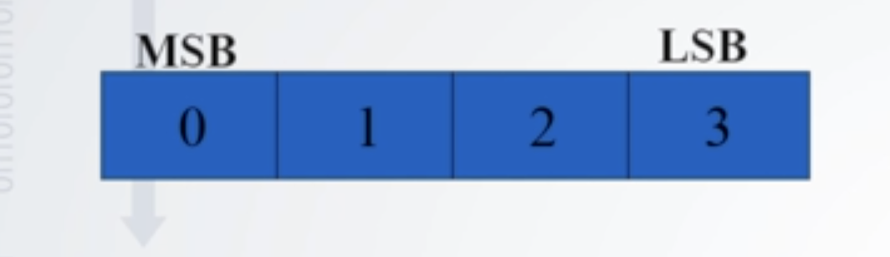

# 主存中的数据组织

所有者: H34V3N

数据组织就是数据在主存中的分布 存储方式

# 按照边界存放数据：

这里的边界是指每个数据的边界，即数据结束的位置：，我们发现有这么几个特点：

### 1.按边界对齐的数据存储（数据对齐）：

我们在32位系统中，定义了几个变量 接下来 我们看看他们在内存中的存储

我们发现，相同长度的数据 即使空出一些格子也要保证相同长度的数据间前后对齐：

而其实现原理如下：

根据不同的数据的长度，我们规定：存储时，数据起始位置必须是自身长度的整数倍（如图 二字节k从4开始，同样长度的j从18开始，他们并没有从奇数的位置开始。数据c长度只有1，其存储就相对自由，可以以任何位置作为起点，因为任何位置都是1的倍数）

我们从图中会发现，这种存储方式造成了空间的浪费，事实上 主存中的空间很大 ，不会因为这种浪费导致空间不足

### 2.未按边界对齐的数据存储

头尾相接 节省了空间，但是，这种模式增加了访存次数比如最长的数据x（黄色部分）。我们在上个图中只需要访问两个空间（即08 12两行），但在这个图中需要访问三行（04 08 12）

### 两种策略的权衡：

我们需要权衡效率和空间 来决定是否选择边界对齐 比如 我们存储的数据都很短，几乎不会出现存储跨行的情况，那我们就可以选择非对齐存储，但是如果会存储一些较大的数据而且空间充足，为了提高效率，我们可以选择边界对齐

同时。面对不同的策略 我们也可以修改自己数据的存储次数：

在边界对齐情况中 我们可以在声明k 后立刻声明j这样就能让空间节省下来

## 按照大小端存放数据：

对于一个数据（这里以4字节数据为例），其每个字节都有一个对应的地址（~~废话~~）按照字节的位置 我们按头尾区分出最高字节地址（msb） 和最低字节地址（lsb）而从0开始

那么 我们为这个数据预留出一个4位的空间：

### 大端存储方式：

由图，我们将这四位的顺序分出位次 从大端到小端，大端存储方式就是将这四位按照从大端开始 到小端的顺序存储 即0 1 2 3

### 小端存储方式：

顾名思义 小端就是从小端开始，倒着存储 即3 2 1 0

注意：这个排序是以字节为基本单位的，小端排序并不单纯是倒叙排序，比如我们存储一个十六进制书v就0x12345678 则其利用小端排序 得到的结果是 78 56 34 12

注意 不同的系统可能采用不同的存储方式 则在不同的存储方式之间，因为顺序不同 我们需要进行顺序交换