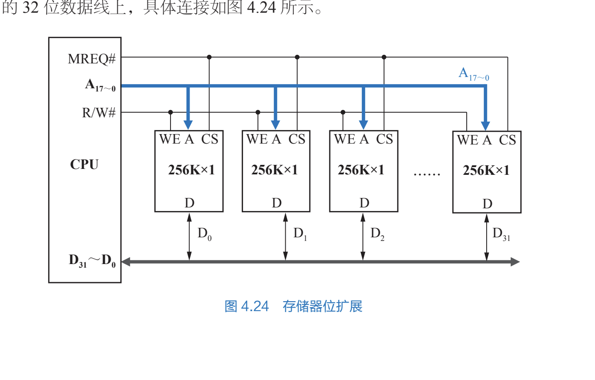
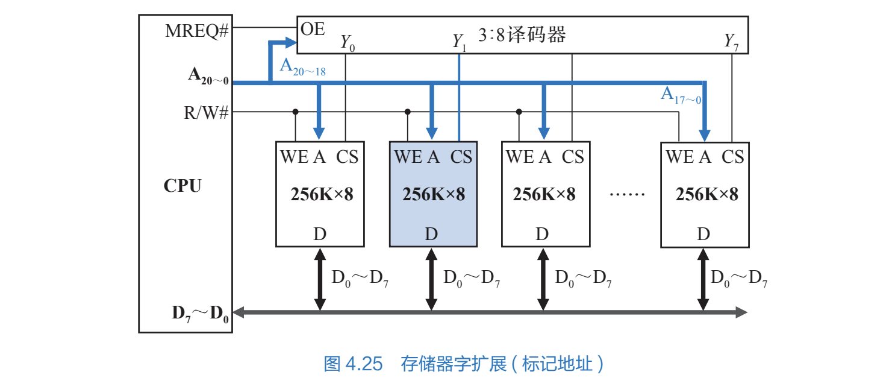

# 主存的组织及其与cpu的连接*

所有者: H34V3N

**内存这一章最主要的内容开始了**

# 主存和cpu的连接：

右侧256k * 1是一个小芯片，

# 存储器的扩展

由于存储芯片的容量或字长与目标存储器可能存在差异，可采用三种扩展方式来适配

## 字长扩展/位扩展/数据线扩展：

相当于小芯片并联在一起同时工作，cpu同时对n个小芯片操作，操作小芯片内同一个地址

注：要求小芯片的地址线相同，即字数相同

存储系统宽N位，芯片k位，则需要并联的芯片N/K个

## 字数扩展/字扩展/地址线扩展：

在MREQ#接入译码器，其接入cpu的A18~A20，其余cpu地址线接到芯片上

每一个时刻只有一个芯片在工作：

38译码器选中一个芯片后 链接芯片的接口就变成高点位，对应芯片变成低电位，开始工作

选择工作芯片的流程：

CPU会存储一个20位的十六进制信息，其中38编码器

<aside>
💡

待总结

</aside>

## 综合扩展：

两种结合在一起 各个位扩展 再字扩展