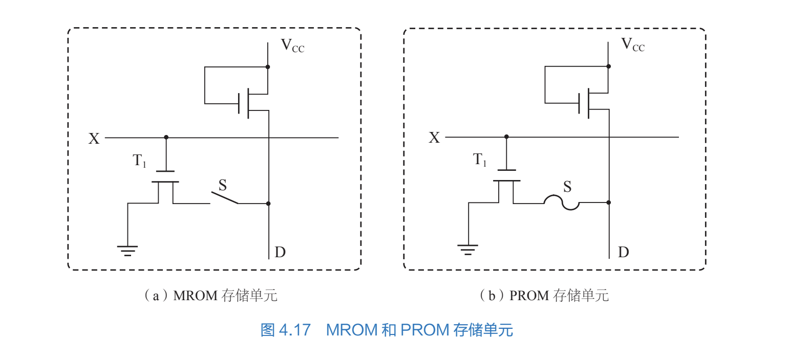
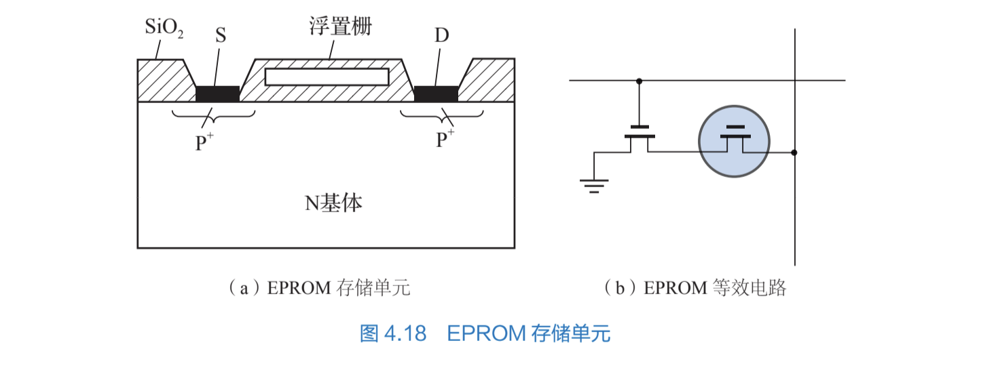

# 只读存储器

所有者: H34V3N

讲的很粗

前面两种存储器一断电，信息就会丢失 但是这种不会

只读存储器用来存储一些不需要修改的子程序 系统软件等，这种程序一般是最底层代码 无需修改

其分为三种

# 1.掩膜式只读MROM

大小4 * 4，一次输出一位 

MOS管T1和开关共同构成一个存储单元，我们在设定芯片时就决定开关S的闭合与否行选通时，T1导通 根据s是否断开来判断是不是1

MROM可以采用行列矩阵结构构成更大的存储器，期内容在生产时由厂家做好，用的时候直接插就好了

# 2.可编程只读存储器（熔丝式）PROM

图在上面b

开始的时候 S是连上的，d点是低电位，当输入高压输入数据时 S熔断 D变成高电位

这种存储器只能编程一次

在这种存储器出厂是每个单元的熔丝都是连上的，代表0，用的时候，使用辅助电路将其通电，使特定位置的单元的熔丝熔断，使其代表1就好

# 3可擦写ROM EPROM

可以多次写入

早期的EPROM 通过高压写入 紫外线照射实现擦除

配备特定的编程器 ，链接数据线高压写入，紫外线擦除器

用紫外线光照射芯片上的石英窗口，就能也只能一次性将所有位置信息擦除

## 电可擦写ROM EEPROM

在原本可擦写的基础上，将紫外线擦写改成高点平擦鞋，只要在一个位置加上高电平，就能实现精准的将某个位置擦除

## 闪存：

现在大量使用的芯片，不插电仍可长时间保持信息

其用来存放BIOS系统，升级方便 不怕CIH病毒