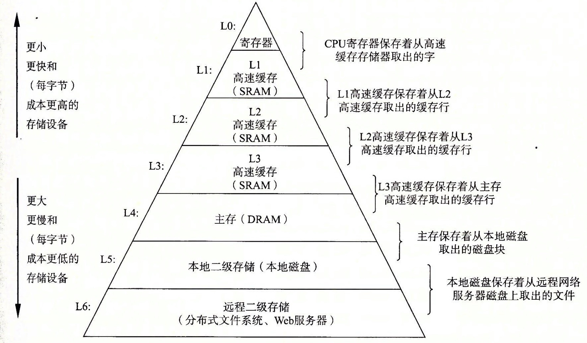
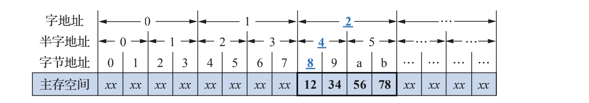

# 存储器概述*

所有者: H34V3N

# 存储器的分类：

存储器分类：存储器有以下多种分类方法：

按存储介质：

1磁存储器

2半导体存储器

3光存储器

按存取方式：

[随机存储器](存储器概述/随机存储器%201d805a2041d280f699e7c017e41655b6.md)

[直接存储器](存储器概述/直接存储器%201d805a2041d280258593c548507c090c.md)

[顺序存储器](存储器概述/顺序存储器%201d805a2041d280c8b9c0c50690450b54.md)

按信息可改性：

1读写存储器：可读可写

2只读存储器：只能读取

按信息的可保存性：

易失性存储器

非易失性存储器

按功能和存取速度：

1寄存器存储器

2高速缓冲存储器

3主存储器

3外存储器

# 存储器的技术指标：

## 存储容量：

存储容量指存储器可以存储的二进制信息，其可以用两种方式表示

### 位表示法：

存储器的单元总数 * 存储字位数

例：1k（1k = 1024个单元） * 4 （每个单元长4个二进制位）

### 字节表示法：

用存储器的单元总数表示

8个二进制位⇒一字节 

128B ： 芯片有128单元

## 存取速度：

### 存取时间：

又称存储器的访问时间，即一次存储器操作（取与存） 从开始到完成所用时间

### 存取周期：

指连续启动两次访问操作的时间间隔

### 存储器带宽：

单位时间存储器所能传输的信息量

# 存储系统的层次结构：

其中 SRAM和组村DRAM是内存，再往下就是外存

# **主存的基本结构：**

目前大多计算机的主存都是按字节编址，存储的字长通常为32或64位

## 数据按地址访问模式：

按照访问存储单元的大小 主存地址可以分为**字节地址 半字地址 字地址** 其结构如图

不过 在访问主存地址时，给出的地址都是字节地址，我们也就按字节地址 来记录数据的位置

字节访问和存储要求对齐（具体在下一节）。我们在访问某地址的信息时，无论是按什么地址单位访问的，都是访问这个单位的首地址，也就是这个单位的第一个字节地址，比如图中的字地址为2的部分，我们想按字访问，就记录字节为8的位置，如果想按字节访问访问半字5的位置，就访问字节a的地址……如果按字或半字记录9的位置，就会出现未对齐的错误

