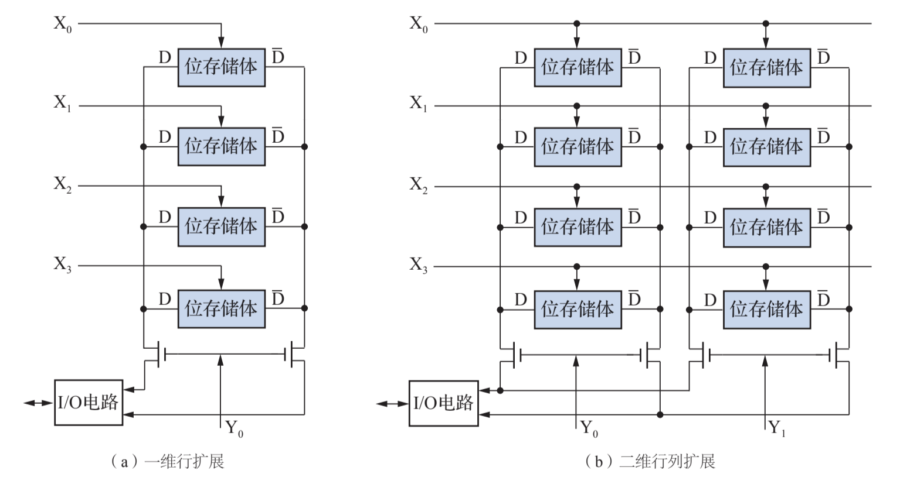

# 存储器结构

所有者: H34V3N

# 存储单元：

存储单元（存储元）是存储器中最小的存储单位，它的作用是存储一位二进制信息（也可能是存储二一个字，也就是8位），其有以下功能

- 具有2种稳定状态，不同种类存储器实现形式不同（表示0和1）
- 两种稳定状态经外部信号控制可以相互转换
- 经控制后能读出其中信息（存的东西是怎样的你得能看到）
- 无外部原因，其中的信息能够长期保存

存储单元有下面几种

[六管mos存储单元](存储器结构/六管mos存储单元%201dc05a2041d280398d6bc9cdcd27b5e4.md)

什么？这里只有一种？ 等我学了别的再说

# 存储单元扩展：

一个单元只能存一个单元的数据，所以我们要将位线，各自链接不同的行选通地址X0到X3就可以得到4存储四个单元的存储器

[半导体存储器](存储器结构/半导体存储器%201dc05a2041d28000a80fddcb98b243a8.md)