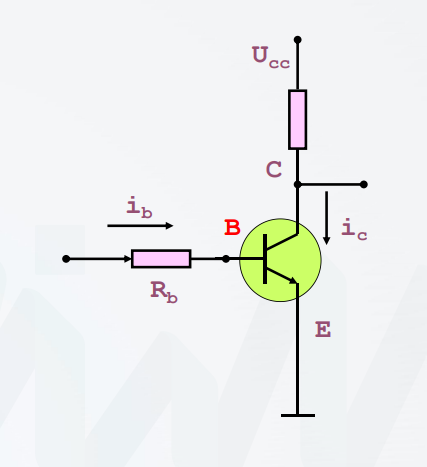

# 六管mos存储单元

所有者: H34V3N

# 6管mos存储单元：

6管指的是mos管，其内部是这样的

其有两种稳定的状态：截止状态和导通状态

这是静态mos存储单元的一种结构，如图所示

其中T1 - T8都是上面那个管

T7 T8在单元的外侧 不计入整 只看T1到T6，

T1 T2是工作管，两者一个开 一个关 构成的电势差，能够表示0 和 1两种状态

T3 T4是负载管（功耗管）为工作管 T1 和 T2 提供偏置电压。在 T1 或 T2 截止时，T3 或 T4 会导通，将对应的输出端拉高，以此保证双稳态触发器能够稳定工作。

其余的是门控管（控制开关）负责读写控制：

写操作：

在进行读写操作时，行选通的高电平信号打开T5 ~ T8 A和IO相连 B和IO—导通，将IO加高点位，IO—加低电位，使得A B的电位变化 变成1 的状态 ，反之，IO IO—接入相反的电位，写入0

读操作：

通过行列选通再次打开门控管T5 ~ T8，A和IO相连 B和IO—导通。利用内部存储的电视差向外释放电流 再放大这个电流差，实现读取0或1。

（其实，可以把这个理解成电路 ，写操作就是往存储器里记录电流，写操作就是以存储器为电源 往外输出电流）

既然提到电流，我们就会想到，内部已经存在的电势差该怎么保存呢：

不进行读写操作时，T5 ~T8截止 行列选通无信号，电源 （如图）通过T3T4 往T1T2提供电流，来保持点位，保存信息