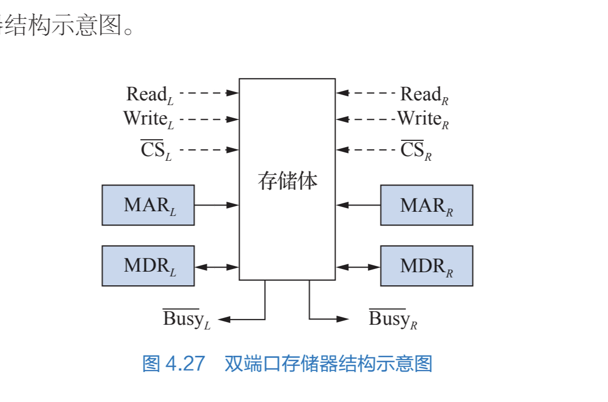
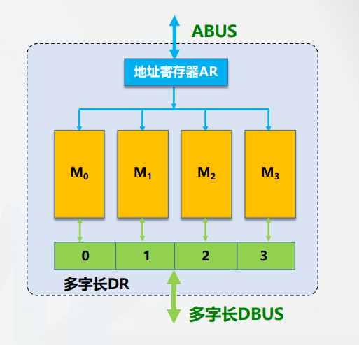

# 并行主存系统*

所有者: H34V3N

# 高速存储器

CPU和 存储器间会存在速度无法匹配的现象，我们有两种方法解决：

增加cache

用高速器件提高速度（和材料有关）

双端口存储器

增加字长 让单个存储周期存储多个子

划分模块进行

# 双端口存储器

双端口存储器又两种独立的读写控制线路，两种线路可以并行操作，只要地址不同 就能够同时存取

用BUSY线传递占用信号，避免同时访问两边的相同地址时产生的拥挤

可能连接两个设备，一个口一边输入 接收的从里往外输出 ，没有就等等，

多模块存储器

## 单体多字存储器：

单体多字，指我们将多个单字长的存储器并行到一起，同时工作

地址寄存器给定地址，每个存储器拿出对应的地址的数据，在DR整合

这种方式成为联动方式，这种一般要求存储器大小 品牌相同

## 多体多字存储器：

这种同样使用多个存储器，但区别是，向两种存储器给定的地址是不同的，两种存储器各干各的

既然都各干各的了，那么就没必要强调存储器之间的配合了，所以，对各个存储器品牌大小的要求就宽松了，可以不同，只是比单体单字慢一些。

<aside>
💡

u盘 ssd性能差异

ssd是多个芯片同时并发输出，u盘的内存芯片不是并发

</aside>

## 多体单字存储器：

多模块顺序存储器：

高位多体交叉，一般用地址总线扩展方式

这样访问方便扩展，往外面一加，再换个译码器，能转出新加的位置码就好

可惜，这只是单单扩展了存储空间，没有提高速度：

如果我们想取出 4 5 6 7位置的数据，那仅仅是四次访问第一个存储器 挨个取出第 4 5 6 7位置的数据

多模块交叉存储器：

10101 →

这样编值，让相邻地址代码的数据再不同的存储器里，我们访问4 5 6 7四个地址的数据 就同时访问四个存储器四个内存条都会工作起来，这样就能提高效率。

由于CPU比存储器要快很多，就能配合cpu同时存取多个数据

这种编值模式又称为交叉编址模式

这种处理模式有如下特点：

- 相邻的地址在同一个存储体内
- 不同存储体的地址不相邻

————再看————