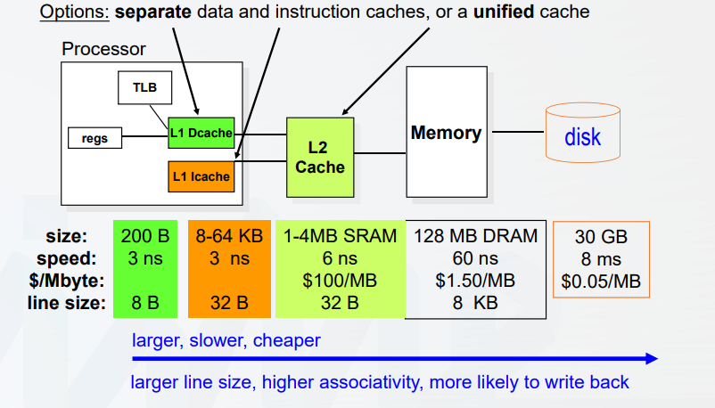
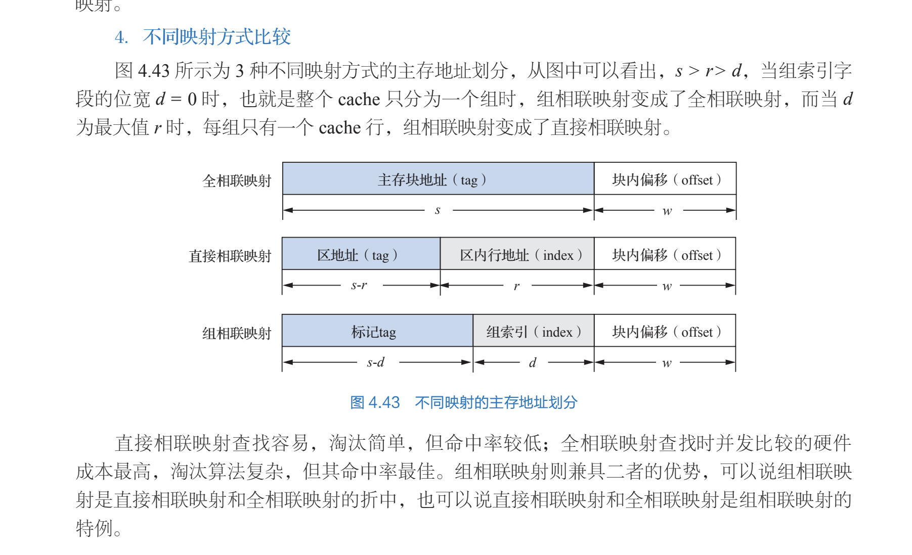

# 高速缓冲存储器（cache）

所有者: H34V3N

# 工作原理：

### U盘的缓冲原理：

早期的U盘写入速度较慢，是CPU先写入内存缓冲区，再由内存缓冲区输入u盘，所以 数据写入内存 电脑就会报告写入完成。如果这时候直接拔掉u盘，写入一半的数据可能坏掉，电流交汇的突然终止也可能破坏u盘的硬件。

当输出和接收设备性能的差异太大时，可能会出现你传输太快 我受不了的尴尬局面，这样，存在一个缓冲空间，就能优化传输的操作。

# 程序局部性：

一段时间内 程序的执行仅限于一个很小的空间

时间局部性：某一部分

空间局部性：程序一旦访问了某个存储单元，其旁边的存储单元也会被访问

举例：

- 数组的元素访问（空间）
- 结构体 数据库访问（空间）
- 局部变量 计数器 指针被重复利用
- 顺序访问的指令（时间）

cache基本思想：

在cpu附近增加隐藏的小的快速存储器

## 读操作：

我们将经常访问的热数据存入这个存储器 cpu去读 这样就有两种情况：

命中（hit）：我们要读的数据在cache里，不用在访问别的存储器

缺失（miss）：不再cache里 我们就要访问内存，把访问过的信息全部放到cache里，这样，下一次再找这个数据就会快点了

## 写操作：

写穿策略：同时往cache和内存里面写，这样 不会提高cpu往内存写的效率

写回策略：先往cache里写，等到ccache里写过的数据要被替换时，再转移到内存里

cache也会分不同的等级品质

# cache里的基本概念：

### 命中：cpu访问的数据能在cache中找到

缺失：在cache找不到

命中率：设a是命中的次数 n是总访问次数，所以命中率 = a/ (a + n)  

缺失率：1 - 命中率

平均访问时间：

我们用h表示cache的命中率，tc表示命中cache时的访问时间tm表示缺失时的访问时间

所以平均访问时间 = htc + （1 - h）tm

访问效率：访问cache的时间 / 平均访问时间

影响命中率的因素：

- 程序行为（局部性）
- cache容量
- 组织方式
- 块大小

# 读写流程和关键技术：

在了解读写之前，我们先明白一个事情：

cache中的数据按行分组 每一行有好多个小项

内存的数据一个数据多个字节都写在同一行上，，多个行构成一个组，我们称这个组为块

有一半内存一个块中的行数和cache里一行的小项数是一一对应的，就如前面所说，cpu发送给cache的地址信息，能够同时在cache和内存里找到相同的数据，就是对应的。

只不过 cache只是存储内存的局部信息，所以在调用之前，涉及到内存中对应块的信息复制出副本转移到cache里

读流程：

cpu给出主存地址（包括块地址和块内地址）

主存块地址为关键字进行查找

如果命中 就访问cache 拿到数据

如果没有命中，就用同样的块地址 带到主存里去相应的地方找

将对应数据的副本存入cache，同时返回块地址

把地址发给cpu，更新查找表。

写流程

cpu给出主存地址

接着查找 如果命中 就改cache数据

（注意两种写策略）

如果没有命中：

给主存块分配cacahe行，再将其装载再cache行，并返回给cpu地址

## 关键技术：

### 数据查找：

通过主存地址 →cache地址 →cache数据

利用相联存储器（CAM）实现

### CAM：

**以内容作为地址访问的存储器称为相连存储器**

工作原理：写入信息时，按顺序写入信息，不记录地址，

cam存储一个查找表（没错 就是前文提到那个查找表），分别记录着主存块号和cache上对应的行号

读出数据时，中央处理单元给出相联关键字，其会和存储器中所有单元中的一部分信息（这里的一部分信息未必指你存储的信息的一部分，也可能指你为这些信息取了一个特别的名字，保存在存储单元的另一个专门用来保存判断关键字的信息的地方）进行比较，如果相等，就会把剩余的信息读出来

cpu给出一个主存块号，cam看看有没有和这个主存块号对应的cache行号，如果有 就是命中，去找cache的对应行

在硬件实现方面：

按内容进行访问作全局的并发比较，即同时比较key，硬件成本很高，需要很多比较器

**CAM的存储容量：**

存储容量 = 查找表容量 = 相联存储器容量 = 表项数 * 表项大小

**总结：CPU cache的基本组织方式：**

CPU cache有较快的SRAM构成

cache与主存均分固定大小的数据块，以块为单位交换数据（就是指前文提到的cache的行和主存的块）

相联存储器存放查找表

CPU给出的块地址与查找表中某单元相同且有效位为1表示命中

（全相联，硬件多路并发，提升查找速度）

### 地址映射：

**块地址与内存地址：**

待理解—————————————————————————-

利用某种方法或规则将主存块定位到cache成为地址映射

（我们可以用函数理解这个过程，主存和cache对应的地址，就是自变量和因变量）

主存和cache的地址映射关系

那么 一般地址映射是怎样进行的呢？

地址映射分为以下几个方法：

- [全相联映射](../tmp/全相联映射%201ee05a2041d280a79c6ad08c8ec7c66e.md)
- [直接相联映射](../tmp/直接相联映射%201ef05a2041d28042aacaec0095cbd1dc.md)
- [组相联映射](../tmp/组相联映射%201f005a2041d2808ebae0d59f3ddf74b0.md)

这几种映射方式的比较

### 替换策略：

cache空间有限，无论是哪种映射方式，肯定都是要写满的，所以会涉及到cache中数据的替换，替换的数据块如果存在脏数据，就要进行淘汰

算法如下：

- [先进先出算法](../tmp/先进先出算法%201f005a2041d280e2b045f6554ac66df5.md)
- [最不经常使用算法](../tmp/最不经常使用算法%201f005a2041d280f6b4c9d2c3f650113a.md)
- [近期最少使用算法](../tmp/近期最少使用算法%201f005a2041d2808a92bfee734460ff25.md)
- [随机替换方法](../tmp/随机替换方法%201f005a2041d2801a8b76c1e42a4c67f8.md)

### 写入策略：

cpu有时也会通过cache，往主存写入数据，这要求也要设定一定的写入策略

两种策略只讲思路，不细将具体的实现方式

- [写回法](../tmp/写回法%201f005a2041d280d8b02cce321a02a185.md)
- [写穿法](../tmp/写穿法%201f005a2041d280549d6adcaffaed42d3.md)