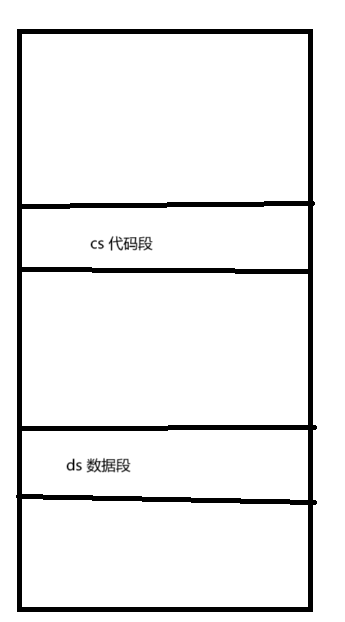

# 寻址方式

所有者: H34V3N

在内存里，代码指令和数据时分开放置的，这样，

寻址方式，就是寻找指令和操作数有效地址的方式

指令和操作数开始都在内存里面，在使用时，把指令和操作数都取到cpu里

# PC

我们管pc叫程序计数器（在x86里叫IP/EIP）

程序的首地址，开始时第一个代码的位置，在执行程序时，执行完程序 pc 就会加1（这个1不是数字1，而是指令的长度）

# 指令寻址

分为顺序寻址和跳跃式寻址

指令一般是人打的代码的东西，编译完都是塞到一块的按顺序存放的，大部分都是顺序寻址，偶尔会遇到跳跃寻址

## 顺序寻址

程序对应的机器指令在主存按顺序存放，所以一般情况，在程序执行代码命令时，都是按当前位置PC加上1（不是数字1，而是当前代码的长度）的顺序读取指令的，但也会出现特殊情况，比如调用函数

函数的代码一般不和主代码在一块，这样会就需要第二种寻址方式：跳跃寻址

## 跳跃寻址

跳跃寻址时，下一条指令不一定通过pc + 1获得，而是通过指令得到下一条指令的地址

比如汇编中常用的call 以及jmp指令

# 操作数寻址

操作数寻址比较复杂

操作数来源比较复杂

- 来自指令的地址字段

比如mov AX 38H

操作数是指令给你的

- 操作数来自寄存器

mov AX BX

在这种情况下，cpu直接访问自己的寄存器，非常快

- 操作数在存储器中

mov AX [2048H]

把2048H中指向的数据存到AX中

具体的寻址方式

指令分成三大类

R - R：寄存器和寄存器之间的访问

R - S：寄存器和内存之间的访问

操作数寻址有8种，二进制表示最大用三位，所以寻址方式码由三位二进制实现

## 立即寻址

例 ： mov AX 38H

即mov 000 0x38

分别是操作码 寻址模式，形式地址（立即数）

我们把0x38放到指令寄存器IR里，整个过程也就是从IR存到AX

立即寻址，是指具体的操作数就在指令里面放着，无需访问哪个存储器

## 寄存器寻址

AX：累加寄存器

BX：通用寄存器

CX：计数器

DX：数据寄存器

例：mov AX BX

## 直接寻址

地址码直接给出操作数在主存的地址

中括号表示里面是地址

inc [200] inc 是直接加一（++）

利用主存中200地址的数加一

这种方式会访问内存

mov AX [2048H]

## 间接寻址

在直接寻址的基础上修改，将目的地址指向主存中保存另一个地址的位置，再读取这个地址找到目标

需要两次访问内存，已经淘汰了

## 寄存器间接寻址

例 inc [BX]

这个寄存器保存了指针，即主存中的一个地址

依靠寄存器寻址

我们通过指令，找到这个寄存器，这个寄存器里面存储着主存地址，再根据这个地址找到目标

把一次访问内存改成访问寄存器，效率高了很多

但还是多了一步访问寄存器，导致其速度慢于直接寻址

## 相对寻址

这种方式需要pc里的数据，这时候指令里存的是偏移量，我们需要用目前pc的地址，加上偏移量得到我们要访问的地址

相对寻址一定出现pc

相对寻址不用找到绝对地址，只要知道当前指令和我们目标操作数在栈上的距离，设其为偏移量就好

## 基址/变址寻址

基址寄存器一般不会被修改

和相对寻址相似，只是我们会调用基址/变址寄存器记录地址，加上偏移量，这个偏移量，在后期cpu的学习中作为立即数imm出现

指令的结构是：操作码 寻址方式 偏移量+寄存器编号

mov AX，32[SI]SI DI是变址寄存器

多了加法运算和访问寄存器，速度没有直接寻址快

## 堆栈寻址方式

硬件堆栈：

是cpu中的硬件成分，符合后进先出原则

压入栈的指令：push XX

出栈的指令：pop XX

我们会把数据暂时保存在硬件寄存器

数据的传送在栈顶和通用寄存器之间进行

优点是速度快，但是内存有限

内存堆栈：

内存堆栈基于内存的地址访问，由于内存是连续的，我们要划分出一片区域来当栈用，我们就用SP（栈指针）记录栈顶的位置

假设有这样的一个栈，我们将a b c分别压入栈中

那么sp就会进行自减操作调整自己指向的位置，再在内存里存入a。b c同理

在进行出栈操作时，先读取c 并删除c sp再进行自加操作调整位置

是软件堆栈，因为是利用指针实现的栈的功能，而硬件部分不是栈

各种指令的比较——————

指令格式设计的例题——————————