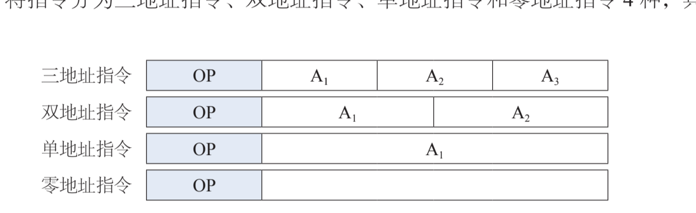

# 指令格式

所有者: H34V3N

表示一条指令的机器字，也成为指令字，简称指令

指令格式：表示用二进制代码表示指令的结构形式

一般步骤：处理什么数据，做什么处理，在哪里得到要处理的数据

一般的指令结构如下：

操作码OP +地址码A

# 操作码和地址码

比如a = a + b

其分为三个部分：操作码字段，寻址方式，地址码字段

换成汇编是这样的：ADD Ax Bx

寻址方式和地址码字段统称操作数字段，其中一个指令可以有多个操作数字段

操作码字段的长度决定指令系统给规模

## 指令字长度

指令中二进制代码的位数

字长和机器字的长度有关，32（半字长）或64位（单字长）还有双字长128位

**指令字越长，对应的地址码长度越长，就有更大的寻址空间**

操作码和寻址方式长度固定，剩下的都给地址码。字长越大，地址码就越长

**指令字越长，占用空间越大**

### 指令的分类

定长指令：一个指令集里所有指令的长度固定

变长指令：指令集里指令长度不固定，有长的有短的

## 指令地址码

——————三二单零地址指令

ac：累加寄存器，是设置好的默认操作

零地址指令：stp 让cpu停止操作。luop，让cpu停止操作这类的

### 扩展操作码*：