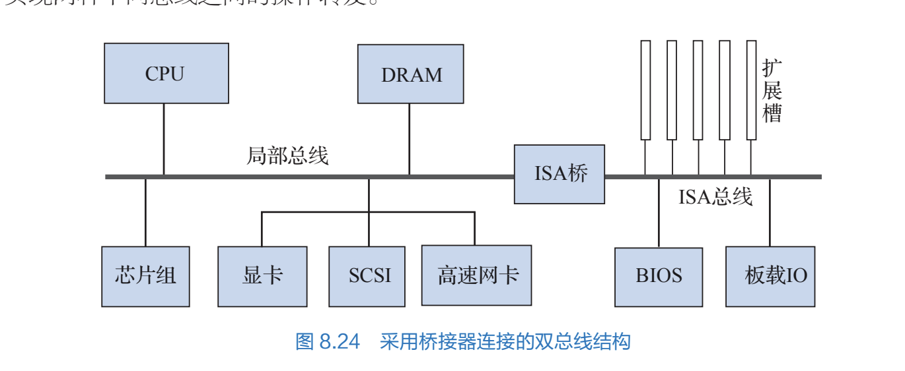

# 总线结构

所有者: H34V3N

# 单总线结构

# 双总线结构

## 主存为中心

## 桥接器架构

cpu 主存等原件通过局部总线（系统总线）连接，一些其他的硬件（网卡 声卡等慢速设备）放到扩展槽上 ，和IO总线连接

两个总线通过桥接器（ISA桥）连接

# 三总线结构

.png).png)

按硬件的运行速度更精细地分成三个部分，每个部分用各自地总线连接，总线之间用桥接器连接

# 其他高性能总线结构

## 前端总线的南北桥结构

.png).png)

# 总线结构和计算机性能关系

最大存储容量

指令系统（的复杂程度）

吞吐量（传输的带宽）