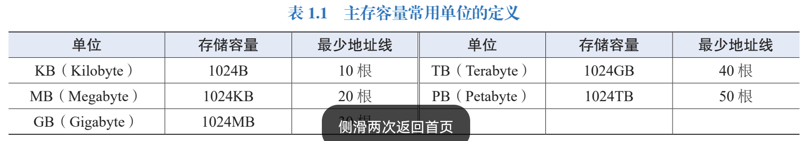

# 计算机性能指标和评价

所有者: H34V3N

我们都知道高级的CPU好 5060的显卡牛比（当你看到这段话的时候，50系显卡可能已经落伍了，但我相信你知道我是什么意思），但是我们该怎样评价计算机的性能呢

# 基本性能指标

这里的东西一定要烂熟于心啊

### 字长

cpu一次处理的二进制数据位数，在现在，一般是32位或64位

字长一般以字节为基本单位

字长越大，计算机计算的精度越大，能表示的数就越大

### 主存容量

主存容量是主存能存储的最大信息，一般表示为[存储单元数](../存储系统/存储器结构%201dc05a2041d280389531c484542fbd31.md) * 存储单元能存储的二进制位数

存储单元数也叫字容量

主存容量常用的单位定义如下

增加主存容量能够减少程序运行过程中访问辅存的次数，你想，这片区域足够大，那我就直接在这里把事情都办完了([具体内容请看虚拟存储器的内容，自己翻书，这部分我还没整理](../存储系统/虚拟存储器%201f105a2041d28052976fed6ce83b28a0.md))

# 与时间有关的性能指标

## 时钟周期

计算机中最基本，最小的时间单位，在一个时钟周期内，计算机只完成一个最基本的动作

因为计算机基本的动作，一般计算机中的计算都是靠电信号传递的，一个小的计算，读写等操作都是一个小的电信号，一般一次时钟脉冲的信号的时长就是时钟周期

时钟脉冲是周期重复的信号，由自己的固有频率，来传递信息

时钟周期是时钟频率（主频）的倒数，也称节拍周期或T周期

## CPI

CPI指执行每条指令所需要的平均时钟周期数，因为一次简单的操作就是一次时钟周期，一些符合我们需求的操作通常是由多个这种简单的操作组合而成的。我们在计算的时候可能是一个指令的CPI，也可能是一类，一群指令的CPI

假设程序中包含的指令总数由IC表示，程序执行所需的时钟周期是m，机器周期是T，频率是f，所以，CPI = m / IC

如果一个程序有很多类指令，那么就分别算出各自的CPI，乘上指令频率P，再相加就得到了这个程序的CPI

## CPU时间

指CPU的执行时间，也就是CPU使用在程序上的时间消耗的时间 ，通常由用户CPU时间（消耗在程序上的时间）和系统CPU时间（消耗在系统上的时间），我们通常只看用户CPU时间

所以，CPU时间可以表示为程序执行所需的时钟周期数 * 一个时钟周期的时间

也就是 Tcpu = m * T = m / f

我们也可以通过引入和CPI有关的变量，来计算Tcpu

如：Tcpu = CPI * CI * T 利用CPI和CI得到m

## IPC（CPI倒过来）

就是每个时钟周期能执行的指令数

# MIPS

指每秒百万条指令

如果用相对较大的时间单位“秒”来衡量执行的指令数，通常数以百万计

MIPS = IC / （Tcpu * 1000000）

## MFLOPS

每秒执行浮点运算的次数，就是MIPS局限指令到浮点数的运算