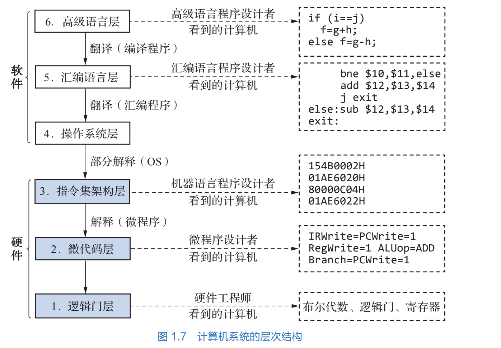

# 计算机系统的层次结构

所有者: H34V3N

在前面的学习里，我们看到编程语言由人能看懂的语言变成机器能读懂的语言，其实，层次就体现了用抽象的方法简化问题的解决过程的思想，你看，如果我们直接操作各种寄存器和计算器，控制与或非门进行计算，然后读取会有多麻烦，在高级语言上写好代码让机器自己运行就舒服多了

下图的结构将计算机系统分成六个层次，每个层次都有计算机相关的不同人员负责

记住这六个层次

具体内容自己看书吧