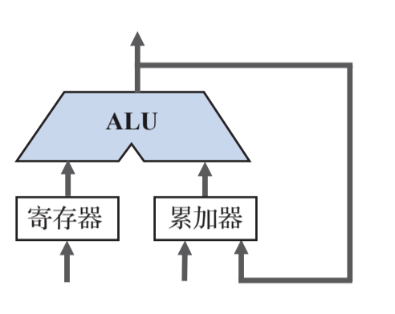
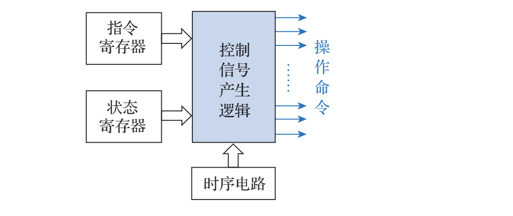
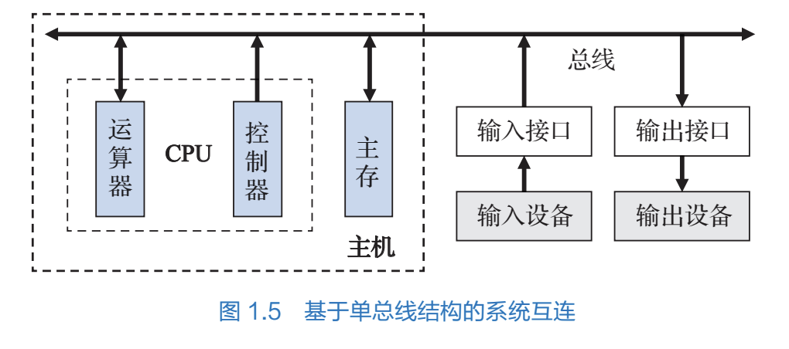

# 计算机系统的组成

所有者: H34V3N

# 计算机硬件系统

20世纪40年代中期，冯诺依曼提出了用二进制作为数组计算机数制基础的理论

因为对于计算机来说，0  和 1只需用有电，或无电进行表示就可以，实现方法很简单。

除此之外，他还提出了存储程序和程序控制的思想。

## 存储程序

存储程序指将解题的步骤变成程序，把程序存储起来，以二进制的形式保存到存储器中。等到需要使用的时候，就读取并运行

## 程序控制

程序控制，就是计算机中的控制器逐条读取出存储器的指令，并按顺序执行（这里的顺序未必是一个一个往下读，详见[指令系统的寻址方式](../指令系统/寻址方式%201f205a2041d280ed9894d0b66bcaff23.md)）

我们把冯诺依曼提这些理论称为冯诺依曼体系结构

# 冯诺依曼体系下的计算机结构

按照冯诺依曼的设计思想，计算机的硬件包括运算器，控制器，存储器，输入设备和输出设备五大部件，其中，运算器和控制器合称中央处理器，也就是我们常说的cpu，CPU和存储器统称为主机（比如台式电脑那个主机，经常捡垃圾的都知道里面一个主板上插着cpu和各种盘啥的，注意 散热工具不算计算机的体系），输入设备（如鼠标键盘），输出设备（如显示屏，耳机）统称输入输出设备

## 存储器

[这里只是概述，如果详细学习请移步后面学习的内容](../存储系统%201d805a2041d2805085c7cd74d74ca1b9.md)

这是一个存储器的组成框图

向存储单元保存或取出信息，都成为访问存储器

访问存储器时，我们先通过地址总线向译码器传入地址信息，接着由译码器译码成存储器空间的编号，利用这个信息找到对应位置的信息，由读写电路决定访问的模式：取出信息或修改信息

## 运算器

只是简单介绍，有关计算器的详细系统在后面会学到

运算器用来进行信息的加工处理，其能够对数据进行数据运算或逻辑运算

运算器通常由算术逻辑单元（ALU）和各种寄存器组成

如图，在这种体系结构下，寄存器用于存放本次计算的操作数（加数减数除数这种），累加器在保存操作数的同时，如果遇到连续运算（1 + 2 + 3）这种，还会临时保存中间的计算结果和最后结果（ALU仅能完成一次的双目运算，1 + 2，2 *3这种，在计算一次后就把计算的结果先放到累加器里，当计算到头后，累加器里保存的就是计算结果）

我们一般将计算器一次能够处理的二进制位数称为**机器字长**

一般机器字长都是8的倍数，在现在，最常见的机器字长是32位或64位（就是32 64位操作系统的那个）

## 控制器

只是简单介绍，具体内容请移步后续学习的[指令系统](../指令系统%201f105a2041d280799c0cc7d7b07364c5.md)和[cpu](../中央处理器%201f405a2041d28090950ffa5f11220840.md)

控制器是计算机的指挥中心，其实质就是解释程序，我们知道，自己写的程序都是用各种编程语言写的，那么其实这些语言（比如cpp）在运行之前，要进行编译操作，变成汇编语言，然后控制器读取汇编语言，将这些语言转化成控制对应系统操作的信号，让部件进行相应的计算要求（毕竟，让机器直接读取int a = 114还是维度太高了）

计算机中由两股信息在流动，分别是控制流信息和数据流信息，其中控制流信息是各种操作命令的信息，其实就是各种指令，数据流信息保存的是要加工或读取的数据，根据控制流信息的指挥，从一个部件流向另一个部件

## 输入输出设备

键鼠耳机显示屏麦克风这些，不细讲了

## 系统互连

计算机利用总线将两个或多个设备或部件连接起来的工具，这样，利用这个信息通路，各个部件更好地联系在了一起，其中，CPU连接计算机各种主要部件的总线叫系统总线

# 计算机软件系统

软件的“软”，软在其其实是认为指定的各种规则，也就是各种程序，其本质是解决问题的思想，方法和过程，在使用语言描述并被机器接收后，机器就会按照这种规则运作，虽然硬件上没有限制这一步，但是我们的规则做到了约束机器，这就是软件

一台计算机中全部程序的集合成为这个计算机的软件系统，计算机软件按功能分为应用软件和系统软件两大类

系统软件是对计算机进行管理，调度，监视服务等软件，主要是方便用户，提高计算机的功能等，系统软件就是电脑里c盘那些不能随便删的文件

应用软件是用户利用计算机解决各种问题而编写的各种程序，比如我们用计算机实现qq，微信等工具的联络功能，虽然有没有这个功能不会影响计算机的运作，但是计算机用其运作方式实现了我们的需求

我们通常将系统软件分成以下几类：

## 操作系统

操作系统用来管理计算机的各种资源，调度用户作业等功能，就是我们常说的windows系统，mac系统，linux系统等，当然，对于其他的电脑之外的计算机还有别的国产的操作系统的支持

## 程序设计语言和语言处理程序

程序设计语言一般被分为三类：机器语言，汇编语言和高级语言

高级语言就是给程序员看的 cpp java python之类的，其中高级语言也分为解释型语言和编译型语言，这个靠大家自己了解了

汇编语言是在机器语言和高级语言之间的语言，其用简单的助记符表示机器语言，和高级语言相比，他把符合人类逻辑的高级语言转变成了符合机器运作方式的语言，但人类还大概能看懂

机器语言是用二进制代码表示的，能被机器直接识别的和执行的指令，每台机器的指令格式都是制造机器的时候设定好的，就是怎样控制机器怎么运作的指令，这类指令人类难以看懂

语言翻译程序包括编译程序，汇编程序，解释程序和其他软件操作程序，编译程序负责将高级语言转化成汇编代码，汇编程序将汇编语言转换成机器指令的程序，解释器将程序中的命令解释，作为信号指挥各个部件运作

预处理程序 等是c语言特有的

数据库管理系统和应用程序自己看