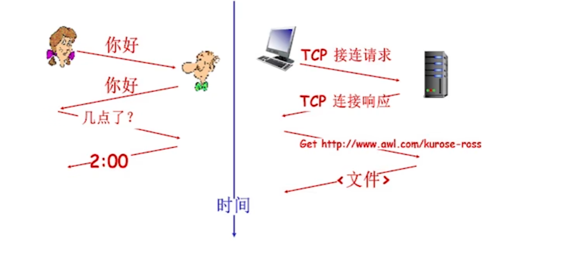
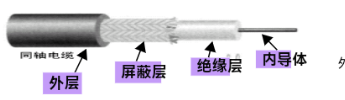
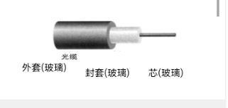

# 第一章

所有者: H34V3N

什么是internet

# 因特网

Internet，也称作网际，互联网

网络：最原本意义的网，像蜘蛛网，关系网，神经元等等这类的都是网络，网络拥有节点（即多条线相交的点）和边（连接节点的线），这些节点和线揭示了事物的各种联系

在这个概念之下，我们引出计算机网络，计算机网络就是联网的计算机构成的系统，在这个网络之下的节点有主机节点（我们的设备 手机电脑，服务器等联网的设备） 作为数据的源或目标，还有数据交换节点（如中继器，交换机，路由器三层，以及负载均衡设备）转发信息。计算机网络的边是节点连接的链路 ，这个链路分为接入网链路（主机连接到互联网的链路） 和主干链路（路由器之间的链路）。在这些概念之外，计算机网络中还有协议这一概念，这是一种标准，信息的传递和厂商制作通信设备都是按照这些标准来制作的，在相同的硬件结构这下，这些设备就能相互交流相互操作，不同的协议有物理层，传输层，网络层，应用层协议，创新层协议和应用程序

在这之下，我们就有互联网的定义，互联网是以tcp协议 ip协议为主的一小簇协议，这些协议支撑起来工作的网络叫做互联网，这网络实在全球大范围使用的，如果你像利用这些协议不介入互联网，自己内部小范围使用也可以，但我们称其企业网

协议：为进行网络中的数据交换而建立的规则，标准或协定

协议定义了网络通讯实体之间交换报文的格式，意义和顺序，以及在报文发送/接收时采取的操作

各种协议构成了设备之间信息交换的流程，让信息的传递井然有序。不会发生混乱

协议三要素：语法，语义，时序/同步

语法：消息的格式

语义：消息传播和接收的相应事件

时序：发送接受消息的次序

internet是网络的网络 ，一般的网络有教育网，运营商搭建的网络，这些网络再联系在一起构成互联网

internt也有一定的标准，RFC（request for comments，一种文档的格式） 和IRETF（inthernet engineering task force，一个非盈利组织，接收大众对于互联网发展的想法，经过评审，公示在这个网站上，作为标准的仓库的作用 ）

## 互联网的覆盖

根据互联网的覆盖范围，将互联网分成下面四类：

个域网（PAN）：最小的网络类型，仅仅是个人的设备的互相连接，如你的手机和你的蓝牙耳机，蓝牙就是常见的个域网技术

局域网（LAN）：覆盖范围较小，一般只包含家庭，办公场所，学校范围的网络

城域网（MAN）：覆盖整个城市或大型校园

广域网（WAN）：连接不同城市，或是不同国家，不同大洲的网络

# 网络边缘

网络边缘是指网络运行的基础设施和终端用户（包含设备，软件）直接进行交互的边界层

核心构成如下：

主机，客户端和服务器，数据中心的服务器

接入网络和物理媒介：有线和无线链路

## 将边缘的端系统接入到核心网

直接接入的核心网是边缘路由器（端系统到其他远程系统路径上的第一台路由器），连接的网络成为接入网

接入网：将网络边缘和网络核心连接起来，通常是将终端系统接入到边缘路由器

接入方式：

家庭：[DSL拨号](tmp/数字用户线DSL%2026305a2041d280239c28df473737fa44.md)/电缆/FTTH/5G固定无线/卫星

企业：以太网/wifi

广域无线接入：345g

无线链路接入网

无线局域网（接入路由器）WHAN和广域蜂窝（也就是流量，接入运营商提供的服务站）

## 主机：发送数据包

接受应用程序的消息，将其分成长度固定的小块，称为数据包

传输的单位：位bit（比特）

8bit = 1byte（1b） b，k，m，g的进位单位是1024

## 传输的物理媒介

指的是发射机和接收机之间的

具体链路介质，分为引导型介质和非引导型介质

### 引导型介质

指的是固体介质，包括铜线，光纤，同轴线缆等

具体的介质如下：

双绞线

两根相互绝缘的铜导线

同轴电缆

能做到双向传输，导体分成内外层

以上两种都通过电信号传播，双线和内外导体都是为了形成回路，两个线螺旋绞在一起是为了减少电磁感应的影响

光缆

利用玻璃纤维传播光脉冲，一个脉冲是一个比特，不会受到电磁噪声干扰

### 非引导型介质

无线电

通过电磁频谱传播，按广播的方式双向传播，其遇到障碍物（如山）会反射，影响接收。同时会被干扰，比如很近的范围内两拨人用相同的频率通话

无线链路

无线局域网wifi 无线广域网4g5g 地面微波和卫星等

# 网络核心

由isp（运营商）的路由器和链路构成的网状区域，主要功能是转发和路由

## 转发

也叫交换，将数据包从输入链路转移到输出链路

## 路由

确定数据包采用的从源到目标的路径

## 电路交换网络——第一代计算机网络

整个数据交换的过程

1：建立连接

2：交换数据

3：释放连接

第一代网络使用的是物理通路，用户在整个数据交换的过程是占用了这条线路的，无法被其他用户使用，这是一个稳定的通路，在传输过程不会出现延迟

由于物理线路的特性，人太多时，一个一个轮流使用的顺序会让用户排队太慢，偶尔也会出现一直在进行连接，但没有传输信息而浪费资源的现象，我们研究出了下面两种复用方式，提高有限资源的利用效率

### 电路交换的复用

单个线在被一个用户使用时，不能被其他用户使用，所以研究了几个复用方式

以上两种方式能够保证在一定时间内让多个人使用网络

**时分复用**

将一个时间段均等分开，每段时间分配给一个用户使用

意思是，我们假设这一段时间是1秒，分给四个人，则每0.25秒给一个人使用，当这0.25秒过去后，就换下一个人建立连接传输数据，如果四个人都轮完了，就重新开始轮

**频分复用**

一个线传输多个频率的信息，每个用户占一个频率

这个就不多说了，和广播一样

**计算练习**

已知链路速率是1.536Mb/S 每秒被分成了24部分，则每个用户分到的速度时：1.536 / 24 = 0.064Mb =64000b/S，

所以传输消耗的总时间是10s

建立连接的时间是0.5ms 所以总时长是10.5ms 

## 存在的问题

如果线路断了，那么整个传输过程就会中断，在紧急情况下不利于传输信息

支付的费用是按照你占用网线的时间决定的，类似qq聊天这种信息传输具有突发性和间歇性（信息不会持续传输，只是你一句我一句话的这种）的数据传输会让你网费的性价比很低

# 分组交换网络——第二代计算机网络

**演化：**

这是最初的电路交换直接从开头到结尾先建立稳定的连接，再传输数据

流程得到改进，将报文直接传输到最近的路由器，路由器一级一级传送，直到终点

我们可以看到，只有完整的报文传送到路由器之后，才会开始传送到下一个地点，比较费时间

将报文分成多份，每个小部分进行传输这样，在第一小份传输到第一个路由器后，这个路由器就会开始往下一个路由器传输，同时，第一个路由器还能接收第二小份，这样充分利用了线路，节省了时间

**流程：**

在发送端，将比较长的报文分成较短的，固定长度的数据段，在每个数据段的开头添加一段首部

每个首部都包含地址等控制信息，每个交换机根据这些控制信息将分组发送到下一个交换机

接下来，将每个分组作为单元，向接收端依次传输

最后接收端在接收到分组后去掉首部，将其还原成报文

注意：分组交换的特征如下：

数据被分若干组传送

数据传送的路径不一定每一组都相同，无需提前确定，我们只要确定信息传递的终点就好

通信子网每个交换节点都是共享节点，都有分组的存储转发，选择路由的能力

通信子网动态分配带宽，能够提高通信线路的利用率

子网通常采用网状拓扑结构，能在节点故障时灵活改变路由

主干线路通常是高速线路

很简单对不对，这只是最顺利的情况……

**优势：**

同时，电路建立的时间可以忽略不计，不会限制用户的速率

假设一个分组的长度是L，传输的速率是R，从出发点到目标点的一共有2个交换机（要传输到三次链路）

那么 总共的时延就是3 * L / R

**问题：**

在这种传输规则下，如果使用的用户较多，发往交换机的分组入大于出，则会分组会在交换机里排队等待交换机的发送，这样会造成时延，如果排队的数据过于多，新数据无法存储，还会造成更严重的丢包

分组携带控制信息，导致实际传输的信息比你原本要发送的信息更多

管理和控制比较复杂

## 网络核心分类

网络核心是分层级的，这样避免了每一家客户端都要和其他客户端建立直接连接，复杂化通信的过程

## 性能指标

### 时延，丢包，吞吐量

**四种时延**

传输时延：

R是链路的带宽（也就是速度） L是分组的长度，那么L / R就是将分组传输到链路的消耗的时间，这个称为传输时延

（前面提到过）

传播时延：

d：物理链路的长度 S：在链路中的传播速度

d/S就是传播时延，数据通过信号在交换机之间飞的过程

排队时延：

由于传播进交换机的速度大于等于传播出交换机的速度，分组不得不排队等待被传出消耗的时间

R：链路带宽

L：分组长度

a每秒到达的分组个数

aL/R表示当前交换机内分组的流量强度，也可以理解为分组的增加幅度

当平均时延大于一时，整个队伍会越排越长，导致时延变长，小于一时反之

**丢包的成因**

由于传入某个交换机的分组数量多于传出的，部分分组会在交换机里滞留，排队等待自己被发出

如果排的队太长，超出了交换机的缓存范围，那么新来的分组就会直接被抛弃掉，这就是丢包

四种分组时延

吞吐量

发送方和接收方传输比特的速率，相当于水管

吞吐量有瞬时和平均之分

通常一个链路的整体的吞吐量，是取决于整个链路最慢的那一部分的吞吐量的（也即是木桶的短板效应）

# 协议层次及其服务模型

复习：

协议的概念：为进行网络中的数据交换而建立的规则，标准或协定

协议定义了网络通讯实体之间交换报文的格式，意义和顺序，以及在报文发送/接收时采取的操作

## 协议的层次

### 分层的原因

由于网络的复杂性，如传输的方式不同，可以进行有线的，无线的，引导性的，非引导性的等，接收信息的客户端，如手机，电脑，冰箱，车，甚至是这些设备使用的软件，可能只是个控制台发送接收的小程序，可能是一个聊天软件，游戏软件等等……这些设备或者传输方式，都在进行着信息传输和接收的活动，由于自身物理性质，机械结构甚至系统，软件程序的多样化，我们为每一种差异做合适的接口会相当麻烦，所以我们采用一种策略，将信息传输涉及到的事物分成五层，每一层无论其使用的是那种通路或工具，都从自己的下一层接收固定格式的信息或信号，经过处理后产生相同格式的信号或信息传给上一层，就像五个黑箱，我们无需了解其内部的工作原理，我们只需要让其接收或输出固定的结果就好，这就是协议的分层

这样，就算网络不断发展，无论是电缆传输，光纤传输还是无线传输，从2G到5G，操作系统是windows还是mac 还是手机的安卓鸿蒙苹果，都遵守这一套黑箱的信息传递规则，保证信息传递的统一和准确性

## 层次通信的解释

由图我们可以看到，地点a和地点b的两个高人使用的不是一种语言，和秘书的也不愿意，还涉及到传真机这一种远程的方式，虽然我们知道，b点的高人不一定懂英语，不一定懂荷兰语，不一定能用脑子接收到传真机的信号，但是一定能通过这一套流程明白a点的高人喜欢兔子

位于地点a的高人将英文“我喜欢兔子”发送给2中说荷兰语的秘书，秘书听得懂英文，也能将其翻译成荷兰文，但他不需要会操作传真机，它只需要将 高人a的话转化成荷兰文传递给1号秘书

1号秘书将荷兰文写入传真机，传递给远方的b地点的1号秘书，这两个秘书不需要会高人a和高人b的语言，只需要懂荷兰语，并且会操作传真机就行，接下来就是相同的流程，一整套下来，“我喜欢兔子”从英文被一路转换成了位于b地点的，高人b听得懂的语言，并传输到他的耳朵里，着就模拟了协议分层的过程

## 分层的理由

理由

利用分层，我们就能处理复杂的网络系统，让整个和网络有关的不同部分关联在一起，同时简化了系统的维护和升级，比如我们想把线缆换成光纤，我们就只需要换掉线，不需要改变整个系统其他部分，就像给机器升级只换其中的零件这样

坏处

## 协议栈

五大层

- [应用层](第二章——应用层.md)
    
    应用层支持的是网络应用，比如浏览器，网络游戏，聊天软件这些距离我们最近的应用使用的协议，主要有FTP SMTP STTP等
    
    我们可以理解为应用层定义了信息的载体，或者说，表示信息的语言
    
- [运输层](第三章——运输层.md)
    
    运输层支持的是进程之间的通信
    
    运输层负责的是应用和应用（不同主机）之间的通信。在网络层将数据段发送到目标机器后，运输层负责将解析后的报文段识别并发送给目标进程
    
- [网络层](%5C%5C172.24.4.139%5Cshare%5Cwebsite%5Cnote%5C计网%5C计网%5C第四五章——网络层%2029305a2041d280caa59ed8de3e177e61.md)
    
    将数据从源端传送到目的端的协议，主要有IP 路由协议等
    
- 链路层
    
    数据在网络的相邻节点（交换机，路由器）之间传输的协议，主要有PPP，以太网等
    
- 物理层
    
    数据在线路上传输的协议，比如无线线路和有线的线缆等
    

后来还研究除了开放系统互联模型，不过我们现在没有用到

## 基本概念

实体Entity：任何可以发送和接收信息的硬件和软件进程，通常是特定的软件模块

对等体Peer：不同机器上包含对应层的实体（就是在五大层里相同层的）

协议Protocol：前面提过了

服务Service：保证上层对等体之间能够相互通信，下层向上层提供的功能

典型的服务有：面向连接传输服务，和无连接传输服务，服务由一组可用于用户进程来访问的原语形式指定

原语指定服务执行的操作，或报告对等体采取的操作

服务原语：网络相邻层之间进行交互时需要变换的一些必要指令

面向连接为例，有六个服务原语：

- 客户机连接请求
- 服务器接收响应
- 客户机请求数据
- 服务器应答
- 客户机请求断开
- 服务器断开连接

服务访问点SAP：同一个系统中间两层的实体进行交互的地方

## 服务和协议的关系

协议是应用在相同层的实体之间进行交互使用的，而服务是在不同的，相邻的协议层的实体之间进行向上交互的

实体使用协议来实现其定义的服务。也就是说，上层需要的信息的格式，在客户端和服务端发送时，通过协议这种规则，保持合适和一致，而服务的功能就是向上层传输需要的信息

上层实体使用接口实现下层实体的服务

## 协议层次和服务模型

基本概念：

协议数据单元PDU：对等层上传数据的单位

服务数据单元SDU：层级之间交换数据的单位

*正好一个服务一个协议*

网络体系结构：层和协议的集合

协议栈Protocol Stack：一个特定的系统使用的一组协议（每层一个），称为协议栈

## 计算机网络中数据的流动

从最初的软件产生信息开始，为了能让应用层的信息能被运输层接收并处理，需要进行一定的加工，也就是在整个信息组的开头加上一个特定的首部（图中H5），接下来同理，为了能到物理层，一共需要添加4个首部，这样物理层接收并通过线路发送到目标端后，目标端物理层先收到信息，

为了能够传到链路层，需要将受到的组加工，也就是去掉最外层的首部（H2）这样就成为了符合链路层规则的组，同理，首部一步一步去除，知道到应用层编程干净完整的信息，这就是计算机网络体系中数据流动的整个过程

这个加工的过程叫封装

其中，每一层被加工的数据都有自己特定的名字：

- 应用层：报文
- 运输层：报文段
- 网络层：数据报
- 链路层；帧

前面描述的流动过程只是通过物理线路实现的流动过程，在实际应用过程中，如果使用交换机和路由器进行交换，那么对报文的封装只要到链路层就可以传递信息了

# 网络攻击

和发展历史自己翻ppt把