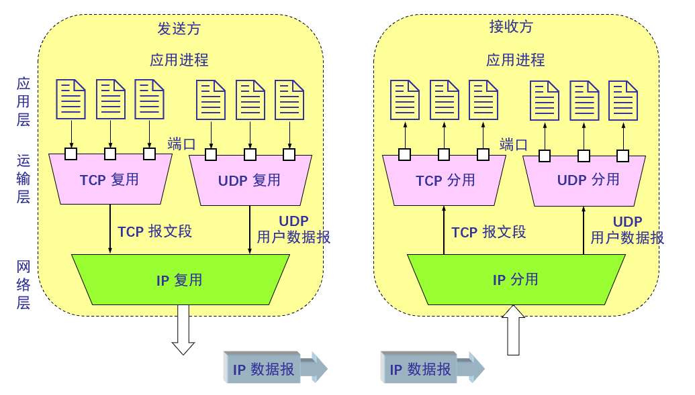

# 第三章——运输层
# 运输层服务
## 运输层的功能
为不同主机上运行的应用进程之间提供逻辑通信
## 工作内容
发送方：将应用数据划分成报段文交给网络层
接收方：将报文段重组成应用数据，交给应用层
说的通俗一点的话，应用层的程序将某个报文发送给操作系统，操作系统处理后称为报文段，报文段通过网络层（再进行一部处理后）的内容发送给另一个主机，主机的操作系统分析了这个报文段，处理后将报文发送给对应的程序
### 网络层和应用层
前文已经提到，网络层实现了主机之间信息的传递，运输层就是实现程序之间信息的传递
其中，不同的运输层协议可能会提供不同的服务（有的应用层协议基于tcp，有的基于udp），但是都能通过网络层传递
由于实现主机间信息传递的是网络层，所以运输层能够提供的服务受到主机之间的传递方式，也就是底层网络协议的服务模型的限制（如果网络层设计的在主机之间传输的线路是远路，运输层什么也做不了，只能感慨“真是绕了好大一圈啊”）
有些服务无法在网络层实现，就由运输层实现
网络层的目的是只管搭建通路送，送成什么样不关我事，所以，运输层采用下面的策略保证信息一定安全完整地送达
### 丢包重传——网络层不提供可靠的传输服务，运输层自己提供
如果长时间没有收到来自对方的报文，运输层就会重发报文，这样保证了运输层一定想办法实现报文的到达
## 两个重要的传输层协议

*这里和ppt区分开，因为数据报和网络层传输的内容重名了，我们统一叫报文段*

TCP
可靠有序地交付信息
拥塞控制
流控制
连接设置
UDP
进行不可靠，无序地配送
尽力而为，ip的简洁扩展 
两者都不提供延迟保证和带宽保证

# 多路复用和多路分解
运输层一个很重要的功能是复用和分用

### 端口

一种标示应用层进程的数据

端口是一个16bit（0到2的十六次方）的数字，我们用这些数字作为端口，标注特定的进程，信息到达目标主机后，通过端口号识别到特定的进程，将信息传递给他
前面在应用层提到的就是这个端口

### 套接字

由IP地址和端口构成，表示TCP连接的端点

运输层实现的是应用程序之间的信息传输，那么某个主机（IP表示）下的某个程序（端口表示）就是一个确定的应用程序，套接字表示的就是这些信息

### 多路复用和多路分解

源主机从多个套接字收集数据，为每个数据封装首部信息，生成报文段，并传递到网络层的工作称为**多路复用**

接收方分析首部信息后，识别出接收者的套接字，将报文段中的数据发给正确的套接字对应的程序的工作叫**多路分解**

我们可以这样理解：发送方的所有程序通过套接字实现和操作系统的连接（操作系统能根据套接字和这些程序进行一对一的连接，相当于打通了一个通路）

多路复用的过程是，尽管这些信息来组不同的通路，在经过操作系统处理后，它们都将被封装到报文段里，统一发送到网络层，并发送到目标主机这个过程，让这些来自不同通路的数据通过同一条路线继续前进，就称作复用的过程

而分解的过程就是反过来，统一通过网络层到目标主机的数据经过操作系统分析，重新解析为通往各自程序的报文，对方的操作系统则根据报文里套接字的信息将他们分发到接受的程序里。

*如果涉及到的运输层协议有tcp和udp两种，那么在将各自协议报文段发送给网络层的过程是两个不同的通路，而网络层利用一个通路将报文段发送到目标主机，目标主机再用两个通路交给tcp udp协议，也就是说，中间多了一次多路复用和多路分解的过程*

### 面向连接的复用和分解

TCP的套接字由四元组（源ip，源端口，目标ip，目标端口）组成，接收方主机能根据这个值将报文定向到相应的套接字

这样的四元组，实现了支持多个并发的套接字，也就能实现多线程的web服务器，同时和多个主机，程序进行交流

我们发现，对于不同的客户来说，源ip是不同的，对于不同的程序来说，源端口号是不同的，这样就实现了服务器进行和不同主机不同程序之间的交流

所以，传输层的协议的最简单的作用就是将本机器上所有程序需要发送的信息统一打包起来，发到网络层，同时将网络层发来的信息检查差错并解包，分发给各自目标的程序
不过，这个阶段，有的程序仅仅是实现了打包这个功能(udp)，而有的程序还做了一些别的事情(tcp)
# 无连接传输：udp（用户数据报协议）

## 介绍

udp实现了运输层协议最基本的两个服务：
1.多路复用/多路分解
2.差错检查

而udp在处理数据的流程就是简单的检查套接字进行接收，封装，递交网络层到从网络层接收，分析，和发送到程序，以及中间的完整性检查

没有复杂的建立连接的过程，信息能传就能干，哪怕对面的程序已经似了接收不了，我也得发

## 优势

## 大量使用udp的坏处
路由器大量分组溢出（瞎几把传。路由器放不下）
减少tcp通信的速率，甚至挤垮TCP（占用的太多把原本属于TCP的带宽也用了，给tcp赶跑了）
## 应用实现可靠传输（丢包重传）

udp本着尽力而为的原则，只负责发数据，不保证数据送到，只能应用层通过丢包重传维持传输的可靠性，如果没法送到，就再传输一次，但是这样会导致程序的开发难度上升

## udp报文段的结构

## udp的检查和

检测收到的报文段是否有差错

# 可靠数据传输的原理

不出错 丢失 乱序

前面已经提到过网络层不能保证数据的准确传输，所以应用层需要的准确传输，是由网络层的最基本的不靠谱的传输信道 + 运输层保证准确传输的逻辑组成的

这个逻辑称为可靠数据传输协议（rdt）

记住四个指令的功能，后续描述信息传递过程时会调用

## rdt1.0

单纯的可靠的连接，不会像udp那样只管发不管接收

整个的协议就是建立在底层的信道完全可靠的基础上实现的

我们分别为发送方和接收方建立FSM（有限状态机，也就是规范传输的模式），两者在底层信道发送和接收数据

FSM模式如下：

在这种情况下，发送方和接收方都只有一个模式：等待其他层的调用，当发送方的上层（一般是应用层）调用这个协议后，协议会往信道（网络层）发送这个数据，具体的过程为：将报文（data）打包成报文段段，再向下发送

接着接收方的网络层收到了这个数据段，将其解析成报文段后调用rdt1.0协议，协议解包这个报文段为报文，发送到应用层

横线下方的函数是横线上方的函数的具体内容

你可能已经注意到了，整个规则是建立在底层信道(网络层)完全可靠的情况下的，然而一般情况不会是这样，我们已经知道网络层在保证数据完整这一块是不靠谱的，所以rdt1.0可以理解为，无意外情况下的数据的传输规则，一个数据就是按上面的规则发送的，当然，出现意外就是后面的事情了——信息传输的不靠谱，有的地方数据出现了偏差！

## rdt2.0

在这个版本的协议下，我们考虑到分组的bit可能受损，但传输的所有分组都会接受，也就是只考虑数据有偏差，不考虑丢包,所以我们得有一个方案，检测数据在传输得过程中是否有偏差

### **差错检测**

利用差错检测：发送方在打包报文的时候会计算出一个校验和，将其一起打包为报文段传给下层，接收方接收到报文段后，计算正文内容的校验和，与发来的校验和比较，如果不同，则说明数据有改变，接下来进入下一步：接收方反馈
#### **接收方反馈（ACK和NAK）**

接收方向发送方发送报文，ack报文表示数据无误，nak表示数据有误，如果发送方接收到了nak，就会重新传输分组，也就是**出错重传**，具体的过程下文会说

发送方在上层调用这个协议后，协议会先将报报文内容（data）和校验和（checksum）打包，发送给接收方，接着进入第二个状态：等待接收方的反馈，如果接收方发来了反馈，而且反馈是NAK，就说明没有发送成功，重新调用udt_send函数再发送，如果没有收到错误的消息，则说明发送成功，整个流程结束，重新进入等待调用的状态

接收方在经过下层调用后，先检测是否出错，如果没有出错，会将发来的分组解包，从缓存传给上层，向发送方发送ACK；如果出错了，就不会解包，直接把这个分组删除出缓存，然后向接收方发送NAK

**出错重传**

相信大家在前面已经发现了，在接收到NAK信息后，发送方只是调用了udt_send函数，而没有进行打包的过程，是的，在打包完成后，报文段会保存在缓存里，等待目标的反馈消息，在重新进入等待调用模式后，才会在缓存中删除内容

整个传输的过程是，每传输一个报文段，就调用一次这个协议，也就是说，发送方和接收方只需留一个报文段的缓冲区即可

这样的思路看起来很精密，可是……ACK和NAK这两个反馈信息受损了呢？

## rdt2.1

反馈信息也可能在传输过程受损，如果2.0收到了破损的信息，就会发送一个信息破损的反馈信息，然后对方重发刚才的反馈信息……如果网络够差，那么就会无限套娃，这样肯定是不行的

### 解决思路

增加足够的检查和比特，能在一定程度上检查出反馈报文的错误和给报文纠错

收到出错的反馈时，无论如何直接重发当前的数据分组，如果使用这种方式传输，需要给每次发送的分组编号：对于这一次传输的文件，我们初始编号为0，在发送的报文段上也表明序号0，此时发送方将专注于0号报文的处理（即下图状态机）中的0序号，无论是重传还是别的情况，只要没收到来自对方的ack确认，其状态一直都是0状态，在收到对方ack后进行下一轮的等待调用及其之后的操作，但是状态变为1，发送的报文段编号也是1，直到收到ack确认后变回0（只有0，1两种状态）

反馈报文的纠错方式和报文是一样的，接收端在发送反馈报文的时候也会连同一个检查和一起打包
我们通常采用第二种方法，比较保险

**发送方**

我们可以看到，初始状态是等待上层的0号调用。在被上层调用后，协议调用发送的函数，将序号（0），报文（data），检查和（checksum）全部打包成报文段，接着发送到下层，进入等待0号反馈的阶段，如果返回的反馈受损，或者反馈的是NAK，则重新在缓冲发送0报文段，如果返回的是ACK，那么表示这次的调用传输成功，进入等待1号调用阶段（是的，调用的编码是0，1，0，1这样来回循环区分前后发送的报文），接着被调用，将序号1和报文，检查和打包发送，重复上述内容，最后回到等待0号调用的阶段，来回往复……

**接收方**

在开始阶段，协议处于等待0号调用的阶段，在接受到下层的零号调用后，协议开始检查发来的报文段

其会检查：报文数据是否完好，以及其编号是否和当前调用编号（0）相同

如果报文数据完好，而且编号是0，那么他会向发送端发送ACK0，接着进入等待一号调用

如果报文数据完好，但是编号是1，说明之前编号为1的报文段已被成功接收，但是反馈报文发送失败，对方误认为报文未发送成功，重新发送了这时依然保持在等待零号调用的状态，发送ACK反馈信息

如果报文数据不完好，且编号正确，协议会发送NAK反馈错误信息，留在0准备号调用的阶段，等待重传

## rdt2.2
此时状态机不再分10两种状态，报文的编号变为0，1，2，3等有序数字，则状态机的状态序号和发送的报文序号相同
不再使用NAK反馈错误信息，而是使用ACK在接收后反馈最近收到的正确的分组的标号

同时，如果遇到了重复的序号，视作错误反馈

发送方等待来自上层的调用，在调用后会连续发送几个报文段，而不是在等待一个报文段得到反馈后再发下一个，此时，每个报文段都有自己的编号，从0开始，接下来如果信息全部传输正常，接收方会在收到对应编号的报文段后发送ACK + 编号，如果不正常就不发送任何消息，如果发送方收到的是从0开始连贯的ACK反馈报文，那么接着进行正常传输，如果中间断了（0，1，2，4，5）就从断掉的编号（3）重新传输（之前传过的45也会重传），直到从3开始接着收到连贯反馈

## rdt3.0

信道的丢包问题
丢包的检测：设定一个计时器，超过规定时间没有收到对方的反馈就视为丢包，重传分组
### **过程**

此时的状态机依然分成01两个状态（或是rdt2.2那样多个状态）来区别每次发送的报文段
和rdt2.x不同，发送方在被上层调用之后，进行一个start-timer函数设置一个计时器再进入等待状态，如果检测到计时器超时，则同样重传，并重置计时器

就像这样

**性能分析**

等待反馈到来消耗的时间是被浪费的了，利用3.0，整体的时间用来传输信息的利用率是不高的

传输速率R指的是链路层在主板处理应用层发来的报文和网络层发来的报文段的时间
RTT是15ms，则往返时延是30ms
可见因为这种机制，报文段只能一个一个发整个30ms只用来发这一个报文段了，而且1个g的链路就没咋用，效率太低了

### 提高性能的方法：流水线技术和滑动窗口协议

发送方不再等待反馈再发送，而是一次发送很多分组（组的长度称为窗口），但这是需要给发送的分组进行编号，序号增多，不再只是0和1，而接受方需要更多缓存空间来保存发来的大量分组，同时每个分组最后一个比特到达，检测完成后接收方返回反馈信息

记得窗口的概念

#### **流水线技术工作原理**

##### 发送过程

此时不再一次只发一个分组，而是一次发多个分组，下图以3个为例

可见，连续发送了三个分组的操作，只需等待2个RTT的时间就能收到回显，大大提升了了传输效率

首先，将发送的分组用k-比特字段表示序号，此时发送方保存了要发送的所有分组的状态，一共分四个状态：已被确认收到；已发送，但还未确认；可用，但还未确发送；不可用
这里的可用指的是是否在窗口范围内

所谓窗口，就是发送方允许当前存在的最多的已被发送但没收到反馈的分组数量，假设窗口为n，如果当前发送了n个分组，都没有收到反馈，则发送方会停止发送等待反馈，此时如果最早发送的分组得到了ACK，则整个窗口会向后移动，意味着窗口内新增了一个处在可用但未被发送状态的分组，此时发送方会立刻将其发送

##### 分组重传
流水线丢失分组，重传的策略，有两种策略
###### GBN协议
Go-Back-N(GBN回退n步)协议，其后的分组全部重传
发送方会为维护一个base表标识，记录目前最早发送，但没有被确认的分组的序号，发送方在按序号顺序发送分组后，会给base标识的分组设定计时器，如果这个分组被确认收到，则base+1并重置计时器；如果计时器超时，则从base号分组开始，重新发送之后的分组
接收方会严格按照顺序接收发送方的分组，从0开始，每收到一个分组，就会返回ACK + 对应编号如果某一个当前应该接收的序号的分组n受损，或收到了乱序的分组，则接收方会记住这一个序号，即使接收到了某个新的序号的分组，其还是会反馈ACK n -1 来告诉发送方n没收到，并将未来到达的其他序号的分组直接丢弃，直到准确收到自己当前应该收到的序号的分组为止
我们称这种只在收到想收到的序号的分组才报正确ACK的思路叫**累积确认**

###### GBN的滑动窗口大小

发送方：2的k次方减一：理由：为了防顺序错误
接收方：1，只需要保存当前接收到的对的序号的就好了

##### 选择重传(SR)协议：仅丢包的分组确认

这种情况下，给每个发送的序号的分组设定计时器，当对应的计时器超时，就重发对应的分组，所以，要设置所有分组的缓存，方便及时重传
对于窗口的移动，哪怕别的分组都已经确认接受了，而最早发送的分组还没有确认，窗口也不会变化，一定要等对应的ack到来

##### 两种方式的对比和总结

# TCP协议（传输控制协议）：面向连接的传输
## 特征
### 面向连接
——TCP连接仅存在于端系统，中间路由器对其毫不知情
这种连接状态相当于：只有端系统知道双方的连接状态（那个软件在连接，当前信息是在握手，还是在传输信息，还是重传或反馈），中间路由器只进行网络层该干的，根据头部的信息把报文段传到该传的靶机
### 全双工服务
可以双向同时传输数据
### 点对点连接
仅存在于两个端系统之间
### 三次握手
三次握手的通过正式链接前的简单通信，确保连接已建立和稳定，同时协商参数
### 可靠的字节流
最大报文段长MSS
## TCP报文段头

此段头为32位段头

- 源端口（Src port）和目的端口（Dst Port）各占用两个字节，表示了信息的来源和去向，是运输层和应用层的服务接口。运输层的复用和分用都要通过接口实现
- 序号（Seq）字段占四字节，TCP连接传送的数据流的每一个字节都会边上一个序号，序号字段的值就是当前报文段发送的数据的第一个字节在整个报文字节流中的序号，每个报文段都是
- 确认号（Ack）字段和序号相映，同样占4字节，是期望对方发送的下一个报文段的数据的第一个字节的序号，防止传输顺序出错
    
    
    
          对于这个例子，主机A发送了内容“C”，同时包含Seq 和Ack，意为：这是自连接建立以来，我发送给你的第42个字节；到此为止，我接收了你发送的78个字节，你要从第79个字节开始发送。接着，主机B在接收到这个信息后，发送了一个回显“C”（注意，这个“回显”和后文的确认收到都是在应用层规定的交流规则，视作B方发送的消息就好）同时包含Seq Ack，意思是：现在我发送给你的是建立连接以来第79个字节，我已经收到了第42个字节，请给我第从第43个字节开始的信息，最后，主机A发送了一个确认收到回显的报文段，这个报文段正文是空的，所以Seq和Ack都不会有变化，意为：我确认收到了你的回显，到目前，我已经发送了42字节的内容，接下来给你发的是第四十三个字节开始的内容，已经接收了79字节的消息，下次给我发从第80字节开始的内容
    
- 首部长度占4bit，示意32bit为单位的TCP首部长度
- 保留字段，占6bit，保留为今后使用，但目前应为0
- 下面的部分都只占1bit
    
    紧急比特（URG）：此bit为1时，表示紧急指针（见后文）字段有效，，告诉系统这个报文段有紧急数据，应该尽快传送
    
    确认比特（ACK）：为1时确认号字段有效
    
    推送比特（PSH）：当设置为1时，接收方就会尽快将信息交付给应用进程，不会再等到整个缓存都填满了再交付
    
    复位比特（RST）：设置为1时，表示连接出现严重差错，必须释放连接后重新建立连接
    
    同步比特（SYN）：设置为1时，表示这是连接请求或连接接收报文
    
    终止比特（FIN）：设置为1时，表明报文段的发送端的数据发送完毕，请求释放运输链接
    
- 窗口字段：占2字节，来控制对方字段发送的数据量，连接方根据分配给自身的缓存，和后文选项字段不同，这个会根据空余的缓存空间告诉对方能接收的最大信息量，之前会话内容可能还在占用着分配的部分缓存，如果大于这个 限度，可能会造成缓存内其他信息被顶掉或其他后果
- 检验和：用来确定信息传输是否有误。占 2 字节。检验和字段检验的范围包括首部和数据这两部分。在计算检验和时，要在 TCP 报文段的前面加上 12 字节的伪首部。
- 紧急指针：再紧急比特有效后，紧急指针指出报文段里的紧急数据的最后一个字节的序号
- 选项字段：TCP里只有一个选项MSS（最大报文段长度Maximum Segment Size，是首部长度 + 正文长度）来控制对方字段发送的数据量，连接方根据分配给自身的缓存，确定自己一次能最多接收多大的字节，这样双方都不会一次发送太大量的字节导致对方缓存容纳不下
- 填充字段：长度不定，作用是保证整个首部长度是4字节的整数倍，无是实质内容

## TCP超时的设置

怎样为TCP连接设置合适的等待时间，在超过这个时间没有收到回复，视为超时

### 估算合适的RTT（往返时延）

样本RTT：对报文被发出到收到对方报文段确认之间的时间（忽略重传）进行测量

我们会对样本RTT作多次测量，根据下面的公式得出估算出的RTT

RTT可能会有波动，有的时候还要估计样本RTT和测量RTT的偏差

## 可靠的TCP数据传输

前面已经提到过，网络层的协议在保证数据完好送达这方面是不可靠的，我们需要采用类似前面可靠UDP传输的方法来保证信息完整传递（丢包重传，检查和等）

不过，对于TCP的可靠数据传输，我们还要了解一些特别之处
TCP的编号采用按字节编号，不会再使用按报文段编号
TCP仅采用唯一的超时定时器，使用GBN思想进行重传

### 具体流程

### 快速重传

此时接收端按照累积的序号作为反馈回复，在这之前序号已经传输到了100，则反馈ACK 100，此时本该收到110 的，但是丢包了 收到了120以及之后的报文段，此时接收方每接收一个新的报文段，还是会反馈ACK100，在多次确认发来的ACK是100后，发送方就会意识到自己丢包了 开始重传100对应的报文段

## TCP流量控制

在从发送方接收到TCP报文后，主机先将信息保存到分配的缓存里，再不断传给应用层的程序

有时，应用层可能读取这些数据的速度会很慢，应为处理信息很慢（每从传输层拿一点信息，就猛击自己魔丸100下？），此时这些信息就会暂留在缓存里，这样就会有一个问题：要是接受的太快，缓存满了怎么办？

### 控制方式

方式：接受方在反馈时，将缓冲区剩余大小告诉发送方（前文在报文头部提到的窗口字段），发送方就会控制自己的传输速度

窗口值计算：

接收方：用整个缓冲区大小，减去上次传输数据收到的数据大小（用编号表示），最后加上传给应用层的数据大小

发送方：最新发送的数据序号，减去对方最新接受的数据序号。小于窗口大小即可

特殊情况：当接收方提示窗口值为0时，发送方将持续发送一字节的报文段，这样接收方就会不断发送包含当前窗口值的反馈

### TCP连接的建立：三次握手

[神秘小视频，看个乐就好](https://www.bilibili.com/video/BV1rS5mzsEB8/?spm_id_from=333.337.search-card.all.click&vd_source=61b8ee0ba7eabf4823038ca831312e3f#/)

发送特定报文，确认以下连接稳定SYN：建立连接标识符
发送了连接的标识符，A向b发送连接信息，包含序号
B回复A自己的标识符和对应序号，并提示已收到序号x的信息
A给B的消息进行反馈确认，并包含向B请求的信息
这三部都包含序号的信息
可见，尽管是握手报文，TCP连接依然对其严格按照byte编号

### TCP连接的释放

共四次挥手：
FIN：断开连接标识符，先发送标识符，提示不再发送报文
A对B发送FIN，告诉他我已经没有数据要发送了，直接收你的数据
B对A的信息确认，A已经发送完了
B向A发送发送剩余的消息，并发送FIN表示自己的信息发送结束了
A确认B结束的消息
A 和 B 都要确认对方已经没有东西可发了，此时连接正式断开
最后挥手完毕，断开连接
# 拥塞控制原理

防止网络中（路由器）数据过多，导致信息无法及时处理，从而导致时延，丢包的问题
注意，报文的到来呈波动性，不是一个稳定的速度，后文提到的传入速度可以理解为泊松分布的参数，可能在某一瞬间，突然到达的报文数量很多但是平均下来就没那么多，这也是导致拥塞的情况，也解释了为什么仅仅传入速率接近吞吐量，缓存就饱满了
## 1，传输速度大于吞吐量

我们规定，此时使用的路由器的缓存是无限大的，没有发生重传，拥塞的成因只有传输速度过大
当分组到达的速率接近链路容量时
时延，丢包→重传 但是延迟到达的数据还重传，就会导致接收方接受的数据增多
我们假设路由器的吞吐量是C/2：
那么，对于信息进入和离开的关系，可以用这个图表示

当进入速度小于吞吐量时，我们可以看到，进去多少就出来多少，成一个正比例关系，但是，当进入速度超过吞吐量时，无论怎样，传出速度不会超过其最大值，所以出现了平台，也就出现了下面传入速度和延迟的关系

当分组到达速率接近吞吐量时，其延迟就会变得巨大
## 2，路由器缓存有限，发生丢包

我们假设只有在发生丢包时才会重传：

在正常的基础上，如果发生了重传，就意味着在当前传入速率的基础上，增加了额外的内容，导致传入速度上升

所以，拥塞会造成不必要的开销

## 3多个发送方，多条路径，发生了超时，重传

发送方不断重传，导致网络中的数据增多，当到吞吐量之后，发生丢包时延

当分组丢失的时候，上游的传输会被浪费掉：最后一个路由器造成的丢包，会导致前几个路由器的传输失去意义，折腾半天丢在对面家门口了
### 死锁

1. **红色流量激增**：假设主机 A 发送了大量的红色数据包。这些包涌入左上角的路由器（这是红色包的第一跳）。
2. **挤占缓存**：左上角路由器的缓存被这些“刚进门”的红色包填满了。
3. **蓝色流量受害**：此时，主机 B 发出的蓝色数据包，已经成功经过了左下角的路由器，辛辛苦苦跑到了左上角的路由器（这是蓝色包的第二跳，也是最后一跳）。
4. **悲剧发生**：但是，因为左上角路由器的缓存已经被“刚进门”的红色包占满了，**蓝色包挤不进去，只能被丢弃**。
5. **恶性循环（死锁）**：
    - 同理，在右边的路由器，蓝色的“刚进门”包可能也会占满缓存，导致红色的“第二跳”包被丢弃。
    - **结果就是**：每个路由器的缓存里都塞满了**刚出发的第一跳数据包**，它们都在等待进入下一个路由器。但是，下一个路由器的缓存里也塞满了它那边刚出发的数据包。
    - 大家都在等对方腾出位置，但谁也动不了。
## 拥塞控制的方法

### 网络辅助

直接网络反馈：路由器以阻塞分组的形式通知发送方”网络拥塞了“

通过接收方：路由器标识分组中的某些字段，接收方在收到字段后知道发生了拥塞，则给发送方发送发送拥塞的消息

**ATM ABR拥塞控制***

特点
“弹性服务”
当发送方网络 “轻载”时:
发送方应充分利用空闲的可用带宽
当发送方网络”拥塞”时:
发送方应将传输速率抑制为最小承诺传输速率

### 端到端拥塞控制

网络层不提供拥塞控制的支持

端系统通过对网络行为（丢包或时延增加）的观测判断是否发生拥塞

## TCP拥塞控制

端到端的拥塞控制
每个发送方自动感知网络拥塞的程度，根据结果限调整外发的流量

### TCP拥塞控制需要解决的三个问题

怎样限制外发速率：

保证发送的信息，减去确认接收到的信息，小于拥塞窗口（当前测试出已知的，到拥塞前可容纳的最大值）即可

怎样感知拥塞：
超时得到ACK，或连续收到三个相同序号的ACK

发送方如何调节发送的速率
Reno算法：简单来说，在发生拥塞后立刻将拥塞窗口减半，在传输稳定后，慢慢增加拥塞窗口
（我们称这种操作为加性增，乘性减AIMD）

### 控制策略
我们在这里重点讲Eeno算法的内容
**慢启动**

MSS：最大报文长度

在建立连接时，设置拥塞窗口为1 MSS

根据这个标准，就能调节初始传输速率：如20kbps，这是个很小的数字

在对方发来ACK之后，我们收到则证明当前通道流畅，此时给拥塞窗口增加1MSS，来试探造成拥塞的极限，直到发生丢包为止

当可用带宽远大于MSS/RTT时，初始阶段可以用指数的速度增加发送速率

**拥塞避免**

在收到三个重复ACK时，意味着发生了时延，我们将拥塞窗口减少到原来的一半，接着限制分组的发送速度 为窗口长度+3，在这之后，线性增大拥塞窗口，试探极限

**快速恢复**
在发生丢包时，我们设置一个门限值，为当前拥塞窗口的一半，之后将拥塞窗口设置为最小（1MSS），接下来以指数速度增大拥塞窗口，当窗口值到达门限值时，再以线性速度增大试探

一定记住这个图
> 注意 和Reno算法相似的还有tahoe的算法，这种算法和Reno相比，其在发生超时后，不会再识别超时的种类，没有快速重传的过程，统一将窗口减半。而且从头开始慢启动，同时

### CUBIC控制拥塞
## 吞吐量的进一步讨论
吞吐量是丢包率的函数：

### 拥塞控制的公平性分析

**TCP的公平性**

对于K个TCP连接，他们在传输信息的时候都会经过一个瓶颈路由器，所有人都要挤这一条道路，但是，这带宽一共为R的链路，该怎么分配给每个连接呢？

其实就是平均分配，每个链路分到R/K个带宽来传输自己在传输的东西

具体实现过程（我们假设开始时2先建立连接并占用带宽传输数据）

上图是这样一个结构中两条线路吞吐量的关系

我们可以看到，有些箭头是平行于”共享同样带宽‘这条线斜向上走的，这是两个线路都没有到达极限，产生加性增的过程

我们也看到向原点方向的箭头，这是在带宽到达极限后，两者进行乘性减的过程，因为连接2的带宽更多，所以除以二，他减得更多，所以在减少后，他和链路一得吞吐量接近了一些；

接下来，重复加性增，乘性减得过程，我们就会发现，整个线不断靠近“共享同样带宽”这一条线，这样，这两个线路得吞吐量就慢慢调整到一致了

**公平性和UDP/公平性和并行TCP连接**

TCP时延建模
