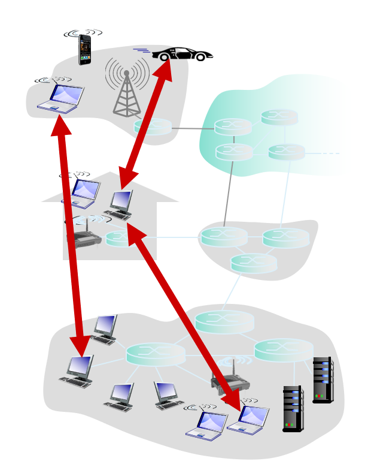

# 第二章——应用层

所有者: H34V3N

# 网络应用原理

## 网络应用程序

指可以向网络发送数据，从网络接收数据，对数据进行处理的应用程序

网络核心设备（路由器，交换机等）不运行用户的应用程序，程序都在终端系统上运行

*你只管传，怎么读是我的事*

## 网络应用体系结构

网络应用运行需要采取一定的体系结构

### 客户机/服务器体系结构（C/S）

存在一个服务器，允许其向客户机提供服务

所有客户机都通过这个服务器获取信息，所有客户机都只直接和服务器连接

客户机之间不能互相通信

使用的服务器通常是服务器集群，保证提高服务器的处理能力

使用这种结构的有浏览器等

### P2P(peer- to-peer）体系结构

在这里，任何一个客户机直接和其他客户机交流，及提供服务，又享受服务

节点的地址以及他们的连接可能会发生变化

P2P结构的体系非常容易扩展，毕竟，是个电脑手机啥的就能加入到体系和其他设备通信，也正是因为这样，这个体系难以管理

使用这种结构的有：迅雷等

### 混合体系结构（hybird）

前面两种体系的混合体

既可以和服务器通信也可以设备之间通信

简单来说，每个节点会将自己有哪些文件告诉中央服务器，如果有电脑向中央服务器请求文件，则中央服务器会检索哪个电脑有这个文件，并告诉询问者其ip和端口，接下来询问者会直接通过这个ip和端口向对方电脑请求文件
## 提供给程序使用的运输层服务

### TCP协议和UDP协议（运输层协议）

# 套接字Socket

*一封信送到了你们小区的邮箱里，你该怎么知道这封信是送给谁的呢？*

*同样你的电脑收到了一个信息，系统怎么知道是qq的还是微信的还是哪个游戏的呢？*

*信封会把地址和收件人写到封面，而网络传来的信息是通过套接字实现识别应用的其他信息的*

每个网络应用进程都有属于自己的，独一无二的套接字
## 套接字的定义
*这里解释的是网络理论层面的套接字，和操作系统层面的套接字句柄有差别*
套接字，像身份证号一样，是在网络里某个主机里某个程序的独一无二的身份证明
## **套接字的结构**

- 主机地址：表示目标网络应用进程运行在哪个主机上，通常是32位的ip地址（最常见的是ipv4，不过现在已经支持ipv6了）
- 端口地址：用16位的端口号标识是哪个网络应用进程的

*诺，如果对局域网开放，那么你和hxd本地连接mc时，用的就是这个端口*

不过有些端口，通常被大家约定俗成为固定给一个应用使用的端口，如ftp的21端口，http的80端口，我们称其为**保留端口**

进程就是通过这些套接字接收和发送报文的

# 应用层协议

首先，应用层协议不是网络应用，联系到前面对协议的定义，应用层协议知识网络应用互相传递信息时遵守的规则

应用层协议定义了以下内容

- 交换的报文的类型（请求报文还是响应报文）
- 报文类型的语法（报文中各个字段以及这些字段该如何描述）
- 字段的语义（信息的含义）
- 进程何时，如何发送和响应报文

# WEB和http协议

## web（world wide web）介绍

是一种应用/软件，叫全球广域网，也叫万维网
和我们常用的qq/微信不同，WEB在服务端的表现是WEB服务器程序，而在我们客户端表现的是浏览器（edge Chrome 360浏览器等），其功能是实现下面的内容：客户端会请求服务端主机里某个路径下的文件，而服务端找到后，就会将这个文件发给客户端，就是干这个的

WEB使用的是C/S模式

### web的构成

WEB服务器

浏览器

协议

1. 信息表达的协议——HTML
2. 信息传输的协议——HTTP

## WEB内容的表达
web在收到请求后，会将请求的文件（无论是jpg，还是html，甚至是没有后缀的神秘二进制文件）

### HTML

HTML——超文本标记语言，他通过”列举标签“这种语法实现将internet资源联系成一个整体，HTML文本就是由一个个HTML命令组成的描述性文本，我们可以通过这个语言，来描述文字，图片，声音等信息

我们看到，所有文字内容都通过<> + </>的的格式呈现，这就是标签，大标签里还有小标签。标签内容特性还能自定义，通过这种语言，我们能看到文字，其他html文件，还有图片的链接等等，我们从服务端接收到零散的图片（如图中的bili.png等），文字等资源，根据这些语言定义的规则，进行有序的排列

其和另一个配置文件（CSS）一起运行后，得到的结果是这样的：

我们也收到了大背景的这张“夕”，但是定义其的内容在new.css里，只是被html引用，所以上面的代码没有

### 单独表达文件

也可以单独表达某些文件，如图片，音频文件等（其实HTML就是在表达文件）

这是一张单独表达图片文件的截图
> 这时可能有人发现了，对于前面的html文件来说，我只是请求了这一个文件，为什么浏览器又显示出图片了又有别的东西，甚至还有视频和音频等
> 这是因为浏览器收到html文件后，会根据其中的代码定义的规则，排列里面提到的各种数据和资源，如果排列途中遇到了缓存里没有的资源（如照片，视频），就会向对方请求这个资源，在所有资源都到齐而且按照html代码的规则摆放后，网页就给你呈现出来了
### URL——统一资源定位符

我们通过浏览器访问网站的过程，就是访问其资源的过程，遇到了那种精美的网站，是因为我们直接访问了作者写好的html，他们把所有资源都呈现出来了
那么对于特定的资源文件来说，也得有一个特定的身份，地址找到他啊，就是url

在输入主机名后，我们在后面接上对方服务器及其内相对路径的文件地址，就能访问这个文件（权限的问题另说）

现在回看前面两张图

第一张图

？这什么路径也没有啊？

当你不填路径的时候，服务器优先在盘符（这里指运行了WEB程序的路径，也可能是某个文件夹）里搜索名为index.html的文件并传输他

第二张

纯纯的传输图片给你看

## HTTP协议———WEB内容的传输规则

web内容的传输

前文已经说到，web采用C/S模式

客户端向服务器发送HTTP浏览器请求，接收，展示web对象

服务器向客户端发送对象请求进行相应，传输需要的东西

http采用有链接的传输方式：使用tcp连接

http是无状态的,服务器不会保留访问过的请求信息

## HTTP如何传输对象

### HTTP1.0

解释过程

（建立TCP链接这一步不理解也没事，是下一章的内容，理解成这两个主机确认能向对方准确发送信息的过程就好）
我们可以看到，这个html文件里包含10个图片，而整个访问过程，是一个文件一个文件传过来，每送达一个文件，就断开连接，之后的文件需要重新和服务端申请链接。开头先传入的是html文件，客户机通过分析html文件的语言发现还需要向服务器请求10个图片，再一次一次重新建立请求。所以上图的从开始访问到将所有图片都展示到浏览器上，一共进行了11次请求，这就是**非持久性连接**

### 非持久性连接

#### RTT
指的是端到端时延，即信息从当前程序到对方程序的时间消耗
2倍的RTT就是往返时延

非持久性连接的意思是，等你想取一个文件的时候，就建立tcp连接，如果文件发送来确认无误后，就立刻断开连接
这就导致需要连续请求多个文件时，需要频繁建立TCP连接，费时费力
### HTTP1.1

HTTP1解决了非持久性连接需要多次请求的问题，服务器在发送响应后，TCP连接暂时不断开，而是保持连接，只有连接一段时间内不再传输信息，才会断开连接

### HTTP2（ppt在后面）

如果要传一个超大文件（几个g），会造成对头阻塞：因为一次只向对方传输一个文件，这个大文件传输完之前，就算客户端发来新的请求，也无法进行别的传输

http2，将传输的对象分为帧，每一帧每一帧传输，含有文件传输的优先级

大文件在传输的过程中，有优先级更高的小文件请求发生，那么大文件传输在这一帧暂停，先传小文件，再传大文件，因为分成帧了，大文件的传输不会不完整或丢失

### HTTP3（未被使用）

## HTTP报文

请求报文是ASCII码

后续会记录wireshark软件的使用，在这个软件中每个信息都清晰可见

### HTTP请求报文

一般格式

用户代理：一般是浏览器代理用户进行请求服务

**请求行支持的方法**

**get**
向服务器请求指定url对象，比如你想要服务端给你传一个图像，就发出get请求

**post**
向服务端提交表单数据
请求一个web页面
💡
get方法也可以请求一个web页面，最好的例子就是搜索引擎：
[https://cn.bing.com/search?q=get方法怎么请求一个web页面](https://cn.bing.com/search?q=get%E6%96%B9%E6%B3%95%E6%80%8E%E4%B9%88%E8%AF%B7%E6%B1%82%E4%B8%80%E4%B8%AAweb%E9%A1%B5%E9%9D%A2)
url规定，？后的内容是查询参数通过修改这个查询参数可以实现不同的页面
（上面的url是可以正常访问必应的）
？后的内容，实际上是上传数据的过程，我们提交了一个表单，表单内容是：get方法怎么请求一个web页面

**head**
请求服务器返回相应报文，这个方法不会请求任何文件，只有一个空报文，通常用于漏洞排查

http1.1新定义的方法：

### HTTP响应报文

格式

状态行：版本 + 状态码 + 短语解释状态码

首部诸行：首部的字段 + 对应的值

后面就是被请求的html文件

### 常见状态码

404，很熟悉吧（

## 用户-服务器交互：cookie

*举个简单的例子，b站网页版，你第一次需要走输入账号密码的流程才能登录，但是之后就算你换网，还是重新开关浏览器，还是重启电脑，再次前往b站时，网页总是给你账号登录了，根据你的账号信息推送视频*

cookie时服务器端存放不同用户的信息，服务器可以设置cookie，当用户访问网站时，检查这个cookie，如果cookie不正确或没有，则重定向到登陆页面

（本地只有cookie的值，服务器那边有详细的用户信息）

在HTTP的相应报文和请求报文都有cookie首部行，给你看cookie的值

### 工作流程

### 好处

## WEB缓存

[这东西和cache神似](https://www.notion.so/cache-1df05a2041d280638615e08193a6eb16?pvs=21)

目的

有的时候，如果你要访问一个离你太远的服务器（跨省，跨国），你的访问时间可能会特别长；有的时候一群客户端访问服务器，给服务带来的压力巨大导致访问时间慢，这时候，我们可以通过连接代理服务器，减少时延

这个时候，我们先向代理服务器申请某些信息，代理服务器如果找到了你要申请的信息，就直接把信息返回给你；如果代理服务器没找到信息，就向原始服务器发送请求，原始服务器将信息返回到代理服务器保存，代理服务器再把对应的信息返回给客户端

举例
现在是一群客户机直接连接原始服务器的情况

平均每个客户机每次请求的文件大小都是100kb，对于这样大小的文件，浏览器每秒访问15个
接着，对方路由器在收到请求报文后，将报文转发到原始服务器到收到原始服务器的回应报文的时间是2s

接入链路的流量强度是1，意味着当前正在排队的报文数量不会轻易改变，可能会流量非常大

流量强度：（文件数 * 大小） /  带宽 = 1500 / 1500 = 1

会很卡

两种改进方案

方案一：增加带宽

增加出口带宽

方案二：缓存

架设web缓存

### 条件get的使用

我们通过条件get让WEB缓存向原始服务器更新数据

下面是一次原始服务器向缓存发送的相应报文

Last-Modified一行记录了WEB缓存对应文件更新的时间

一周后缓存再发送请求

这时候缓存连带着更新时间一起发送，供服务器判断

如果时间对的上，在缓存服务器发来的时间节点之后对应的访问内容未被修改，将返回以下内容

如果对不上，访问内容更新过，则服务器返回以下内容，连带着最新版的文件

# FTP：文件传送协议

采用2个tcp端口（21/20）连接

采用C/S模式

和http的关系和区别

常见FTP命令 和应答

FTP（文件传输协议）和HTTP（超文本传输协议）都是用于在网络上传输数据的协议，但它们服务于不同的目的，并且它们的应答机制也有所不同。

1.**FTP应答**：
1.FTP主要用于文件传输，它是一个基于文本的协议，使用两个端口：一个用于控制连接（通常是21端口），另一个用于数据传输（通常是20端口）。
2.FTP应答通常是文本格式的，包含状态码和描述性消息。例如，一个成功的连接可能会返回状态码 230，表示用户已成功登录。
3.FTP应答可以包含多行文本，每行以 \r\n 结尾。

2.**HTTP应答**：

1.HTTP主要用于从服务器传输超媒体文档（如网页），它是一个无状态的、基于请求/响应的协议。
2.HTTP应答通常包含一个状态行、一些响应头和可选的响应体（如HTML文档）。状态行包括HTTP版本、状态码和状态消息。
3.HTTP状态码是三位数字，如 200 OK 表示请求成功，404 Not Found 表示请求的资源未找到。
尽管两者都使用状态码来表示操作的结果，但它们的格式和用途有所不同。FTP应答更侧重于文件传输过程中的状态，而HTTP应答则侧重于文档请求和传输的状态。此外，HTTP协议通常用于Web浏览器和服务器之间的交互，而FTP则用于文件的上传和下载。

# 电子邮件

## 电子邮件的构成

- 用户代理（邮箱的客户端）
- 邮件服务器（客户端对应的服务器）
- 简单邮件传输协议

### 用户代理

写作，编辑，阅读邮件报文

如OE foxmail outmail QQ邮箱

### 邮件服务器

邮件服务器里包含外出报文序列和每个用户的邮箱

邮箱包含了每个用户收到的邮件，外出报文队列里面是发出的邮件，当邮件传输发生错误，对方邮箱未收到有件时，邮件会暂存到外出报文序列里

整个邮件传输的过程是：个人代理 → 自己的邮箱 → 对方的邮箱 → 对方的代理

### SMTP协议

用在**邮件服务器**之间发送邮件
<i>*注意，是邮件服务器之间，主机对邮件服务器得到访问还是http或pop3等* </i>
采用tcp传输协议，端口25

直接从发送服务器传输到接收服务器

传输的三个阶段
- 握手（打招呼）
- 报文传输
- 结束
内容包含ascii码的命令和状态码和短语的命令/相应交互
**SMTP的五个命令**
HELO：进行握手，和服务器初步建立连接
MAIL FROM：告诉服务器邮件来源的地址
RCPT TO：告诉服务器邮件要发到哪里
DATA：告诉服务器，接下来的内容是邮件的具体信息，服务器接收到这个命令后开始读取代理接下来发的信息，同时将.视作读取结束的标志
QUIT：断开连接
STMP和http：

## 传输过程

甲使用用户代理，给乙发了个邮件
用户代理将消息发给邮件服务器，同时将消息保存在消息队列里（HTTP）
解析SMTP的客户端，向乙的邮件服务器建立TCP连接，将消息发到乙的邮箱服务器（STMP）
乙的服务器将这个消息存储到对应的邮箱里（STMP）
乙的代理访问邮件服务器，阅读甲发的消息（POP3）

其中，代理客户端和邮件服务器的交流大概是下面这样

首先，和右键服务器握手（包括传输层TCP握手和右键应用的STMP握手），建立稳定连接，发送HELO报文
在双方确认后，告诉邮件服务器源邮箱地址
在对方确认后，告诉邮件服务器目标邮箱地址
在对方确认后，开始输入正文，可以换行，以单独一行的·作为结束的标志
在这之后，这条邮件就发出去了，此时可以重走握手之后发邮件的流程再发一个右键，或是发送quit报文断开连接
## 邮件报文的格式——RFC 822

首部诸行，是表明邮件来源和去路等信息的部分，类似于http协议的首部
<i> 注意，对于邮件头部，不同的代理商会做不同的处理：像是教育网和企业网代理商，通常会在你邮件得头部加入发件人得ip地址，而类似Gmail等大型公共邮件服务商，通常会出于隐私保护而不给看发送人得ip地址</i>
信体，是邮件的具体内容，采用ascii码保存
注，右键本体还有一个格式，而这个右键本体内容再包裹上一层STMP的头部后，变成STMP报文再传输
## 客户机获取邮件的方法

**pop3（Post Office Protocol 3）协议**

###### 两个客户端命令：
登陆阶段
user：用户名
pass：口令，主要用于用户的登录
登陆后的交互命令：
list：列出报文号码
retr：用报文号码取信 retr + num
dele：用报文号码删信dele + num
quit：退出
###### 两个服务器响应：
登陆阶段
+OK
-ERR，表示当前命令执行成功与否
###### POP3评述

也就是说，如果想进行邮件的标记已读，或移动位置，这些只会在当前的客户机上实现，不会让服务器的内容发生实质性的改变

如果你换了一台机器，那么你之前对邮件的整理操作都会消失

**IMAP协议（因特网邮件访问协议）**

这个协议将所有邮件保存到服务器上，用户可以在服务器上组织自己的邮件目录，服务器会改变相应内容

这样的话，服务器就要额外维护imap会话的用户信息，也就是目录和用户名及其报文的ID的映射关系，别把用户之间的目录和邮件搞混了

# DNS：目录服务

## dns概况

将域名和ip关联起来

dns是一个分布式数据库，由多台分层次的服务器组成

我们通常用48位mac地址 32位ip地址 和定长的域名三种方式链接网站

dns的作用就是实现ip地址和域名的转换

### dns的解析过程

假设我的主机上有dns客户机，现在我访问百度的主页：[www.baidu.com/index.html](http://www.baidu.com/index.html)

浏览器抽出域名的部分，www.baidu.com将其发送给dns客户机

dns客户机将域名加入查询请求报文发送到dns服务器

服务器识别后，送回相应报文，里面有域名对应的ip地址

dns客户机将这个地址发给ie浏览器

接着根据url要求，浏览器向地址所在服务器发出请求

### dns的实现——采用分布式数据库

如果dns只使用一个服务器，那么全球的客户机都会向这个服务器发送请求，会给服务器带来巨大的压力，所以我们采用分布式数据库，将服务器分层，减少根服务器的压力

使用udp（53号端口）——快，传输数据的成本低

采用C/S模式

作为因特网核心的部分，不和用户直接交互

**根DNS服务器**
包含所有顶级域服务器的地址

**顶级域dns服务器**
顶级域名和国家的顶级域名的解析工作
如com org net gov cn等
也就是说，这个服务器内含有对应域名的下的权威dns服务器的地址
比如com的顶级域服务器，包含baidu.com,google.com等二级域名的权威服务器地址，但不提供这些域名对应的ip信息，也就是说，还是告诉你下一步该去哪找

**权威dns服务器**
顶级域服务器的下一层，负责某个组织的域名

**本地dns服务器**
本地dns服务器严格来说不属于DNS层次结构，其就像一个代理服务器，dns客户机向这个服务器发送请求，如果服务器里没有保存，就向更高级的服务器发送请求

### 完整的解析过程

所以，一般的流程是这样的：你拿着手里的域名（baidu.com），问根服务器ip是什么，根服务器告诉你去com对应的顶级域服务器那里找，顶级域服务器再告诉你去baidu.com的权威服务器那里找，接下来这个权威服务器就会告诉你域名对应的ip

不过，这个思路可以用不同的算法实现

**解析过程1：**

请求主机向本地dns的发送请求，本地dns先检查自己有没有这个域名对应的地址，如果有，则返回对应ip，如果没有，则根据域名的格式找到对应的权威服务器或顶级服务器，这个服务器返回对应的ip给本地dns服务器，本地dns服务器再返回给请求主机

注意，这里的 迭代体现在本地dns会根据域名直接访问合适的高级dns服务器

**解析过程2**

这个就是纯粹递归的过程，如果本地dns找不到对应的ip不会直接定向到合适的服务器，只会先请求根dns服务器，再往下一步一步请求，得到结果后原路返回

## DNS缓存

任意一个 服务器在得知（是的，得知，即可能是自己本来就有的，也可能是查到的结果原路返回的时候路过的）某个映射后，就会将其缓存下来，等下一次请求到来的时候，能直接在缓存中找到并且直接返回对应ip

## DNS能提供的服务
域名到ip地址的转换
主机/邮件服务器的别名
负载均衡
# DNS记录的格式及其维护
## 格式：RR格式
（name,value,type,ttl）

ttl为生存时间，决定了这个记录应该在缓存中删除（过期）的时间

其中最关键的type的值决定了name和value的含义
### Type = A
name = 主机名 value = ip地址
是将主机名和ip地址对应起来
### Type = NS
name = 域名（.com）
value = 这个域名对应的权威服务器的主机的名字
### Type = CNAME
Name = 别名
value = 真名
### Type = MX
value = 和name相关的邮件服务器的域名
## DNS的维护

### 手工操作（基本上都是手工维护）

传统上，DNS记录的更新和维护大多依赖于手工操作。DNS管理员需要直接编辑DNS服务器中的区域文件（zone file），手动添加、修改或删除记录。这些记录通常包括A记录、MX记录、CNAME记录等。

- **特点**：
- **效率较低**：当DNS记录发生变动时，需要手动进行调整，较为费时费力。
- **易于出错**：手工操作容易引入人为错误，比如输入错误或格式不规范，可能导致DNS服务的中断或错误解析。
- **灵活性低**：无法实现快速响应，因为每次更新都需要人工干预并可能伴随一定的延迟。
- **适用场景**：在相对稳定的环境中，DNS记录较少变化，手工维护是常见的方式。小型企业或个人网站经常采用这种方式，因为记录更新频率较低，且手动维护足以应对。

### **RFC2136 - DNS 动态更新**

- **定义**：**RFC2136** 是 IETF 定义的标准，允许通过协议实现 DNS 记录的**动态更新**（Dynamic DNS Update）。这种机制允许客户端程序自动更新DNS服务器上的记录，而无需管理员手动干预。
- **工作原理**：
- 客户端可以通过发送一个**DNS更新请求**（UPDATE request）到DNS服务器，通知其更新特定的DNS记录。更新内容可能是添加新的记录、修改现有记录或者删除某些记录。
- 该请求采用的是**DNS协议扩展**，直接通过 DNS 消息传递，服务器根据请求对相应的区域文件进行更新。
- **特点**：
- **自动化**：客户端（如DHCP服务器、网络设备或其他支持动态更新的服务）可以在IP地址或其他相关信息变更时，自动向DNS服务器提交更新请求，实现DNS记录的实时更新。
- **实时性**：由于是自动更新，DNS记录的变动可以即时生效，大大提高了更新效率，尤其在IP地址经常变化的环境中非常有用。
- **安全性**：为了防止恶意或未经授权的更新，DNS动态更新可以结合**TSIG（Transaction SIGnature）**协议进行身份验证，确保只有经过授权的客户端能够提交更新。
- **应用场景**：
- **动态IP地址**：当网络设备（如路由器或主机）频繁更换IP地址时，动态DNS更新可以自动修改A记录或其他记录，使得DNS记录保持最新状态。
- **大规模网络**：在企业环境或大型网络中，手工维护DNS记录效率低下，动态更新可以极大简化维护工作量。
- **支持移动设备**：移动设备或临时连接到网络的设备经常会有动态IP，利用动态DNS更新，可以自动更新这些设备的DNS记录。

1. **手工维护和动态更新的对比**
- **效率**：手工维护需要人工干预，动态更新通过协议可以自动执行，效率高。
- **灵活性**：动态更新支持实时的自动化调整，适应快速变化的网络环境，而手工维护适用于变动较少的静态环境。
- **适用场景**：手工维护适合小型网络或静态网络，动态更新则更适合大规模、动态变化的网络环境。

## DNS报文

查询和回答的报文格式是一致的

## 将自己的域名地址加入dns服务器

## 攻击DNS服务器

略

# P2P文件分发

情景

## 文件分发

我们假设文件的大小是F，各个客户机从因特网送，拿数据的速度是：u 和d。如图

### C/S体系结构的文件分发

这种体系下，所有用户机统一把信息上传到一个服务器上，拿取信息也需要在服务器请求，这种情况下，假设有这几个客户端向服务端请求同一个数据

服务器会将对应信息发给每个客户机，因为涉及到向n个客户机发送f数据，实际的上传量是nf 

> 互联网上的绝大多数通信都是“单播”形式，应用层因特网只支持计算机之间一对一发送数据，所以这里发送数据是发送n个f，尽管是相同的文件发给所有人，互联网也不会只让发送者发送一份，然后复制成很多份同时发给多个客户机

那么，服务端在分组传输的时候，客户端就会接收每一组报文，这时，所以，真正影响传输时间的是 服务器传输nf量的数据的时间，每个客户机在互联网接收数据的时间之中的最大值，即

### P2P体系结构的文件分发

和C/S相比，P2P允许客户机之间互相发送请求

在收到请求后，服务器向网络上传一份f文件，这个文件被分成了n个部分，每部分发给不同的客户机，每个客户机在收到一部分文件后，充当服务器把自己收到的部分传到互联网上（因为N-1个客户机和服务器接收，所以是n倍的自己接收的部分），由其他客户机接收

此时，真正的传输时间不小于下面三个时间的最大值：

- 服务器上传一份f的时间：必须上传一份完整版
- 一个客户机接收整个f文件的最大时间
- 整个p2p体系合力上传n份文件所用时间：整个系统需要N份f，而服务端只发了一份（掰成碎片分别发给每个主机，接下来主机把自己的碎片分享给n-1个其他主机），体系分享上传自己收到的部分所花时间

比特洪流

## P2P文件定位的方法

### 集中式目录法

当一台计算机上线时，它会将所有用的资源（有哪些）和ip地址发送到中央服务器

如果你想搜索哪一个文件，你可以向服务器搜索这个资源的名称，然后，服务器会告诉你拥有这个资源的ip，接下来搜索的主机就会向目标主机发送资源的请求

**缺点**

单点故障：整个比特洪流系统通过这一个中央服务器运作，如果这个服务器出现故障，整个系统都瘫痪

性能瓶颈：中央服务器会受到所有客户机的请求，用户数量越多，请求越多，这样会导致过多人占用服务器处理能力和带宽，降低效率，甚至导致服务器过载

知识产权的侵犯：盗版视频直接通过服务器共享啊，盗版电影漫天飞啊

### 洪范查询法

洪范查询法采用全分布式的无中心服务器的结构

**覆盖网络**
对等方维护的tcp连接，我们称其为网络的边
这些所有的对等方和边构成了整个覆盖网络
通常一个对等方直接连接的节点少于10个
**文件定位方法**

客户机向相邻的客户机访问，如果被访问的客户机没有该文件，就接着向它相邻的客户机发出请求，直到找到特定文件

再找到想要的资源之后，命中的消息原路返回，接下来请求方直接连接提供方，请求资源

### 对方加入覆盖网络的方法

1，欲加入的对等方首先通过对等方列表找到覆盖网络的成员

2，向成员建立tcp连接，直到某个对等方成功连接

3，接着欲加入的对等方向连接的对等方发送一个Gnutella的ping消息，对方将这个消息转发到其所有邻居

4，在其他对等方受到消息后，会通过覆盖网络向想要加入的对等方发送pong消息，这样欲加入的对等方就知道了整个覆盖网络的其他对等方的ip，便于建立tcp连接

## 不均匀性法

能够提高传输效率，减少泛洪的范围，减少请求的量

**不均匀性法** 可以用于优化网络资源的分配和提高文件传输效率。P2P 网络的一个显著特征是每个节点（即用户）既是客户端又是服务器，资源的分布和共享并非均匀。这意味着某些节点可能比其他节点拥有更多的带宽或计算资源，而某些文件的请求量可能远高于其他文件。在这种背景下，不均匀性法可以被用来解决以下问题：
1. **节点资源分配**
P2P 网络中的节点资源（如带宽、处理能力等）通常是有限的，且不同节点的能力不同。通过不均匀性法，可以根据节点的资源能力对其分配任务。例如：
- **高带宽节点** 可以被分配更多的文件片段传输任务，而低带宽节点则相应地减少负担。这可以通过动态调整节点任务的负载来提高整体网络效率。
- **重要节点的优先处理**：某些节点可能在网络中扮演重要角色，如拥有稀缺文件或常被请求的内容。通过不均匀性法，可以为这些节点分配更多的网络资源，以确保文件的快速共享和分发。
1. **文件块的不均匀分发**
P2P 文件共享通常将大文件拆分为多个小块，节点可以独立地下载不同块然后进行拼接。但在文件分发过程中，并非所有块的分发都是均匀的。例如：

- **热门文件块的优先传输**：通过不均匀性法，某些热门块（如高频请求的块）可以优先分发，以加快整个网络中的下载速度。这种方法可以确保最受欢迎的文件块更快地分发给更多节点，从而提高文件整体的下载效率。
- **稀缺块的优先分发**：不均匀性法还可以用于识别并优先传输网络中稀缺的文件块。稀缺块一旦扩散到更多节点，其他节点可以通过更多路径下载，减少等待时间。

1. **网络负载的均衡**

P2P 网络中存在着节点间的负载不均现象，某些节点可能因过多请求而超负荷，而其他节点则资源闲置。通过不均匀性法，可以根据节点的当前状态进行负载均衡。

- **动态调度传输任务**：通过监控网络中每个节点的状态（如可用带宽、CPU 占用等），不均匀性法可以优先将传输任务分配给资源充足的节点，从而避免过载现象发生。
- **热点节点的冷却**：当某个节点因过多请求成为“热点”时，其他请求可以被分配给相对闲置的节点，减少热点节点的压力。

1. **文件传输的优先级管理**

在某些P2P网络中，可能需要对某些文件或用户进行优先处理。例如，某些关键的文件可能需要更快速、更广泛地传播，而通过不均匀性法，可以调整这些文件在网络中的传播策略：

- **根据文件受欢迎程度动态调整**：使用不均匀性法对文件的受欢迎程度进行分析，根据需求量分配更多的网络资源给最常被请求的文件。
- **对VIP用户进行优先服务**：某些P2P网络中可能会对VIP用户或贡献较大的用户进行优先服务，分配更多的资源。这同样可以利用不均匀性法根据用户的贡献或需求动态分配资源。

### 不均匀性法下的内容定位的要点

每个资源都有一个摘要和一个描述符

需要资源的客户端向其组长发送请求的资源的关键字

组长会将这个关键字向其他组长转发，每个组长都会返回一个匹配的内容

客户端会选择一个最匹配的内容进行下载

HTTP请求报文会用这个资源的摘要作为被请求资源的标识符，向持有该资源的对方请求下载

____________________________________________________________________
# 视频流和内容分发

## 挑战

异构性：不同用户对于一个视频有不同的需求，如接受的视频的分辨率，优先还是无限等等

规模太大：对于大的视频网站来说，用户规模也十分庞大

我们会采用分布式的，应用级的基础架构

## 数据的压缩

每个视频可以分成许多帧，每一帧都是一个图像，这个图像通过数值矩阵实现每一个像素的颜色是什么，每个像素用bit代表的颜色值表示

采用两种方式减少传输的数据量

空间编码，对于一个帧的某一颜色仅发送两个值：颜色值和这个颜色值的数量

时间编码：发送帧与帧之间的差异的位置，不会发送完整的图像的矩阵数据

## DASH

以HTTP为基础，视频编码为几个不同的码率，对于想要的视频码率，用户可以自行进行动态的请求
服务器：将视频文件分成多个数据块，每个块通过不同的速度存储和编码
清单文件提供每个块的url
客户端：动态：定期测量服务器到客户端的带宽
查询清单，每次请求一个数据块，具体请求哪个码率的数据块根据当前带宽的情况

*当前网速过慢，已经为您切换为360p*

客户端自行动态选择
能够决定什么时候请求（如果请求多了可以放缓冲区，但是太多了缓冲区会溢出）
请求哪种码率和在哪里请求（往哪请求传得快）

## 处理大量用户

两种方式在多个地理位置设置大量的站点，缓解用户太多造成的压力，我们可以通过向站点请求得到视频
### 深入enter deep
将cdn服务器推入许多接入网，广泛分布在网络之中
### 邀请做客 bring home
搞几个少量的较大的集群，分布在网络的交换节点上，能提供较大的带宽。这些集群靠近访问网络
# 套接字编程
两幢传输服务的套接字类型：TCP UDP

